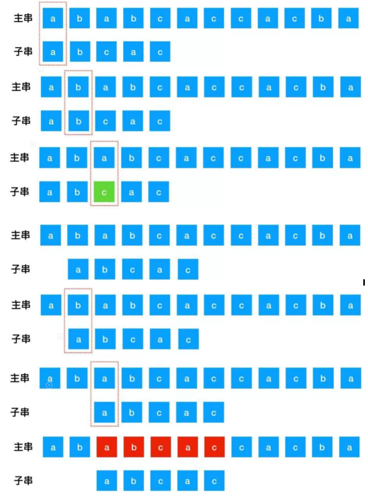

# Brute Froce 算法

### 概念

`Brute Force` 算法，简称为 `BF` 算法，中文意思是暴力匹配算法，是一种简单朴素的模式匹配算法，常用于在一个主串 `S` 内查找一个子串 `T` 的出现位置

其核心思想与操作是：
- 对于给定的主串（文本串） `S` 与子串 `P`（模式串），`S` 的长度为 `N`，`P` 的长度为 `M`
- 首先，将 `S[1]` 和 `P[1]` 进行比较
- 若相等，则再比较 `S[2]` 和 `P[2]`，一直到 `P[M]` 为止
- 若 `S[1]` 和 `P[1]` 不等，则 `P` 向右移动一个字符的位置，再依次进行比较
- 依次类推，直到 `P` 中每个字符依次与文本串 S 的一个连续子串相等，则模式匹配成功；否则模式匹配失败



### Brute Force 算法代码实现

```java
int index(String S, String P ) {
    int n = S.length();
    int m = P.length();

    int i = 0, j = 0;
    while (i < n && j < m) {
        if(S.charAt(i) == P.charAt(j)) {
            i++;
            j++;
        } else {
            i = i - (j - 1); // If match fails, move i to the next position after the last match start
            j = 0;    
        } 
    }

    if (j == m) {
        return i - j; // Match successful, return the starting position of the match
    } else {
        return -1;    // Match failed, return -1
    }
}
```
```python
def bruteForce(S: str, P: str) -> int:
    n, m = len(S), len(p)
    
    i, j = 0, 0                     # i 表示文本串 S 的当前位置，j 表示模式串 p 的当前位置
    while i < n and j < m:          # i 或 j 其中一个到达尾部时停止搜索
        if S[i] == p[j]:            # 如果相等，则继续进行下一个字符匹配
            i += 1
            j += 1
        else:
            i = i - (j - 1)         # 若匹配失败则将 i 移动到上次匹配开始位置的下一个位置
            j = 0                   # 匹配失败 j 回退到模式串开始位置

    if j == m:
        return i - j                # 匹配成功，返回匹配的开始位置
    else:
        return -1                   # 匹配失败，返回 -1
```
```js
var bruteForce = function(S, P) {
    let n = T.length;
    let m = p.length;

    let i = 0, j = 0; 
    while (i < n && j < m) { 
        if (T[i] === p[j]) { 
            i++;
            j++;
        } else {
            i = i - (j - 1); 
            j = 0;         
        }
    }

    if (j === m) {
        return i - j; 
    } else {
        return -1;   
    }
}
```

### Brute Force 算法分析

`BF` 算法简单、易理解，但其效率很低
- 因为在匹配过程中可能会出现回溯：当遇到一对字符不同时，`子串`直接回到开始位置，`主串`也回到匹配开始位置的下一个位置，再重新开始比较
- 回溯后，`主串`与`子串`有些部分比较是没有必要的

由于这种操作策略，`BF` 算法的效率很低

最坏情况是每一趟比较都在子串的最后遇到了字符不匹配的情况，每轮比较需要进行 `m` 次字符对比，总共需要进行 `n - m + 1` 轮比较，总的比较次数为 `m * (n - m + 1)`，所以 `BF` 算法的最坏时间复杂度为 `O(m * n)`


在最理想的情况下（第一次匹配直接匹配成功），`BF` 算法的最佳时间复杂度是 `O(m)`

一般情况下，根据等概率原则，平均搜索次数为 `(n+m)/2`，所以 Brute Force 算法的平均时间复杂度为: `O(n + m)`
