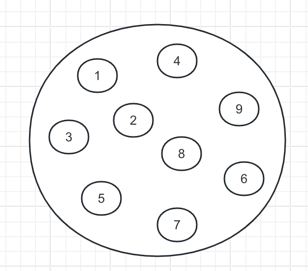
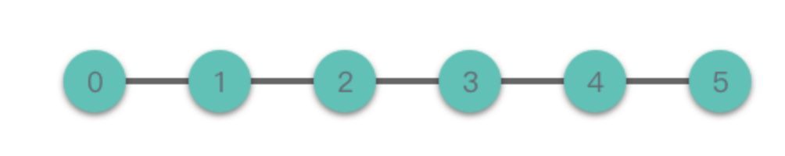
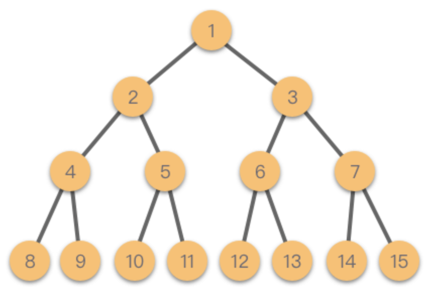
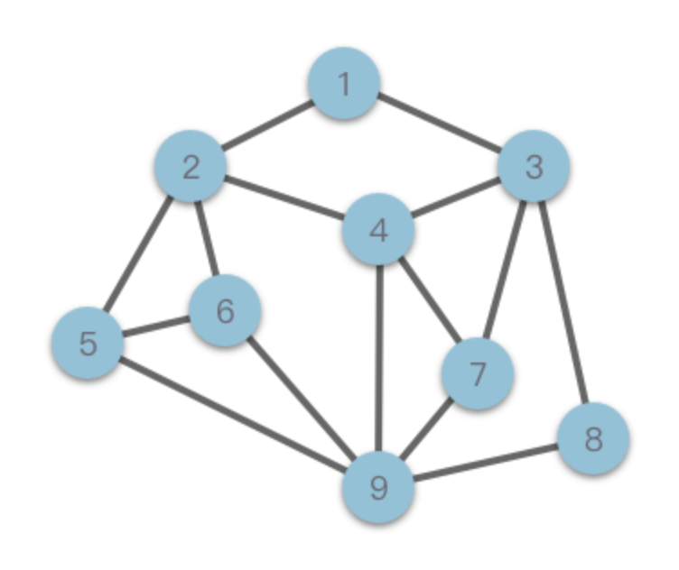
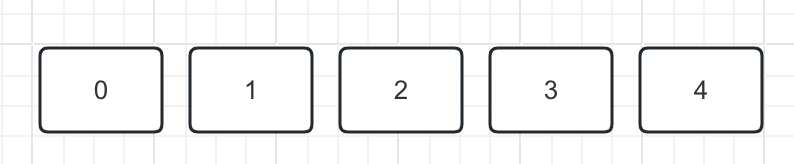
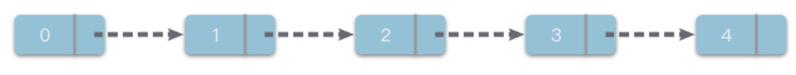

## 简介

> 程序 = 数据结构 + 算法

对于程序设计来说，数据结构和算法的关系密不可分

简单地说：
- `数据结构`是数据的计算机表示和相应的一组操作
- `算法`是解决问题的方法或过程
  > 算法就是将输入转换为输出的过程
- `程序`则是算法和数据结构的具体实现

以做菜作为举例，`数据结构`是食材和调料，`算法`可以看作是不同的烹饪方式或菜谱，不同的食材和调料结合不同的烹饪方式，就有不同的组合

> 学习算法和数据结构的目的在于当设计程序时，**选择更加合适的`数据结构`，使用更优的`算法`（即，花费时间更少、占用空间更小）**

## 数据结构

数据结构（`Data Structure`）：指相互之间存在着一种或多种关系的数据元素的集合和该集合中数据元素之间的关系组成
> 简单地说：数据结构就是带有结构特性的数据元素的集合

学习数据结构，就是为了了解和掌握计算机中的数据是以何种方式进行组织、存储的

数据结构分类：
- `逻辑结构`：反映数据间的逻辑关系
- `存储结构`：数据结构在计算机中的表示（存储方式）

### 逻辑结构

**1. 集合**

> 结构中的数据元素除了同属于一种类型外，无其它关系(无逻辑关系)

集合中的数据元素是无序的，且每个数据元素都是唯一的，很像数学意义上的集合

**2. 线性结构**

> 结构中的数据元素之间是`一对一`的关系(线性表)

线性结构中的数据元素（除第一个和最后一个元素），左侧和右侧分别只有一个数据与其相邻
> 线性结构类型包括：数组、链表，以及由它们衍生出来的栈、队列、哈希表

**3. 树形结构**

> 结构中的数据元素之间是`一对多`的关系(非线性)

树是一种非线性结构，树是递归的，在树的定义中又用到了树的概念

最简单的树形结构是二叉树，这种结构可以简单的表示为：根、左子树、右子树，左子树和右子树又有自己的子树... 除了二叉树，树形结构类型还包括：多叉树、字典树等

**4. 图状结构或网状结构**

> 结构中的数据元素之间是`多对多`的关系(非线性)

图形结构是一种比树形结构更复杂的非线性结构，用于表示元素与元素之间的关系。一张图由一些称为`顶点`或`结点`和连结这些点的直线或曲线（称为`边`）组成

在图形结构中，任意两个结点间都可能相关，即结点间的邻接关系可以是任意的。图形结构类型包括：无向图、有向图、连通图等

### 存储结构

**1. 顺序存储结构**

> Sequential Storage Structure，将数据元素存放在一片地址连续的存储单元里，数据元素之间的逻辑关系通过数据元素的存储地址来直接反映

在顺序存储结构中，逻辑上相邻的数据元素在物理地址上也必然相邻 

优点：
- 简单、易理解
- 实际占用最少的存储空间
  
缺点：
- 需要占用一片地址连续的存储单元，并且存储分配要事先进行
- 对于一些操作的时间效率较低（移动、删除元素等操作）

**2. 链式存储结构**

> Linked Storage Structure，将数据元素存放在任意的存储单元里，存储单元可以连续，也可以不连续

链式存储结构中，逻辑上相邻的数据元素在物理地址上的表现是随机的（可能相邻，也可能不相邻）

链式存储结构中，一般将每个数据元素占用的若干单元的组合称为一个链结点，每个链结点不仅要存放一个数据元素的数据信息，还要存放一个指向该元素在逻辑关系上的直接后继元素所在链结点的地址，该地址被称为`指针`
> 换句话说，数据元素间的逻辑关系是通过`指针`来间接反映的

优点：
- 存储空间不必事先分配，在需要存储空间时可以临时申请，不会造成空间的浪费
- 一些操作的时间效率远比顺序存储结构高（插入、移动、删除元素）
  
缺点：
- 链式存储结构比顺序存储结构的空间开销大（不仅数据元素本身的数据信息要占用存储空间，指针也需要占用存储空间）

**3. 索引存储结构**

**4. 散列存储结构**

## 算法

> `算法（Algorithm）`：解决特定问题求解步骤的准确而完整的描述，在计算机中表现为一系列指令的集合，算法代表着用系统的方法描述解决问题的策略机制

简单地说，`算法`指的是解决问题的方法

算法是某一系列运算步骤，它表达解决某一类计算问题的一般方法，对这类方法的任何一个输入，它可以按步骤一步一步计算，最终产生一个输出

它不依赖于任何一种语言，可以使用**自然语言、编程语言（Python、C、C++、Java 等）**描述，也可以使用**伪代码、流程图**来表示

### 算法的基本特性

算法应必须具备以下特性：
- `输入`：对于待解决的问题，都要以某种方式交给对应的算法，在算法开始之前最初赋给算法的参数称为输入
  > 一个算法可以有多个输入，也可以没有输入(如计算 1+2+...+100，这是对固定问题的求解，可以看做没有输入)

- `输出`：算法是为了解决问题存在的，最终总要返回一个结果，所以至少需要一个或多个参数作为算法的输出
  
- `有穷性`：算法必须在有限的步骤内结束，且应在一个可接受的时间内完成
  
- `确定性`：组成算法的每一条指令必须有着清晰明确的含义，不能令人在理解时产生二义性或者多义性，即算法的每个步骤都必须准确定义而无歧义
  
- `可行性`：算法的每一步操作必须具有可执行性，在当前环境条件下可以通过有限次运算实现，即每一步都能通过执行有限次数完成，且可以转换为程序在计算机上运行并得到正确的结果

### 算法设计衡量

对于给定的问题，往往会有多种算法来解决，而不同算法的成本和效率也是不同的。一个好的算法应该考虑以下因素：
- `正确性`：指算法能够满足具体问题的需求、程序运行正常、无语法错误、能通过相应测试...
- `可读性`：指算法遵循标识符命名规则、简洁易懂、注释语句恰当、方便自己和他人阅读，便于后期修改和调试
- `健壮性`：指算法对非法数据以及操作有较好的反应和处理

> 这 3 个因素是算法的基本标准，是所有算法所必须满足的

但一般对好的算法的评判标准是从以下两个方面来衡量：
- 运行时间更少，即`时间复杂度`更低
- 占用内存空间更小，`空间复杂度`更低

现实中算法，往往是需要同时从时间复杂度、空间复杂度两个方面考虑问题。当然能同时兼顾运行时间和占用空间的算法肯定是比较好的，但总是会有各种各样的因素导致了运行时间和占用空间不可兼顾
- 在程序运行时间过高时，可以考虑`以空间换时间`
- 在程序对运行时间要求不是很高、而设备内存又有限的情况下，选择占用空间更小，但需牺牲一定量的时间的算法

