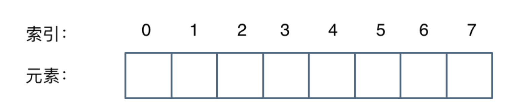
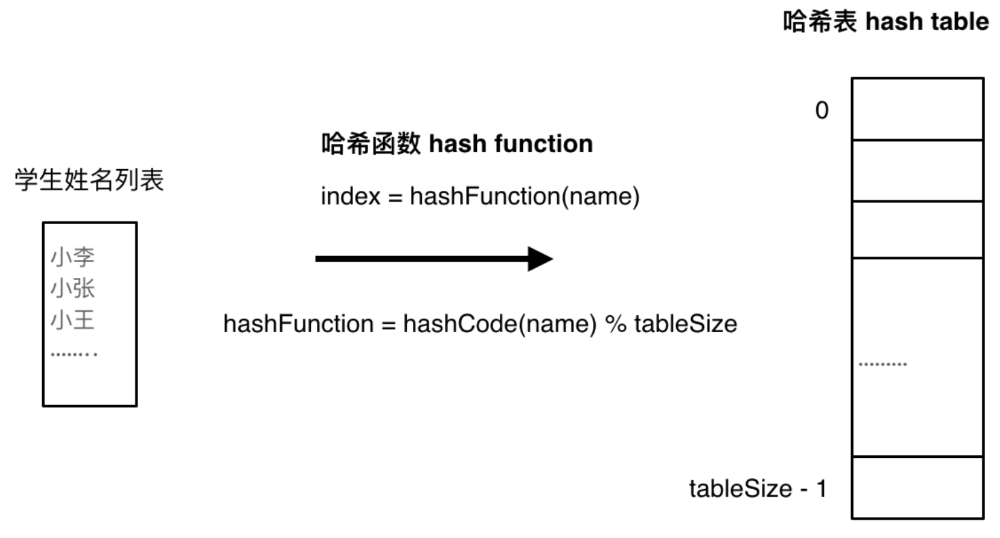
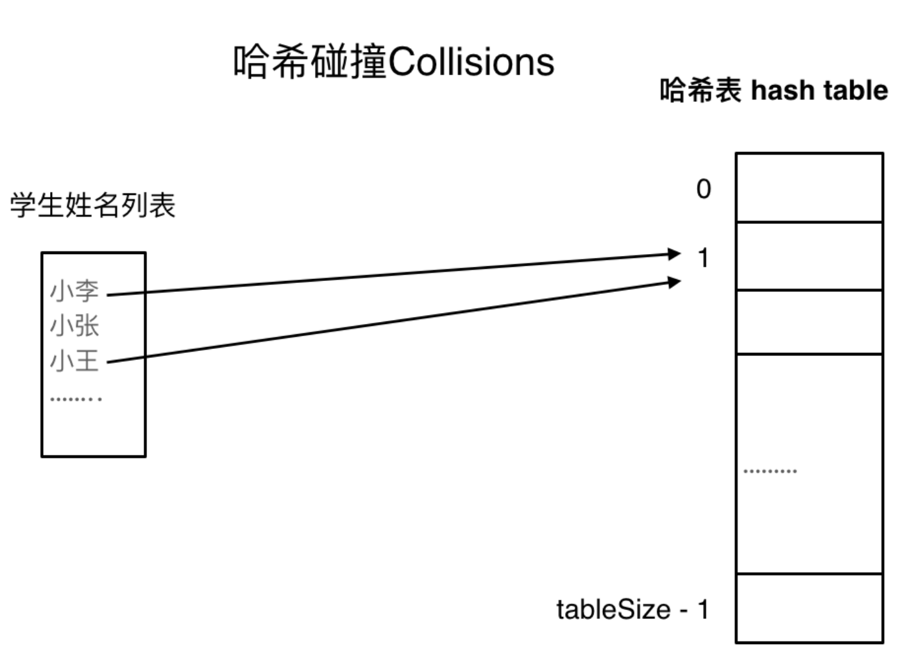
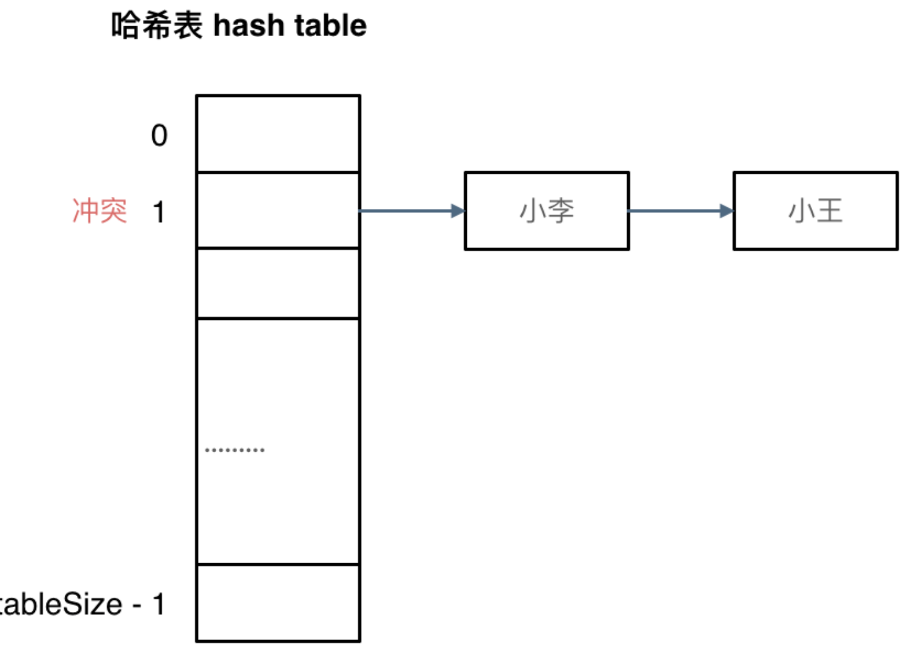
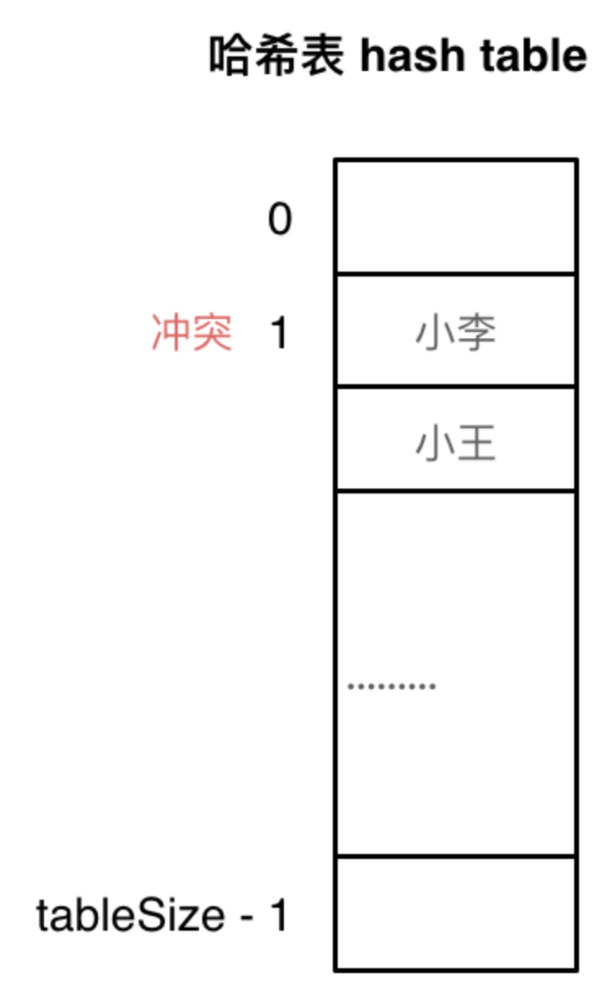

# 哈希表

### 理论基础

`哈希表`（`Hash table`，也称为`散列表`或`散列映射`），是**根据关键码的值而直接进行访问**的数据结构
> 是一种实现了关联数组抽象数据类型的数据结构，它通过一个`哈希函数`将键(key)映射到表中的一个位置来访问记录，以加快查找的速度
> 
> 这个映射过程称为`哈希化`，这个位置称为`哈希值`

其实直白来讲数组就是一张哈希表，哈希表中关键码就是数组的索引下标，然后通过下标直接访问数组中的元素，如下图所示：

哈希表能解决什么问题呢？-- **一般哈希表是用来快速判断一个元素是否出现集合里**，如要查询一个名字是否在这所学校里

> 要枚举的话时间复杂度是 `O(n)`，但若使用哈希表则只需要 `O(1)` 就可以做到

只需初始化把这所学校里学生的名字都存在哈希表里，查询时通过索引直接就可知道这位同学在不在这所学校里 -- 将学生姓名映射到哈希表上就涉及到了`哈希函数（hash function）`

**哈希表的基本组成包括：** 

- `哈希函数`：
  
  - 负责将输入的键转换为索引
  - 一个好的哈希函数应尽量减少冲突，即不同的键尽量映射到表的不同位置
  
  

  若 hashCode 得到的数值大于哈希表的大小，即 tableSize ，怎么办？
  - 为了保证映射出来的索引数值都落在哈希表上，会再次对数值做一个`取模`的操作，这样就保证学生姓名一定可以映射到哈希表上
  
  若学生数量大于哈希表的大小，此时就算哈希函数计算的再均匀，也避免不了会有几位学生的名字同时映射到哈希表（即，同个索引下标的位置）

  此时就需要`冲突解决`

  

- `数组`：
  - 这是存储实际数据（键值对）的地方
  - 哈希表的大小通常是预先设定的，有些哈希表实现可以动态扩展大小

- `冲突解决（哈希碰撞）`：
  
  - 当两个键的哈希值相同时，则会发生冲突
  - 常见的解决方法：
    > (1) `链表法`，即在每个数组槽位存储一个链表，所有哈希值相同的元素都放在同一个链表中  
    > (2) `开放寻址法`，即探测数组的其他位置，直到找到空槽位
  
  链表法(拉链法)：

  

  > 数据规模是 dataSize， 哈希表的大小为 tableSize
  > 
  > 注意：该方法就是要选择适当的哈希表的大小，这样既不会因为数组空值而浪费大量内存，也不会因为链表太长而在查找上浪费太多时间

  开放寻址法(线性探测法)：

  > 注意：使用该方法时，一定要保证 tableSize 大于 dataSize，因为需要依靠哈希表中的空位来解决碰撞问题

  

### 哈希表的特点

`时间复杂度`：
- 理想状态下，哈希表的插入、删除和查找操作的时间复杂度接近于 `O(1)`
- 但最坏的情况下，如发生大量冲突时，操作的时间复杂度可能退化到 `O(n)`  
  
`应用广泛`：哈希表在编程中非常常用，尤其是在`需要快速数据查找的场景`，如`数据库索引`、`缓存实现`、`对象存储`等  

`动态调整`：哈希表通常会在`负载因子`（**表中已有元素占总槽数的比例**）达到一定阈值时进行扩展，以保持操作的高效性

### 常见的三种哈希结构

当想使用哈希法来解决问题的时候，一般会选择如下三种数据结构：
- 数组
- set(集合)
- map(映射)

在 `C++` 中，set 和 map 分别提供以下三种数据结构，其底层实现以及优劣如下表所示：

| 集合 | 底层实现 | 是否有序 | 数值是否可以重复 | 能否更改数值 | 查询效率 | 增删效率 |
| --- | --- | --- | --- | --- | --- | --- |
| std::set | 红黑树 | 有序 | 否 | 否 | O(log n) | O(log n) |
| std::multiset | 红黑树 | 有序 | 是 | 否 | O(log n) | O(log n) |
| std::unordered_set | 哈希表 | 无序 | 否 | 否 | O(1) | O(1) |

`std::unordered_set` 底层实现为`哈希表`

`std::set` 和 `std::multiset` 的底层实现是`红黑树(一种平衡二叉搜索树)`，所以 `key` 值是有序的，但 **`key` 不可以修改**，改动 `key` 值会导致整棵树的错乱，所以只能`删除和增加`

| 集合 | 底层实现 | 是否有序 | 数值是否可以重复 | 能否更改数值 | 查询效率 | 增删效率 |
| --- | --- | --- | --- | --- | --- | --- |
| std::set | 红黑树 | key 有序 | key 不可重复 | key 不可修改 | O(log n) | O(log n) |
| std::multiset | 红黑树 | key 有序 | key 可重复 | key 不可修改 | O(log n) | O(log n) |
| std::unordered_set | 哈希表 | key 无序 | key 不可重复 | key 不可修改 | O(1) | O(1) |

`std::unordered_map` 底层实现为`哈希表`

`std::map` 和 `std::multimap` 的底层实现是`红黑树`；同理，`std::map` 和 `std::multimap` 的 `key` 也是有序的（这个问题也经常作为面试题，考察对语言容器底层的理解）

当要使用`集合`来解决哈希问题时，优先使用 `unordered_set`，因为它的查询和增删效率是最优的 
> - 若需要集合是`有序`的，就用 `set`
> 
> - 若要求`不仅有序还要有重复数据`，就用 `multiset`

再来看一下 `map`，`map` 是一个 `key value` 的数据结构，`map` 中对 `key` 是有限制但对 `value` 没有限制（因为 `key` 的存储方式使用`红黑树`实现的）

> 其他语言例如：`Java` 里的 `HashMap、TreeMap` 也是一样的原理，可以灵活贯通

虽然 `std::set、std::multiset` 的底层实现是`红黑树`，使用`红黑树`来`索引和存储`，不过使用方式还是`哈希法`，即 **`key` 和 `value`** -- 所以使用这些数据结构来解决映射问题的方法依然称之为`哈希法`， `map` 同理

### 总结

**当遇到要快速判断一个元素是否出现集合里时，就要考虑`哈希法`**

哈希法是**牺牲了空间换取时间**，因为要使用**额外的`数组`、`set` 或 `map` 来存放数据**

因此，若做面试题时遇到需要**判断一个元素是否出现过的场景**也应第一时间想到哈希法！