# KMP 算法

### 概念

`KMP` 算法（`Knuth-Morris-Pratt` 算法），是一个著名的字符串匹配算法，效率很高，但确实有点复杂

`KMP` 主要应用在字符串匹配上，常用于在一个文本串 `s` 内查找一个模式串 `p` 的出现位置 

`KMP` 的经典思想就是: 当出现字符串不匹配时，可以记录一部分之前已经匹配的文本内容，利用这些信息避免从头再去做匹配

因此如何记录已经匹配的文本内容，是 `KMP` 的重点，即 `next` 数组肩负的重任

### 前缀表

`next` 数组就是一个前缀表（`prefix table`）

`前缀表`是用来`回退`的，它记录了`模式串`与`主串(文本串)`不匹配时，模式串应从哪里开始重新匹配，也意味着在某个字符失配时，前缀表会告诉你下一步匹配中，模式串应该跳到哪个位置

> 时间复杂度 `O(N)`，空间复杂度 `O(M)`

例子：要在文本串 `aabaabaafa` 中查找是否出现过一个模式串 `aabaaf`

可以看出文本串中第六个字符 `b` 和模式串的第六个字符 `f` 不匹配，此时若是暴力匹配，当发现不匹配时就要从头匹配了，嵌套 `for` 循环，时间复杂度 `O(MN)`，空间复杂度 `O(1)`
> 最主要的问题：若字符串中重复的字符比较多，该算法就显得很蠢

但若使用`前缀表`，就不会从头匹配，而是从上次已匹配的内容开始匹配，找到了模式串中第三个字 `b` 继续开始匹配

**`前缀表`是如何记录的呢？**

前缀表：记录下标 `i` 之前（包括 `i`）的字符串中，有多大长度的相同前缀后缀

字符串的`前缀`：指`不包含最后一个字符`的所有`以第一个字符开头`的`连续子串`
> 以 `aabaaf` 为例，它的前缀有：a、aa、aab、aaba、aabaa

`后缀`：指不包含第一个字符的所有以`最后一个字符结尾`的连续子串
> 以 aabaaf 为例，它的后缀有：f、af、aaf、baaf、abaaf

`前缀表`要求的就是`相同前后缀的长度`

以 `aabaaf` 为例，最长相等前后缀数量分别如下：
- a -> 0
- aa -> 1
- aab -> 0
- aaba -> 1
- aabbaa -> 2
- aabaaf -> 0

### 为什么一定要用前缀表

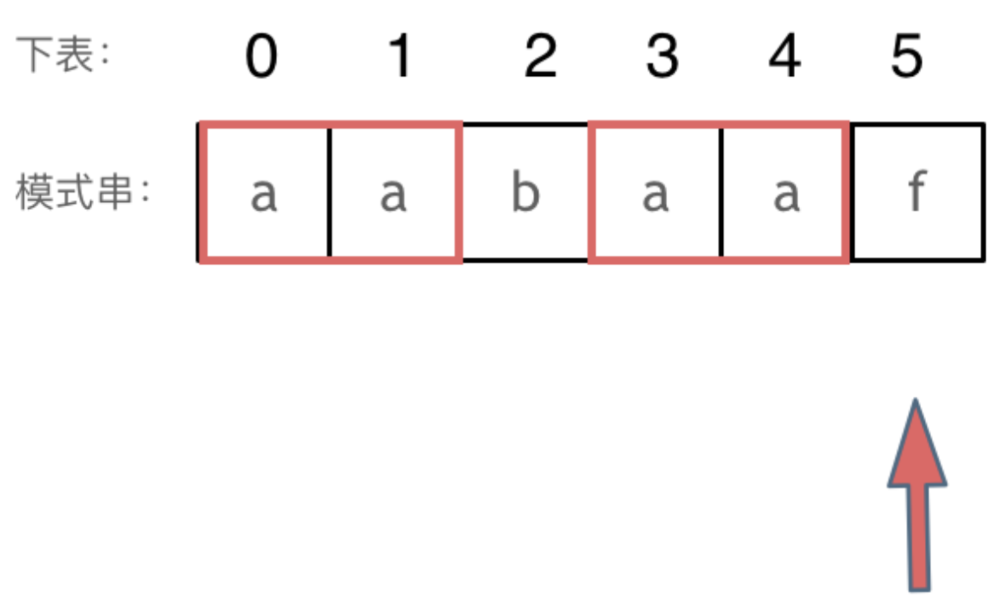

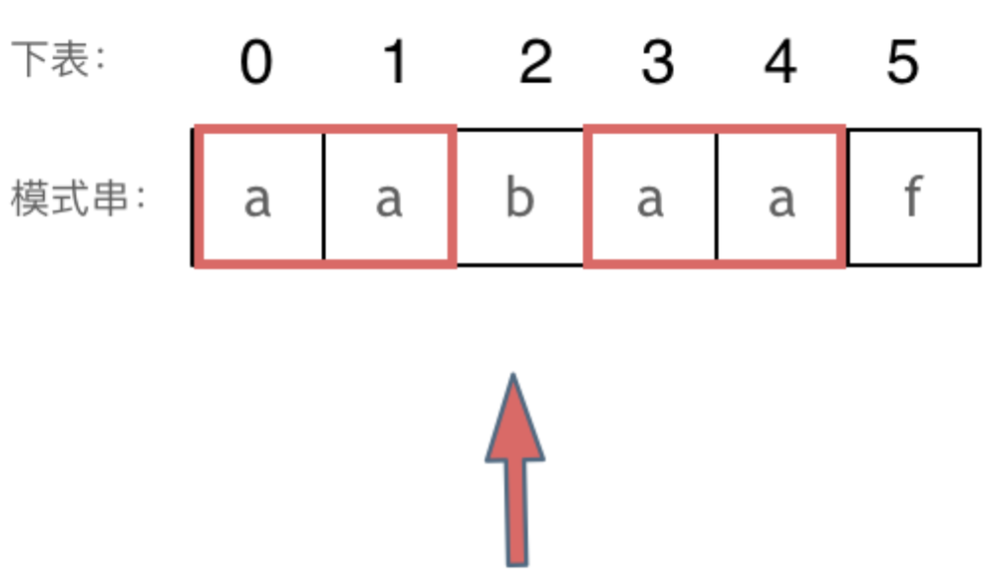

下标 `5` 之前这部分的字符串（即字符串 `aabaa`）的最长相等的前缀和后缀字符串是`子字符串 aa`，因为找到了最长相等的前缀和后缀，匹配失败的位置是后缀子串的后面，则找到与其相同的前缀的后面重新匹配即可

所以**前缀表具有告诉当前位置匹配失败、跳到之前已经匹配过的地方的能力**

### 计算前缀表

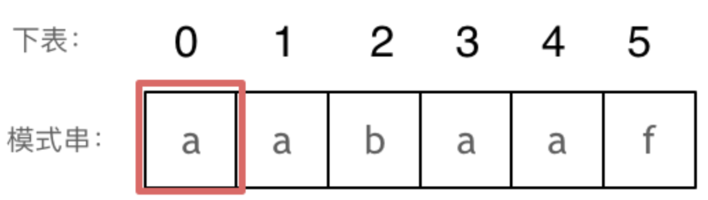

长度为前 `1` 个字符的子串 `a`，最长相同前后缀的长度为 `0`
> 注意：
> - 字符串的`前缀`是指不包含最后一个字符的所有以第一个字符开头的连续子串
> - `后缀`是指不包含第一个字符的所有以最后一个字符结尾的连续子串

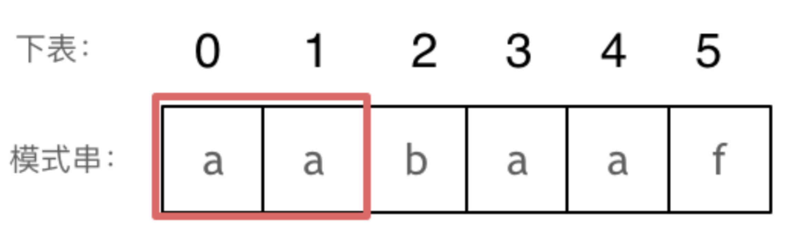

长度为前 `2` 个字符的子串 `aa`，最长相同前后缀的长度为 `1`

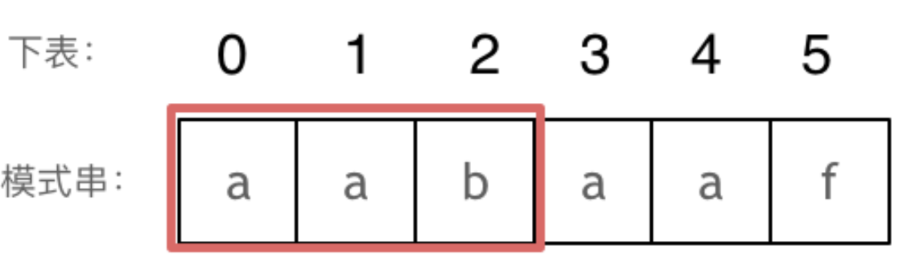

长度为前 `3` 个字符的子串 `aab`，最长相同前后缀的长度为 `0`

以此类推：
- 长度为前 `4` 个字符的子串 `aaba`，最长相同前后缀的长度为 `1`
- 长度为前 `5` 个字符的子串 `aabaa`，最长相同前后缀的长度为 `2`
- 长度为前 `6` 个字符的子串 `aabaaf`，最长相同前后缀的长度为 `0`
  
把求得的最长相同前后缀的长度就是对应前缀表的元素，如图：

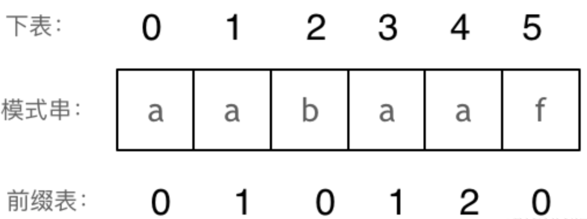

> 可模式串与前缀表对应位置的数字表示的就是：下标 `i` 之前（包括 `i`）的字符串中，有多大长度的`相同前缀后缀`

找到的不匹配的位置，则此时要看它的前一个字符的前缀表的数值是多少
> 为什么要前一个字符的前缀表的数值呢，因为要找前面字符串的最长相同的前缀和后缀

### 前缀表与 next 数组

很多 `KMP` 算法的实现都是使用 `next` 数组来做回退操作，则 `next` 数组与前缀表有什么关系？
- `next` 数组就可以是前缀表，但很多实现都是`把前缀表统一减一`（`右移一位`，初始位置为 `-1`）之后作为 `next` 数组

其实这并不涉及到 `KMP` 的原理，而是具体实现，`next` 数组既可以是前缀表，也可以是前缀表统一减一（右移一位，初始位置为 `-1`）

### 使用 next 数组来匹配

以下以`前缀表统一减一`之后的 `next` 数组来做演示
> 注意：`next` 数组是新前缀表（旧前缀表已统一减一）

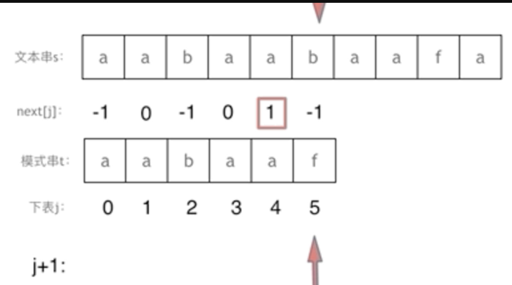

> 前缀表无论是`统一减一`还是`不减一`得到的 `next` 数组仅仅是 `kmp` 的实现方式的不同

### 时间复杂度分析

其中 `n` 为文本串长度，`m` 为模式串长度，因为在匹配的过程中根据前缀表不断调整匹配的位置，可以看出匹配的过程是 `O(n)`，之前还要单独生成 `next` 数组，时间复杂度是 `O(m)` --> 所以整个 `KMP` 算法的时间复杂度是 `O(n+m)` 

空间复杂度：`O(m)`，只需保存模式串字符串的前缀表

> 暴力的解法的时间复杂度显而易见是 `O(n×m)`，所以 `KMP` 在字符串匹配中极大地提高了搜索的效率

### KMP 算法运行过程示例

首先，列出模式串 `P` 的所有子串：

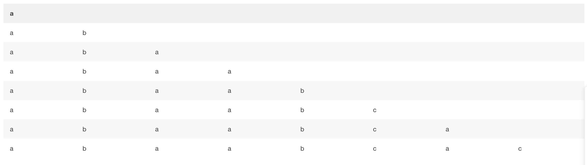

然后，求每一个子串的所有前缀与后缀
> `前缀`指除了最后一个字符外，一个字符串的全部头部组合；`后缀`指除了第一个字符外，一个字符串的全部尾部组合

以第五列为例进行演示：

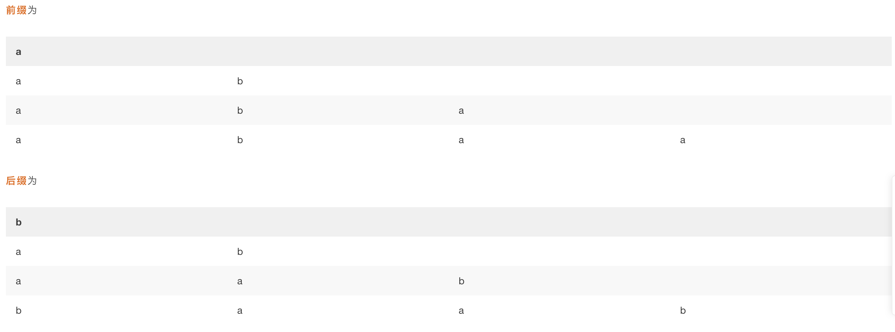

因此，它的前缀后缀的公共元素的最大长度为 `2`

求得原模式串 `P` 的子串对应的各个前缀后缀的公共元素的`最大长度表`如下图：

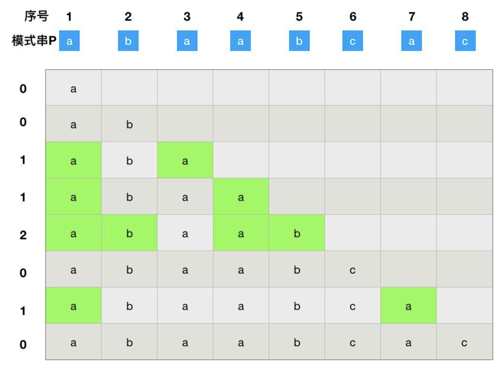

根据最大长度表去求 `next` 数组：`next` 数组相当于`最大长度值`整体向右移动一位，然后初始值赋为`-1`

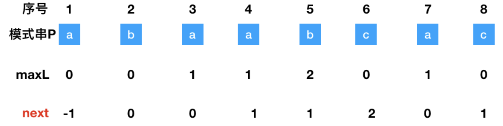

将模式串 `P` 与文本串 `S` 的字母一个个进行匹配，当失配时模式串向右移动

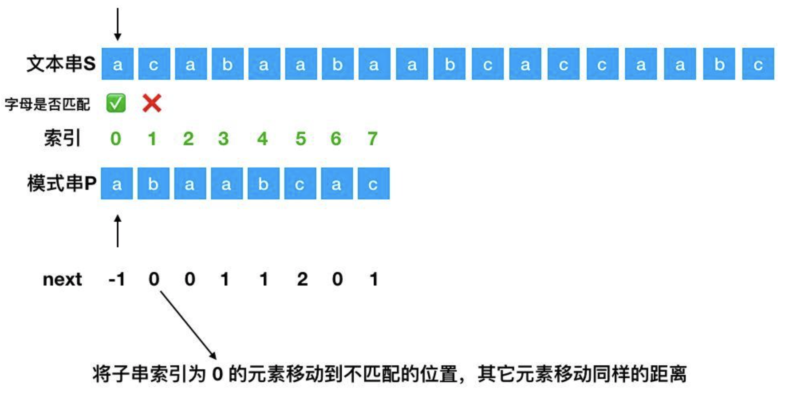

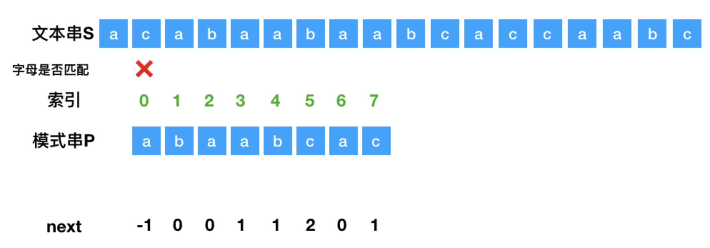

如模式串的 `b` 与文本串的 `c` 失配，找出失配处模式串的 `next`数组里面对应的值，这里为 `0`，然后将索引为 `0` 的位置移动到失配处

