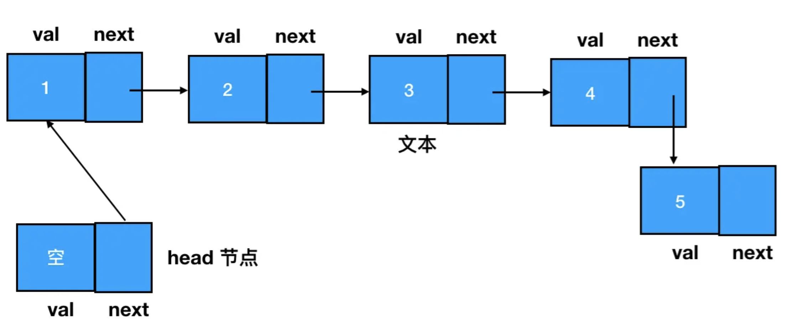
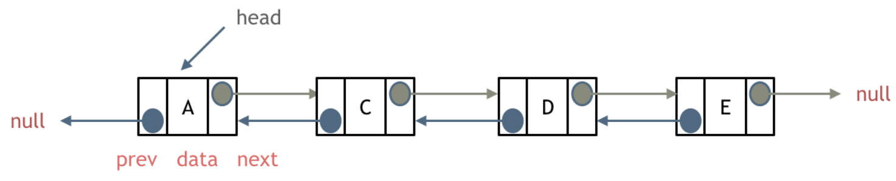
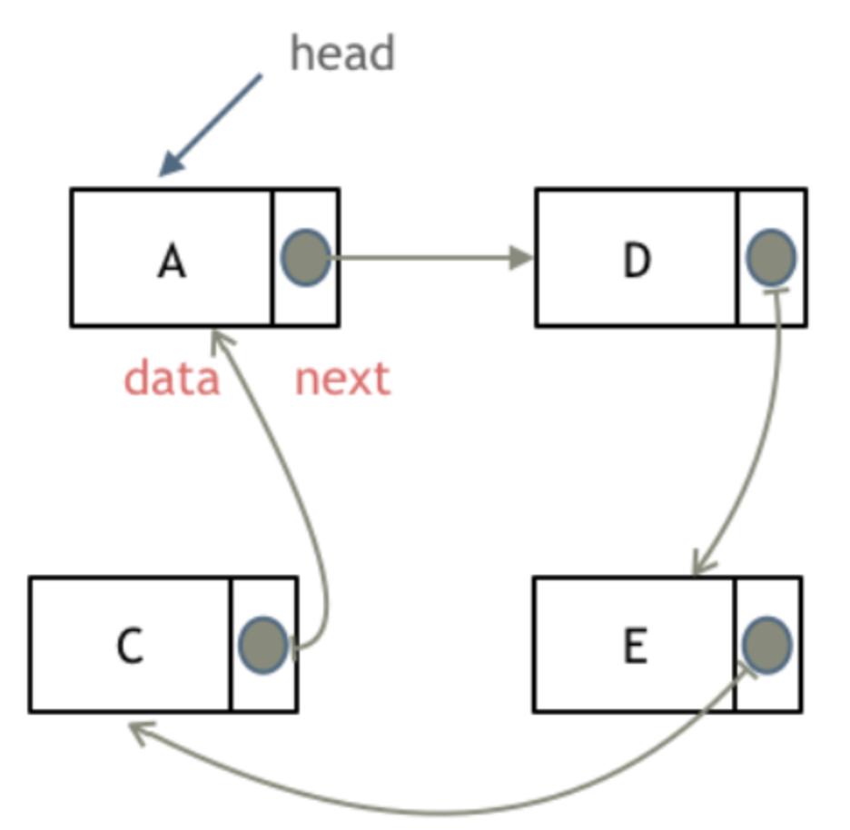
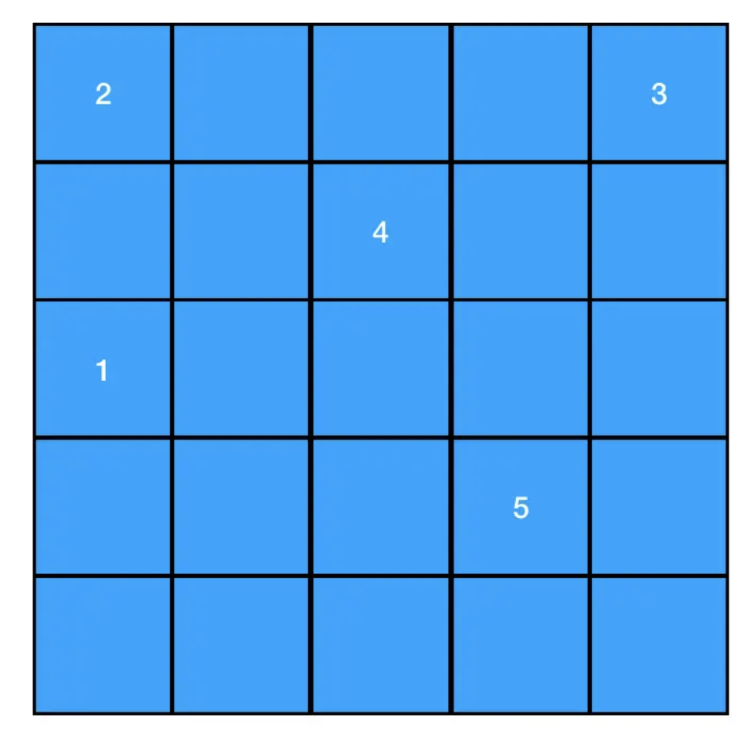
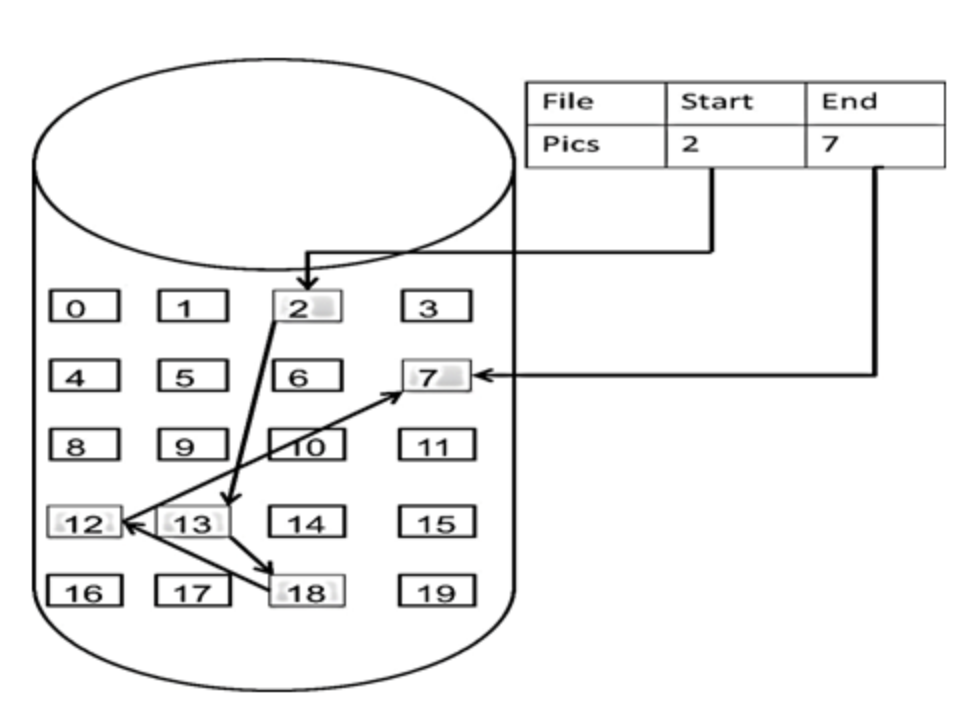
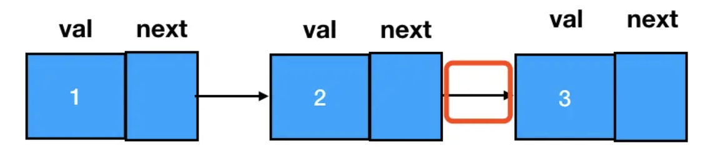
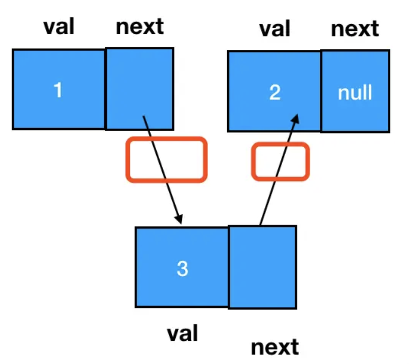
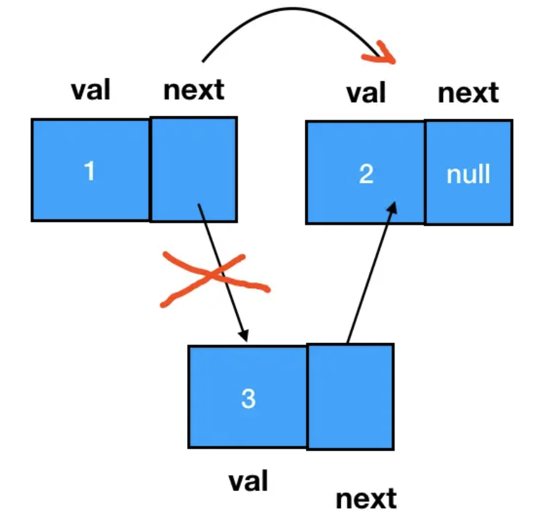

# 链表

### 理论基础

链表和数组相似，它们都是：`有序的列表`、`线性结构`（有且仅有一个前驱、有且仅有一个后继）

`链表`是一种通过 `指针` 串联在一起的`线性结构`

> 每个节点由两部分组成：一个`数据域` (存储当前节点所存储的数据值)，一个`指针域`（存放指向下一个节点的指针）
> 
> 最后一个节点的指针域指向 `null`（空指针）
> 
> 链表的`入口节点` -> 链表的`头结点`，即 `head`

**要想访问链表中的任何一元素，都得从`起点节点`开始，逐个访问 `next`，一直访问到目标结点为止**。为了确保起点节点是可抵达的，有时还会设定一个 head 指针来专门指向链表的开始位置



> 链表是一种兼具`递归`和`迭代`性质的数据结构

### 链表的类型

**1. 单链表**：`单链表`中的指针域只能指向节点的下一个节点，上面所述就是单链表

**2. 双链表**：

每个节点有`两个指针域`，一个指向下一个节点，一个指向上一个节点

> 因此，双链表既可以`向前查询`也可以`向后查询`



**3. 循环链表**：

循环链表，顾名思义，就是`链表首尾相连`
> 循环链表可以用来解决`约瑟夫环`问题



### 链表的存储方式

数组在内存中是连续分布的，但链表在内存中可不是连续分布的 

链表中，数据单位的名称叫做`“结点”`，而结点和结点的分布，**在内存中可以是`离散`的(这个`离散`是相对于数组的`连续`来说的)**

如：一个内容为 1->2->3->4->5 的链表，在内存中的形态可以是散乱如下的：



链表会通过**指针域的指针**链接在内存中各个节点，通过指针串联在一起
> 所以链表中的结点在内存中不是连续分布的 ，而是散乱分布在内存中的某地址上，分配机制取决于操作系统的内存管理



### 链表的定义

下面给出 Java/Python/JS 三种定义方式

```java
public class ListNode {
  // 节点的值
  int val;
  
  // 下一个节点
  ListNode next;
  
  // 节点的构造函数(无参)
  public ListNode() {
  }
  
  // 节点的构造函数(有一个参数)
  public ListNode(int val) {
    this.val = val;
  }
  
  // 节点的构造函数(有两个参数)
  public ListNode(int val, ListNode next) {
    this.val = val;
    this.next = next;
  }
}
```
```python
class ListNode:
  def __int__(self, val, next = None):
    self.val = val
    self.next = next
```
```js
class ListNode {
  val;
  next = null;
  construcctor(val) {
    this.val = val;
    this.next = null;
  }
}
```

### 链表的操作

**添加节点**

链表元素的添加和删除操作，本质上都是在围绕 `next` 指针做文章

直接在尾部添加结点相对比较简单，改变 next 指针即可，如要把 node3 添加到 node2 所在链表的尾部，直接把 node2 的 next 指针指向 node3 即可：



若在两个结点间插入一个结点，由于链表有时会有头结点，这时即便是往链表头部增加结点，其本质也是“在头结点和第一个结点间插入一个新结点”

要想完成这个操作，需要变更的是`前驱结点`和`目标结点`的 next 指针指向，过程如下图：  



```js
// 若目标结点本来不存在，则手动创建
const node3 = new ListNode(3);     
// 把 node3 的 next 指针指向 node2（即 node1.next）
node3.next = node1.next
// 把 node1 的 next 指针指向 node3
node1.next = node3
```

> 注意：若 `node1.next = node3` 在 `node3.next = node1.next` 前，将**丢失对 `node2` 的引用**，因为 node1.next 将指向 node3，且不会有对 node2 的引用，这会有效地从列表中删除 node2

**删除节点**

> 注意，删除的标准是：在链表的遍历过程中，无法再遍历到某个结点的存在

按照这个标准，要想遍历不到 node3，直接让它的前驱结点 node1 的 next 指针跳过它、指向 node3 的后继即可：



> 在 `C++` 里最好是再`手动释放`这个删除的节点，释放这块内存  
> 
> 其他语言如 `Java、Python、Js` 有自己的内存回收机制，不用手动释放

如此一来，node3 就成为了一个完全不可抵达的结点，会被 JS 的垃圾回收器自动回收掉，这个过程用代码表述如下：
```js
node1.next = node3.next;
```

> 注意：在涉及链表删除操作的题目中，重点不是定位目标结点，而是**定位目标结点的`前驱结点`**  
> 
> 做题时，可使用一个指针来定位目标结点的前驱结点，如说上述例子中，只要能拿到 node1 即可
> ```js
> // 利用 node1 可以定位到 node3 
> const target = node1.next;
> node1.next = target.next;
> ```

### 数组和链表的性能分析

| / | 插入/删除(时间复杂度) | 查询(时间复杂度) | 适用场景 |
| --- | --- | --- | --- |
| 数组 | O(n) | O(1) | 数据量固定，频繁查询，较少删除 |
| 链表 | O(1) | O(n) | 数据量不固定，频繁增删，较少查询 |

在链表中，`添加`和`删除`操作的复杂度是固定的，即不管链表里面的结点个数 n 有多大，只要明确要插入/删除的目标位置，则仅仅是**改变目标结点及其前驱/后继结点的指针指向** --> 因此链表增删操作的复杂度是常数级别的复杂度，即 `O(1)`

链表的弊端：**当试图读取某一个特定的链表结点时，必须从头遍历整个链表来查找它**。如要在一个长度为 n（n > 10） 的链表里，随着链表长度的增加，搜索的范围也会变大、遍历其中任意元素的时间成本自然随之提高 --》 这个变化的趋势呈线性规律，即 `O(n)`

而在数组中，直接通过`索引`访问，这个查询操作的复杂度会被降级为常数级别 `O(1)`

> **数组**在定义时，**长度就是`固定`的**，若想改动数组的长度，就需重新定义一个新的数组
> 
> **链表**的长度可以是不固定的且可以`动态增删`，适合数据量不固定、频繁增删、较少查询的场景

### 单链表代码实现

```java
import java.util.NoSuchElementException;

public class MyLinkedList2<E> {

    private static class Node<E> {
        E val;
        Node<E> next;

        Node(E val) {
            this.val = val;
            this.next = null;
        }
    }

    private Node<E> head;
    private Node<E> tail; // 实际的尾部节点引用
    private int size;

    public MyLinkedList2() {
        this.head = new Node<>(null);
        this.tail = head;
        this.size = 0;
    }

    public void addFirst(E e) {
        Node<E> newNode = new Node<>(e);
        newNode.next = head.next;
        head.next = newNode;
        if (size == 0) {
            tail = newNode;
        }
        size++;
    }

    public void addLast(E e) {
        Node<E> newNode = new Node<>(e);
        tail.next = newNode;
        tail = newNode;
        size++;
    }

    public void add(int index, E element) {
        checkPositionIndex(index);

        if (index == size) {
            addLast(element);
            return;
        }

        Node<E> prev = head;
        for (int i = 0; i < index; i++) {
            prev = prev.next;
        }
        Node<E> newNode = new Node<>(element);
        newNode.next = prev.next;
        prev.next = newNode;
        size++;
    }

    public E removeFirst() {
        if (isEmpty()) {
            throw new NoSuchElementException();
        }
        Node<E> first = head.next;
        head.next = first.next;
        if (size == 1) {
            tail = head;
        }
        size--;
        return first.val;
    }

    public E removeLast() {
        if (isEmpty()) {
            throw new NoSuchElementException();
        }

        Node<E> prev = head;
        while (prev.next != tail) {
            prev = prev.next;
        }
        E val = tail.val;
        prev.next = null;
        tail = prev;
        size--;
        return val;
    }

    public E remove(int index) {
        checkElementIndex(index);

        Node<E> prev = head;
        for (int i = 0; i < index; i++) {
            prev = prev.next;
        }

        Node<E> nodeToRemove = prev.next;
        prev.next = nodeToRemove.next;
        if (index == size - 1) { // 删除的是最后一个元素
            tail = prev;
        }
        size--;
        return nodeToRemove.val;
    }

    // 查
    public E getFirst() {
        if (isEmpty()) {
            throw new NoSuchElementException();
        }
        return head.next.val;
    }

    public E getLast() {
        if (isEmpty()) {
            throw new NoSuchElementException();
        }
        return getNode(size - 1).val;
    }

    public E get(int index) {
        checkElementIndex(index);
        Node<E> p = getNode(index);
        return p.val;
    }

    // 改
    public E set(int index, E element) {
        checkElementIndex(index);
        Node<E> p = getNode(index);

        E oldVal = p.val;
        p.val = element;

        return oldVal;
    }

    public int size() {
        return size;
    }

    public boolean isEmpty() {
        return size == 0;
    }

    private boolean isElementIndex(int index) {
        return index >= 0 && index < size;
    }

    private boolean isPositionIndex(int index) {
        return index >= 0 && index <= size;
    }

    // 检查 index 索引位置是否可以存在元素
    private void checkElementIndex(int index) {
        if (!isElementIndex(index))
            throw new IndexOutOfBoundsException("Index: " + index + ", Size: " + size);
    }

    // 检查 index 索引位置是否可以添加元素
    private void checkPositionIndex(int index) {
        if (!isPositionIndex(index))
            throw new IndexOutOfBoundsException("Index: " + index + ", Size: " + size);
    }

    // 返回 index 对应的 Node
    // 注意：请保证传入的 index 是合法的
    private Node<E> getNode(int index) {
        Node<E> p = head.next;
        for (int i = 0; i < index; i++) {
            p = p.next;
        }
        return p;
    }
}
```

### 双链表代码实现

```java

import java.util.NoSuchElementException;

public class MyLinkedList<E> {
    // 虚拟头尾节点
    final private Node<E> head, tail;
    private int size;

    // 双链表节点
    private static class Node<E> {
        E val;
        Node<E> next;
        Node<E> prev;

        Node(E val) {
            this.val = val;
        }
    }

    // 构造函数初始化虚拟头尾节点
    public MyLinkedList() {
        this.head = new Node<>(null);
        this.tail = new Node<>(null);
        head.next = tail;
        tail.prev = head;
        this.size = 0;
    }

    // 增
    public void addLast(E e) {
        Node<E> x = new Node<>(e);
        Node<E> temp = tail.prev;
        // temp <-> tail
        temp.next = x;
        x.prev = temp;

        x.next = tail;
        tail.prev = x;
        // temp <-> x <-> tail
        size++;
    }

    public void addFirst(E e) {
        Node<E> x = new Node<>(e);
        Node<E> temp = head.next;
        // head <-> temp
        temp.prev = x;
        x.next = temp;

        head.next = x;
        x.prev = head;
        // head <-> x <-> temp
        size++;
    }

    public void add(int index, E element) {
        checkPositionIndex(index);
        if (index == size) {
            addLast(element);
            return;
        }

        // 找到 index 对应的 Node
        Node<E> p = getNode(index);
        Node<E> temp = p.prev;
        // temp <-> p

        // 新要插入的 Node
        Node<E> x = new Node<>(element);

        p.prev = x;
        temp.next = x;

        x.prev = temp;
        x.next = p;

        // temp <-> x <-> p

        size++;
    }

    // 删
    public E removeFirst() {
        if (size < 1) {
            throw new NoSuchElementException();
        }
        // 虚拟节点的存在是我们不用考虑空指针的问题
        Node<E> x = head.next;
        Node<E> temp = x.next;
        // head <-> x <-> temp
        head.next = temp;
        temp.prev = head;

        x.prev = null;
        x.next = null;
        // head <-> temp

        size--;
        return x.val;
    }

    public E removeLast() {
        if (size < 1) {
            throw new NoSuchElementException();
        }
        Node<E> x = tail.prev;
        Node<E> temp = tail.prev.prev;
        // temp <-> x <-> tail

        tail.prev = temp;
        temp.next = tail;

        x.prev = null;
        x.next = null;
        // temp <-> tail

        size--;
        return x.val;
    }

    public E remove(int index) {
        checkElementIndex(index);
        // 找到 index 对应的 Node
        Node<E> x = getNode(index);
        Node<E> prev = x.prev;
        Node<E> next = x.next;
        // prev <-> x <-> next
        prev.next = next;
        next.prev = prev;

        x.prev = x.next = null;
        // prev <-> next

        size--;

        return x.val;
    }

    // 查
    public E get(int index) {
        checkElementIndex(index);
        // 找到 index 对应的 Node
        Node<E> p = getNode(index);

        return p.val;
    }

    public E getFirst() {
        if (size < 1) {
            throw new NoSuchElementException();
        }

        return head.next.val;
    }

    public E getLast() {
        if (size < 1) {
            throw new NoSuchElementException();
        }

        return tail.prev.val;
    }

    // 改
    public E set(int index, E val) {
        checkElementIndex(index);
        // 找到 index 对应的 Node
        Node<E> p = getNode(index);

        E oldVal = p.val;
        p.val = val;

        return oldVal;
    }

    public int size() {
        return size;
    }

    public boolean isEmpty() {
        return size == 0;
    }

    private Node<E> getNode(int index) {
        checkElementIndex(index);
        Node<E> p = head.next;
        // TODO: 可以优化，通过 index 判断从 head 还是 tail 开始遍历
        for (int i = 0; i < index; i++) {
            p = p.next;
        }
        return p;
    }

    private boolean isElementIndex(int index) {
        return index >= 0 && index < size;
    }

    private boolean isPositionIndex(int index) {
        return index >= 0 && index <= size;
    }

    // 检查 index 索引位置是否可以存在元素
    private void checkElementIndex(int index) {
        if (!isElementIndex(index))
            throw new IndexOutOfBoundsException("Index: " + index + ", Size: " + size);
    }

    // 检查 index 索引位置是否可以添加元素
    private void checkPositionIndex(int index) {
        if (!isPositionIndex(index))
            throw new IndexOutOfBoundsException("Index: " + index + ", Size: " + size);
    }

    private void display() {
        System.out.println("size = " + size);
        for (Node<E> p = head.next; p != tail; p = p.next) {
            System.out.print(p.val + " -> ");
        }
        System.out.println("null");
        System.out.println();
    }
}
```