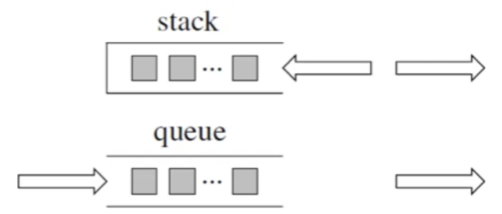
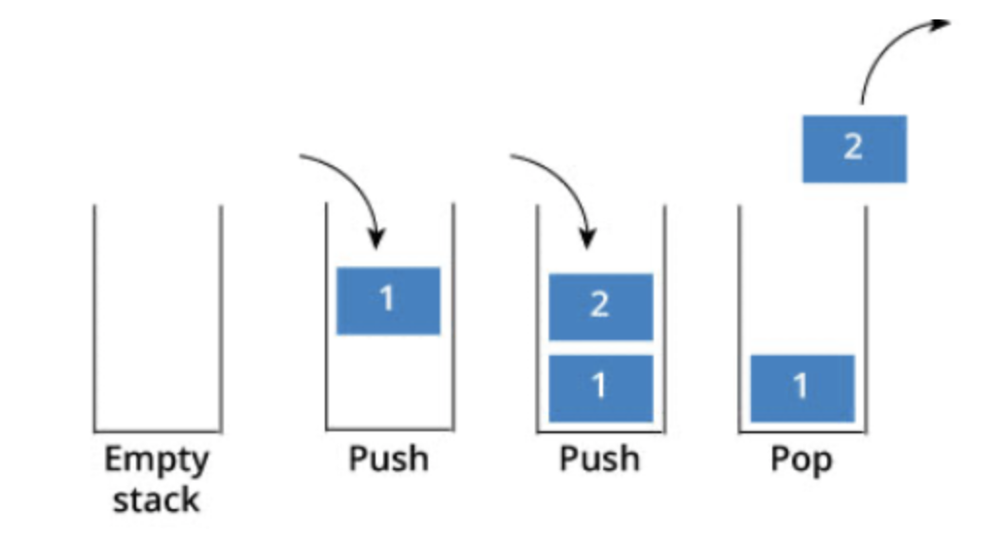

# 栈和队列

### 理论基础

> `栈`是`后进先出(LIFO，Last In First Out)`，`队列`是`先进先出(FIFO)`



在 `JavaScript` 中，**栈和队列的实现一般都要依赖于数组**，完全可以把栈和队列都看作是“特别的数组”
> 注意：实际上，栈和队列作为两种运算受限的`线性表`，用链表来实现也是可以的。只是链表实现起来会比数组麻烦得多，做不到开箱即用，按照数组的思路往下走即可

两者的区别在于：它们各自对数组的`增删操作`有着不一样的限制

**栈（Stack）**

有两个特征：
- 只允许从`尾部添加`元素
- 只允许从`尾部取出`元素 

> 所谓`栈顶元素`，实际上指的就是数组尾部的元素 

在 `JavaScript` 中，栈就是限制只能用 `push` 来添加元素，同时只能用 `pop` 来移除元素的一种特殊的数组

栈`先进后出`，如图所示：



栈提供 `push` 和 `pop` 等接口，所有元素必须符合`先进后出`规则，所以栈不提供`走访功能`，也不提供`迭代器(iterator)`
> 不像是 `set` 或 `map` 提供迭代器 `iterator` 来遍历所有元素

**队列（Queue）**

这个过程的规律也很明显：
- 只允许从`尾部添加`元素
- 只允许从`头部移除`元素

在 `JavaScript` 中， 整个过程只涉及了数组的 `push` 和 `shift` 方法
> 队列元素出队时关心的是`队头`元素（数组的第一个元素）
> 
> 其他语言的用法请自查

### 栈和队列的使用场景

`栈`：通常用于解决涉及`递归`、`后缀表达式求值`、`括号匹配验证`、`浏览器的前进和后退`等问题  

`队列`：常用于`任务调度`、`缓冲处理`、`宽度优先搜索（BFS）算法`等场景

### 基本 API

**队列的基本 API**

```js
class MyQueue<E> {
    // 向队尾插入元素，时间复杂度 O(1)
    void push(E e);

    // 从队头删除元素，时间复杂度 O(1)
    E pop();

    // 查看队头元素，时间复杂度 O(1)
    E peek();

    // 返回队列中的元素个数，时间复杂度 O(1)
    int size();
}
```

**栈的基本 API**

```js
class MyStack<E> {
    // 向栈顶插入元素，时间复杂度 O(1)
    void push(E e);

    // 从栈顶删除元素，时间复杂度 O(1)
    E pop();

    // 查看栈顶元素，时间复杂度 O(1)
    E peek();

    // 返回栈中的元素个数，时间复杂度 O(1)
    int size();
}
```

不同编程语言中，队列和栈提供的方法名称可能不一样，但每个方法的效果肯定是一样的

### 用数组实现栈

```java
// 用数组作为底层数据结构实现栈
public class MyArrayStack<E> {
    private ArrayList<E> list = new ArrayList<>();

    // 向栈顶加入元素，时间复杂度 O(1)
    public void push(E e) {
        list.add(e);
    }

    // 从栈顶弹出元素，时间复杂度 O(1)
    public E pop() {
        return list.remove(list.size() - 1);
    }

    // 查看栈顶元素，时间复杂度 O(1)
    public E peek() {
        return list.get(list.size() - 1);
    }

    // 返回栈中的元素个数，时间复杂度 O(1)
    public int size() {
        return list.size();
    }
}
```

### 用数组实现队列

有了前文[环形数组](https://github.com/donnapersonal/LeetCode/blob/main/notes/array_basics.md)中实现的 `CycleArray` 类，用数组作为底层数据结构实现队列就很简单，直接复用 `CycleArray` 提供的方法就可以实现标准队列

```java
public class MyArrayQueue<E> {
    private CycleArray<E> arr;

    public MyArrayQueue() {
        arr = new CycleArray<>();
    }

    public void push(E t) {
        arr.addLast(t);
    }

    public E pop() {
        return arr.removeFirst();
    }

    public E peek() {
        return arr.getFirst();
    }

    public int size() {
        return arr.size();
    }
}
```

### 用链表实现栈

```java
public class MyLinkedStack<E> {
    private LinkedList<E> list = new LinkedList<>();

    // 向栈顶加入元素，时间复杂度 O(1)
    public void push(E e) {
        list.addLast(e);
    }

    // 从栈顶弹出元素，时间复杂度 O(1)
    public E pop() {
        return list.removeLast();
    }

    // 查看栈顶元素，时间复杂度 O(1)
    public E peek() {
        return list.getLast();
    }

    // 返回栈中的元素个数，时间复杂度 O(1)
    public int size() {
        return list.size();
    }
}
```

也可以把双链表的头部作为栈顶，因为双链表头部增删元素的时间复杂度也是 `O(1)`，只要做几个修改 `addLast -> addFirst`，`removeLast -> removeFirst`，`getLast -> getFirst` 即可

### 用链表实现队列

```java
public class MyLinkedQueue<E> {
    private LinkedList<E> list = new LinkedList<>();

    // 向队尾插入元素，时间复杂度 O(1)
    public void push(E e) {
        list.addLast(e);
    }

    // 从队头删除元素，时间复杂度 O(1)
    public E pop() {
        return list.removeFirst();
    }

    // 查看队头元素，时间复杂度 O(1)
    public E peek() {
        return list.getFirst();
    }

    // 返回队列中的元素个数，时间复杂度 O(1)
    public int size() {
        return list.size();
    }
}
```

上面这段代码相当于是把双链表的尾部作为队尾，把双链表的头部作为队头，在双链表的头尾增删元素的复杂度都是 `O(1)`，符合队列要求

当然，也可以反过来把双链表的头部作为队尾，双链表的尾部作为队头，类似栈的实现，只要改一改 `list` 的调用方法即可

### 用数组实现双端队列

环形数组头尾增删元素的复杂度都是 `O(1)`

```java
class MyArrayDeque<E> {
    private CycleArray<E> arr = new CycleArray<>();

    // 从队头插入元素，时间复杂度 O(1)
    void addFirst(E e) {
        arr.addFirst(e);
    }

    // 从队尾插入元素，时间复杂度 O(1)
    void addLast(E e) {
        arr.addLast(e);
    }

    // 从队头删除元素，时间复杂度 O(1)
    E removeFirst() {
        return arr.removeFirst();
    }

    // 从队尾删除元素，时间复杂度 O(1)
    E removeLast() {
        return arr.removeLast();
    }

    // 查看队头元素，时间复杂度 O(1)
    E peekFirst() {
        return arr.getFirst();
    }

    // 查看队尾元素，时间复杂度 O(1)
    E peekLast() {
        return arr.getLast();
    }
}
```

### 用链表实现双端队列

```java
class MyListDeque<E> {
    private LinkedList<E> list = new LinkedList<>();

    // 从队头插入元素，时间复杂度 O(1)
    void addFirst(E e) {
        list.addFirst(e);
    }

    // 从队尾插入元素，时间复杂度 O(1)
    void addLast(E e) {
        list.addLast(e);
    }

    // 从队头删除元素，时间复杂度 O(1)
    E removeFirst() {
        return list.removeFirst();
    }

    // 从队尾删除元素，时间复杂度 O(1)
    E removeLast() {
        return list.removeLast();
    }

    // 查看队头元素，时间复杂度 O(1)
    E peekFirst() {
        return list.getFirst();
    }

    // 查看队尾元素，时间复杂度 O(1)
    E peekLast() {
        return list.getLast();
    }
}
```

