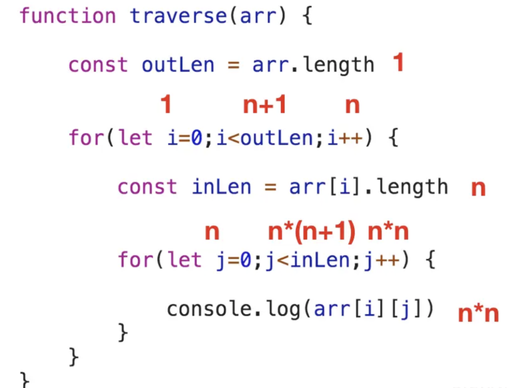
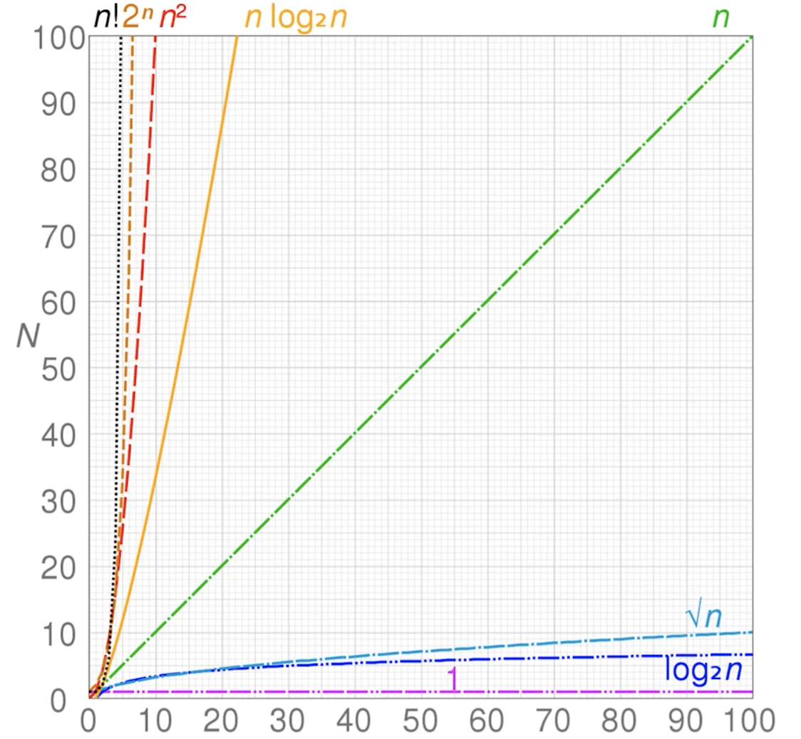

# 算法的衡量

### 时间复杂度

**时间复杂度**，定性表述该算法运行的时间，一个函数，用大 `O` 表示，如：O(1)、O(n)、O(log n) ...

看下面例子，观察代码执行次数
```js
function traverse(arr) {
  var len = arr.length
  for(var i=0;i<len;i++) {
      console.log(arr[i])
  }
}

var len = arr.length // 执行 1 次
console.log(arr[i]) // for 循环执行 `n` 次，该语句会被执行 `n` 次
var i = 0 // 初始化只有 1 次，因此它只会被执行 1 次
i < len // 在所有的 `for` 循环里，判断语句都会比递增语句多执行一次，因此该判断语句执行的次数就是 n+1
i++ // 递增语句跟随整个循环体，毫无疑问会被执行 n 次

// 假如把总的执行次数记为 T(n)，结果就是：
T(n) = 1 + n + 1 + (n+1) + n = 3n + 3
```

再看二维数组：
```js
function traverse(arr) {
  var outLen = arr.length

  for(var i=0;i<outLen;i++) {
    var inLen = arr[i].length
    for(var j=0;j<inLen;j++) { 
      console.log(arr[i][j])
    }
  }
}

var outLen = arr.length // 执行 1 次
console.log(arr[i][j]) // 最内层的循环体执行 n*n = n^2 次
...

// 总执行次数 T(n) 结果：
T(n) = 1 + 1 + (n+1) + n + n + n + n*(n+1) + n*n + n*n = 3n^2 + 5n + 3
```


代码的执行次数可以反映出代码的执行时间。但若每次都逐行去计算 `T(n)`，非常麻烦

> `算法的时间复杂度`，反映的不是算法的逻辑代码到底被执行了多少次，而是**随着输入规模的增大**，算法对应的执行总次数的一个`变化趋势`

可以尝试对 T(n) 做如下处理：
- T(n) 是常数，则无脑简化为 1
- T(n) 是多项式，如 3n^2 + 5n + 3，则只保留次数最高那项且将其常数系数无脑改为 1

因此上述 2 个遍历函数，**遍历 `N` 维数组，需要 `N` 层循环，只需关心其最内层那个循环体被执行多少次即可**
> 可以看出，规模为 `n` 的一维数组遍历时最内层的循环会执行 `n` 次，其对应的时间复杂度是 `O(n)`；`n*n` 的二维数组遍历时，最内层的循环会执行 `n*n` 次，其对应的时间复杂度是 `O(n^2)`
>
> 以此类推，`n*m` 的二维数组最内层循环会执行 `n*m` 次，其对应的时间复杂度就是 `O(n*m)`；规模为 `n*n*n` 的三维数组最内层循环会执行 `n^3` 次，因此其对应的时间复杂度就表示为 `O(n^3)`

**例子 1**
```js
let i = 0;
i += 1;
```
上述代码运行的时间复杂度为 `O(1)`，每次执行该代码文件时，这两行代码永远只会执行 1 次

**例子 2**
```js
for(let i = 0; i < n; i ++) {
  console.log(i);
}
```
上述代码运行的时间复杂度为 `O(n)`，因为该循环执行了 n 次

**例子 3**
```js
let i = 0;
i += 1;
for(let i = 0; i < n; i ++) {
  console.log(i);
}
```
上述代码运行的时间复杂度为 `O(1) + O(n) = O(n)`，因为当代码按顺序执行时，它们的时间复杂度是相加的，且 n 足够大时，只保留增长趋势较大的时间复杂度，常数可忽略不计

**例子 4**
```js
for(let i = 0; i < n; i ++) {
  for(let j = 0; j < n; j ++) {
    console.log(i, j);
  }
}
```
上述代码运行的时间复杂度为 `O(n) * O(n) = O(n^2)`

**例子 5**
```js
let i = 1；
while(i < n) {
  for(let j = 0; j < n; j ++) {
    console.log(i);
    i *= 2;
  }
}
```
上述代码运行的时间复杂度为 `O(log n)`
- log n = log2 n，log 函数是用来求 2 的多少次方为 n
- 假设 `i` 在以 `i = i*2`的规则递增了 `x` 次后，`i < n` 开始不成立（即`i >= n` 成立），此时要计算的其实就是这样一个数学方程：`2^x >= n => x >= log2 n`
- 即，只有当 `x` 小于 `log2 n` 时，循环才是成立的、循环体才能执行

常见的时间复杂度按照从小到大的顺序排列，有以下几种：


**可以总结成一句方便记忆的口令：`常对幂指阶`**
- O(1)：是常数阶时间复杂度的一种表示方式，并不是指只执行了一行代码。只要代码的执行时间不随着问题规模 n 的增大而增长，这样的算法时间复杂度都记为 O(1)
  > 一般情况下，只要算法中不存在循环、递归语句，其时间复杂度均为 O(1)

- O(log n)：这类算法随着问题规模 n 的增大，对应的计算次数呈对数关系增长
  > 对数时间复杂度一般出现在`二分查找`、`分治`这种一分为二的算法中

- O(sqrt(n))：一般出现在`筛素数`、`求平方根`的算法中

- O(n)：这类算法随着问题规模 n 的增大，对应计算次数呈线性增长
  > 一般含有非嵌套循环，且单层循环下的语句执行次数为 n 的算法涉及线性时间复杂度
  > 算法举例：图遍历、拓扑排序、树遍历、DP 动态规划

- O(nlog n)：这类算法随着问题规模 n 的增大，对应的计算次数呈线性对数关系增长
  > 线性对数一般出现在`排序、堆、递归与分治`算法中，如 `快速排序`、`归并排序`、`堆排序`等

- O(n^2)：这类算法随着问题规模 n 的增大，对应计算次数呈平方关系增长
  > 一般含有双层嵌套，且每层循环下的语句执行次数为 n 的算法涉及平方时间复杂度

- O(n^3)：一般出现在`任意两点最短路径`、`DP 动态规划`算法中
  
- O(n^4)：一般出现在`DFS 搜索`、`DP 动态规划`
  
- O(2^n)：一般出现在 combination 组合算法中
  
- O(n!)：这类算法随着问题规模 n 的增大，对应计算次数呈阶乘关系增长
  > 阶乘时间复杂度一般出现在 permutation 排列中，如 `全排列`、`旅行商问题暴力解法`相关的算法


**最佳、最坏、平均时间复杂度**
- 最佳时间复杂度：每个输入规模下用时最短的输入所对应的时间复杂度
- 最坏时间复杂度：每个输入规模下用时最长的输入所对应的时间复杂度
- 平均时间复杂度：每个输入规模下所有可能的输入所对应的平均用时复杂度（随机输入的情况下期望用时的复杂度）
  
> 最佳时间复杂度和最坏时间复杂度均是极端条件下的时间复杂度，发生的概率其实很小。为了能更好的表示正常情况下的复杂度，所以一般采用平均时间复杂度作为时间复杂度的计算方式

### 空间复杂度

**`空间复杂度`**，是对一个算法在运行过程中临时占用存储空间大小的量度，和时间复杂度相似，它是内存增长的**趋势**

> 算法的空间复杂度计算主要包括：
> - 局部变量（算法范围内定义的变量）所占用的存储空间
> - 系统为实现递归（若是递归算法）所使用的堆栈空间

常见的空间复杂度有 `O(1)`、`O(log n)`、`O(n)` 和 `O(n^2)`

看以下例子：
```js
function traverse(arr) {
  var len = arr.length
  for(var i=0;i<len;i++) {
    console.log(arr[i])
  }
}

// 用空间的有以下变量：
arr 
len 
i
```

尽管做了很多次循环，但这些都是**时间**上的开销，循环体在执行时并没有开辟新的内存空间。因此，整个 `traverse` 函数对内存的占用量是**恒定**的，它对应的空间复杂度就是 `O(1)`

另个例子：
```js
function init(n) {
  var arr = []
  for(var i=0;i<n;i++) {
    arr[i] = i
  }
  return arr
}

// 在 `init` 中，涉及到的占用内存的变量有以下几个：
n 
arr 
i
```

注意这里跟上面的例子是有区别的，这里的 `arr` 并不是一个一成不变的数组。`arr` 最终的大小是由输入的 `n` 的大小决定的，它会随着 `n` 的增大而增大、呈一个线性关系，因此这个算法的空间复杂度就是 `O(n)`

由此可知，假如需要初始化的是一个规模为 `n*n` 的数组，则它的空间复杂度就是 `O(n^2)` 