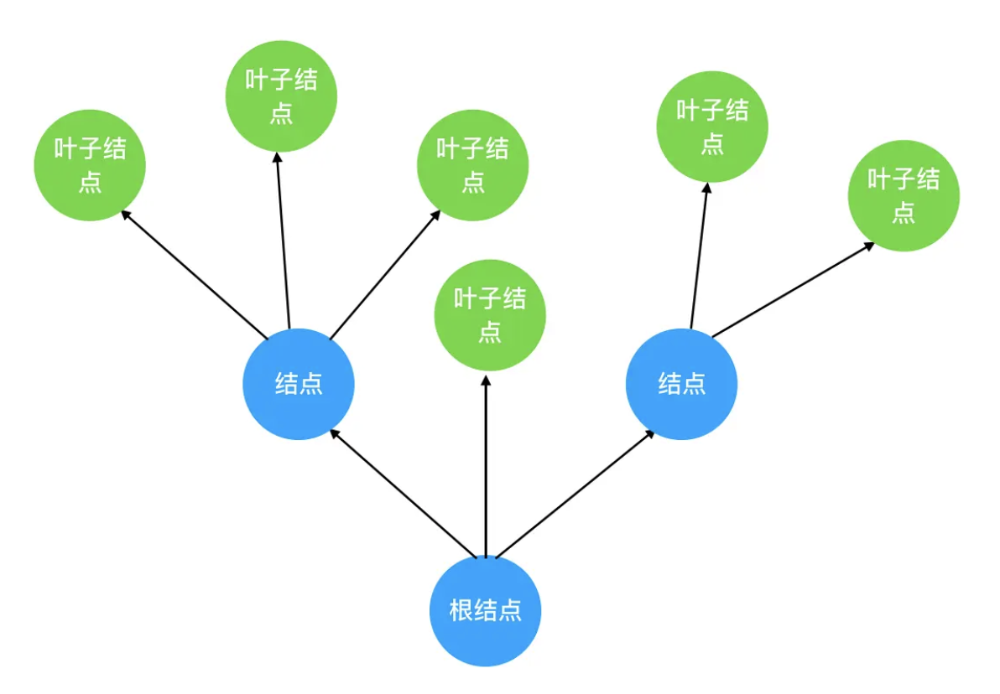
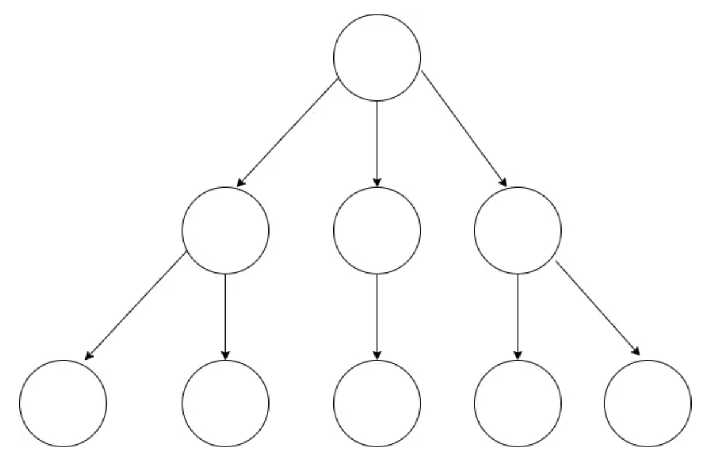
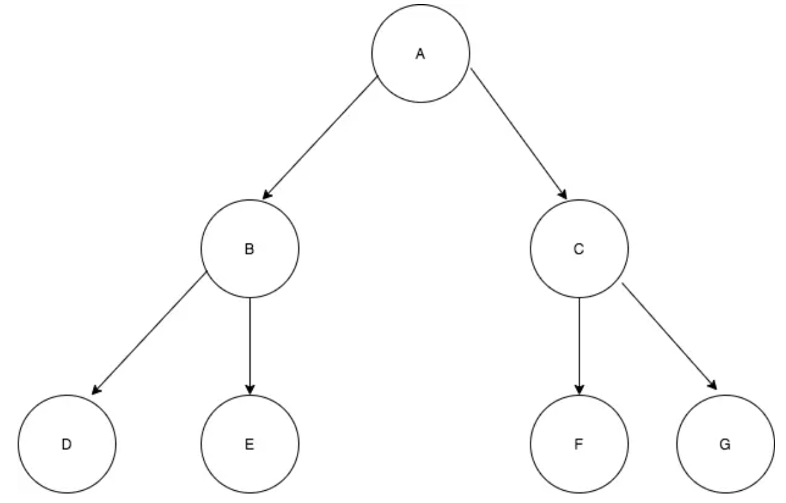
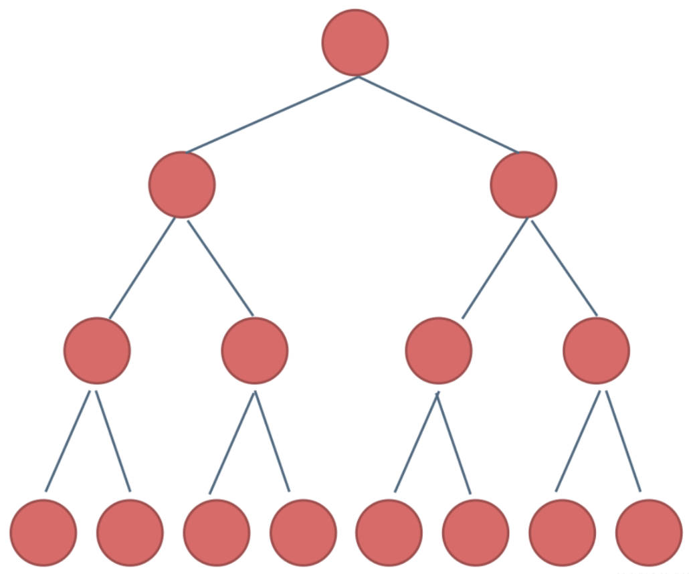
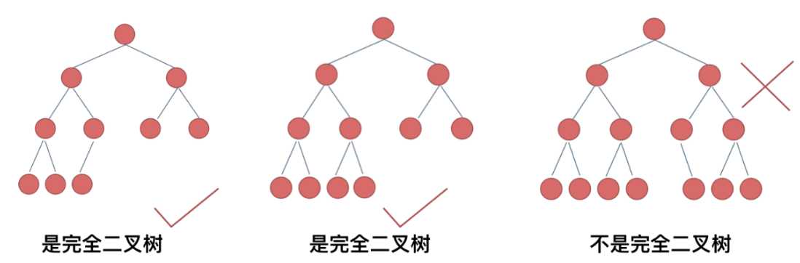
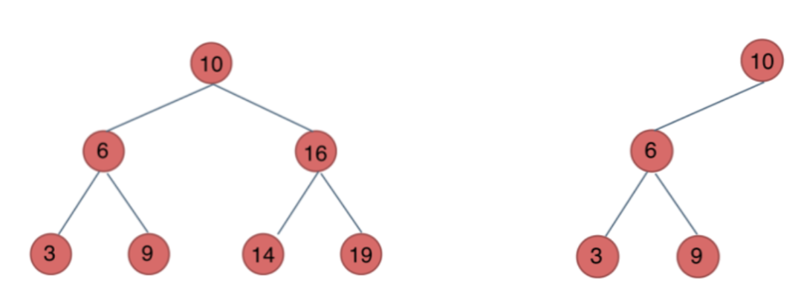
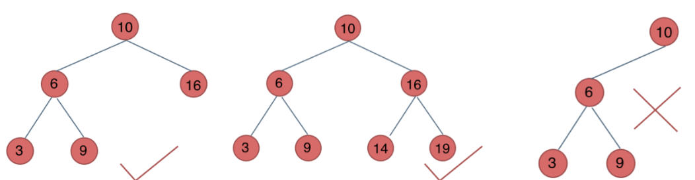
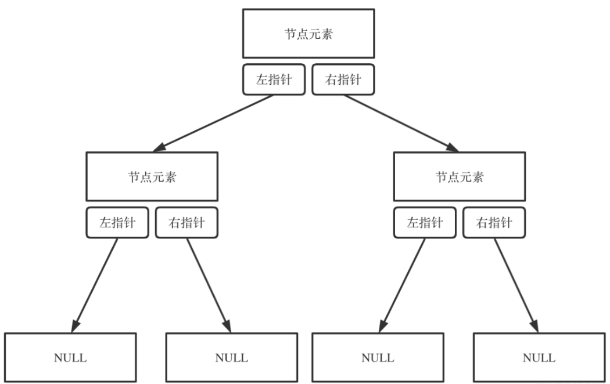
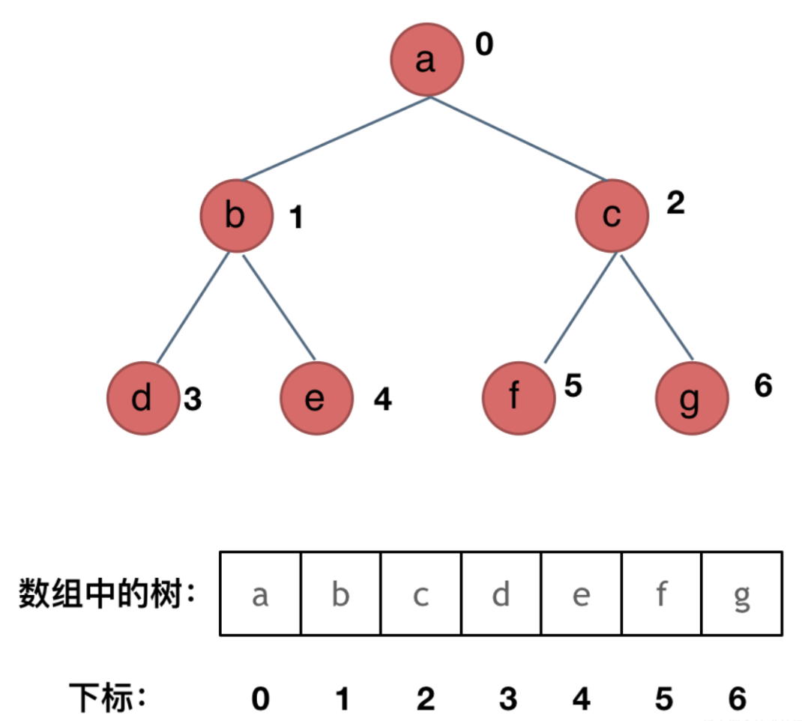
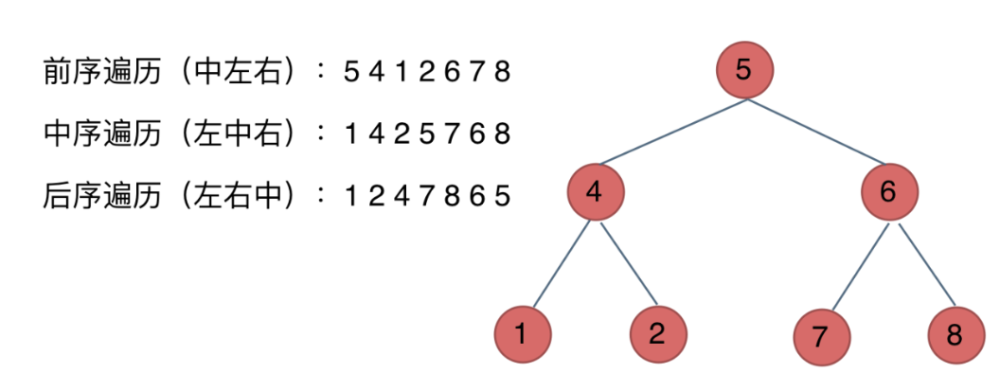

# 树

### 计算机中的树结构

数据结构中的树，首先是对现实世界中树的一层简化：把树根抽象为`根结点`，树枝抽象为`边`，树枝的两个端点抽象为`结点`，树叶抽象为`叶子结点`，抽象后的树结构如下：



把这棵树颠倒过来就得到了计算机中的树结构：



- `树的层次计算规则`：根结点所在的那层记为第一层，其子结点所在的就是第二层，以此类推 ...
  
- `结点和树的“高度”计算规则`：叶子结点高度记为 `1`，每向上一层高度就加 `1`，逐层向上累加至目标结点时，所得到的的值就是目标结点的高度
  > 树中结点的最大高度，称为`树的高度`

- `“度”的概念`：一个结点开叉出去多少个子树，就被记为`结点的“度”`，如上图中，根结点的“度”就是 `3`
  
- `叶子结点`：叶子结点就是度为 `0` 的结点。在上图中，最后一层的结点的度全部为 `0`，所以这一层的结点都是叶子结点

### 二叉树

二叉树是指满足以下要求的树：
- 可以没有根结点，作为一棵空树存在
- 若不是空树，则**必须由根结点、左子树和右子树组成，且左右子树都是二叉树**，如下图：
  
  

> 注意: **二叉树不能被简单定义为每个结点的度都是 2 的树**
>
> 普通的树并不会区分左子树和右子树，但在二叉树中，左右子树的位置是**严格约定、不能交换**的，如上图，B 和 C、D 和 E、F 和 G 是不能互换的

### 二叉树的种类

在解题过程中二叉树有两种主要的形式：`满二叉树`和`完全二叉树`

**满二叉树**

`满二叉树`：若一棵二叉树只有度为 `0` 的结点和度为 `2` 的结点，且度为 `0` 的结点在同一层上，则这棵二叉树为满二叉树



这棵二叉树为`满二叉树`，即深度为 `k`，有 `2^k-1` 个节点的二叉树

**完全二叉树**

`完全二叉树`：在完全二叉树中，除了最底层节点可能没填满外，其余每层节点数都达到最大值，且最下面一层的节点都集中在该层`最左边`的若干位置

若最底层为第 `h` 层（`h` 从 `1` 开始），则该层包含 `1 ~ 2^(h-1)` 个节点



> `优先级队列`就是一个`堆`，`堆`就是一棵`完全二叉树`，同时保证父子节点的顺序关系

**二叉搜索树**

上面的树都没有数值，而二叉搜索树是有数值的，二叉搜索树是一个`有序树`

- 是一棵空树
- 若它的左子树不空，则**左子树上所有结点的值均小于它的根结点的值**
- 若它的右子树不空，则**右子树上所有结点的值均大于它的根结点的值**
- 它的左、右子树也分别为二叉排序树



**平衡二叉搜索树**

`平衡二叉搜索树`：又被称为 `AVL(Adelson-Velsky and Landis)`树，且具有以下性质：
> 它是一棵空树或它的左右两个子树的高度差的绝对值不超过 `1`，且左右两个子树都是一棵`平衡二叉树`



上图中，最后一棵不是平衡二叉树，因为它的左右两个子树的高度差的绝对值超过了 `1`

> `C++` 中 `map、set、multimap，multiset` 的底层实现都是平衡二叉搜索树，所以 `map、set` 的增删操作时间时间复杂度是 `logn`

### 二叉树的存储方式

**二叉树可以`链式存储`，也可以是`顺序存储`**
- `顺序存储`的元素在内存是连续分布的，而`链式存储`则是通过指针把分布在各个地址的节点串联一起
- 链式存储方式用的是`指针`，顺序存储的方式用的是`数组`
  
`链式存储`



`顺序存储`



如何遍历?
- 若父节点的数组下标是 `i`，则它的左孩子是 `i * 2 + 1`，右孩子是 `i * 2 + 2`

> 但用链式表示的二叉树更有利于理解，所以`一般都用链式存储二叉树`

### 二叉树的遍历方式

二叉树主要有两种遍历方式：
- `深度优先遍历(DFS)`：先往深走，遇到叶子节点再往回走
- `广度优先遍历(BFS)`：一层一层的去遍历

> 这两种遍历是图论中最基本的两种遍历方式

从 `DFS` 和 `BFS` 进一步拓展，才有如下遍历方式：

- 深度优先遍历(DFS)
  
  > 深度优先搜索的核心思想：试图穷举所有的完整路径

  - 前序遍历（递归法，迭代法）
  - 中序遍历（递归法，迭代法）
  - 后序遍历（递归法，迭代法）
  
  > 这里前中后，指的是`中间节点的遍历顺序`
  > - 前序遍历：中左右
  > - 中序遍历：左中右
  > - 后序遍历：左右中

  

- 广度优先遍历(BFS)
  - 层次遍历（递归法，迭代法）
  
经常会使用`递归`的方式来实现`DFS`，即实现前中后序遍历，使用递归是比较方便的
- `栈`就是`递归`的一种实现结构，即前中后序遍历的逻辑其实都可以借助`栈`使用`递归`的方式来实现

`BFS`的实现一般使用`队列`来实现，即队列先进先出的特点所决定的，因为需要先进先出的结构才能一层一层的来遍历二叉树

> `BFS` 相对 `DFS` 的最主要的区别是：`BFS` 找到的路径一定是最短的，但代价就是空间复杂度可能比 `DFS` 大很多

### 二叉树的定义

二叉树的定义和链表差不多，但相对于链表，二叉树的节点里多了一个指针，会有两个指针分别指向左右孩子

```java
public class TreeNode {
    int val;
    TreeNode left;
    TreeNode right;

    TreeNode() {}
    TreeNode(int val) { this.val = val; }
    TreeNode(int val, TreeNode left, TreeNode right) {
        this.val = val;
        this.left = left;
        this.right = right;
    }
}
```
```python
class TreeNode:
    def __init__(self, val, left = None, right = None):
        self.val = val
        self.left = left
        self.right = right
```
```js
function TreeNode(val, left, right) {
    this.val = (val===undefined ? 0 : val)
    this.left = (left===undefined ? null : left)
    this.right = (right===undefined ? null : right)
}
```


  
