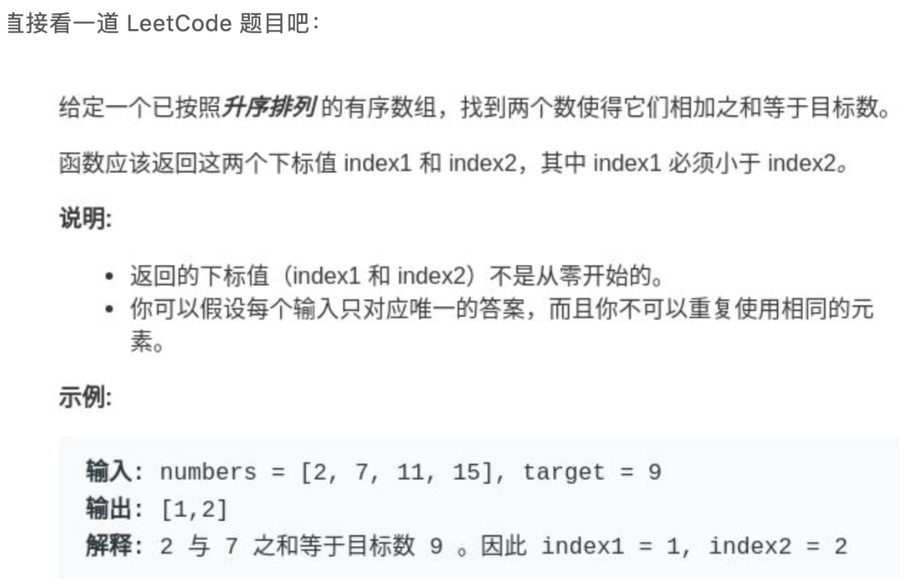
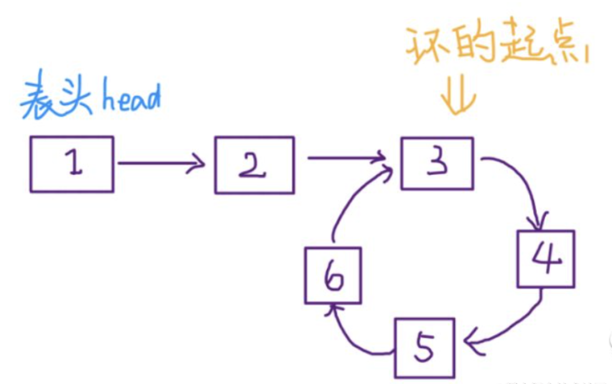
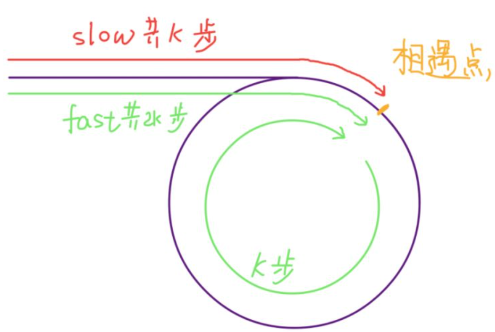
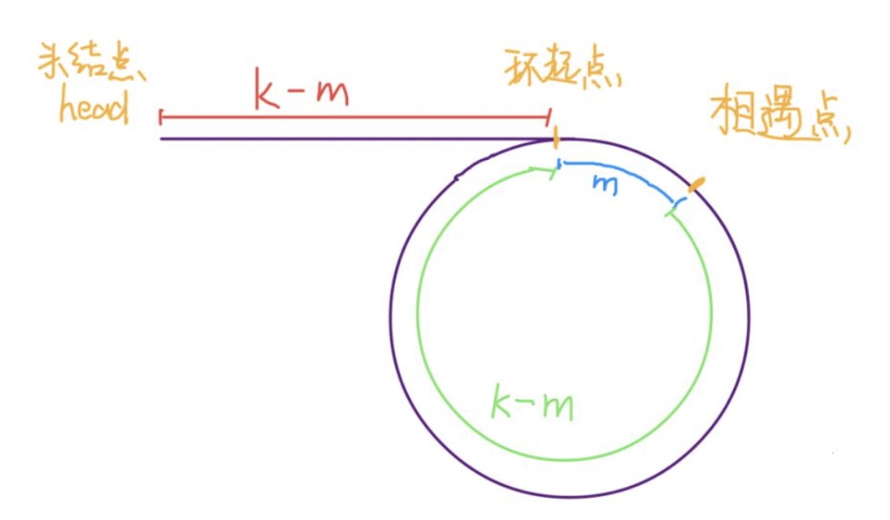
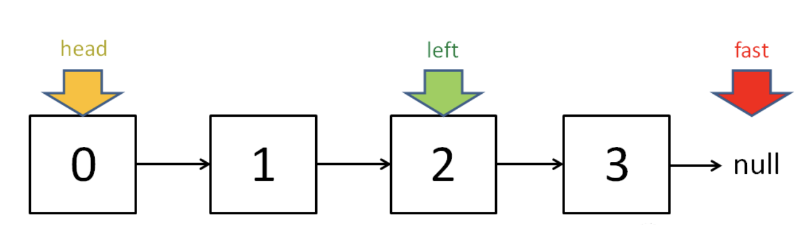

# 双指针法

### 理论基础

在编程中，`双指针法`是一种使用`两个指针（或索引）`遍历数据结构（通常是`数组或链表`）以解决问题的技术。根据问题的不同，这两个指针可能会以不同的速度或方向移动
> **`双指针法`在数组和链表的操作中非常常见，很多考察数组、链表、字符串等操作的面试题，都使用双指针法**

`双指针技`巧还可以分为两类：
- 一类是`快慢指针`，就是两个指针`同向`而行，一快一慢，主要解决`数组（或字符串）`中的问题，如：二分查找

- 一类是`左右指针`，两个指针`相向`而行或`相背`而行，主要解决`链表`中的问题，如：判定链表中是否包含环

### 左右指针的常用算法

**二分查找**

请查看[二分法](https://github.com/donnapersonal/LeetCode/blob/main/notes/binary_search.md)相关章节，这里旨在指出它的双指针特性

**两数之和**



> **`双指针法` 要求输入数组是`有序`的**。因此，只要看到数组有序，就应想到`双指针`技巧
> 
> 若原始数组未排序，则需先对数组进行排序，这会带来额外的时间成本

```java
int[] twoSum(int[] nums, int target) {
  int l = 0, r = nums.length - 1;
  while (l < r) {
    int sum = nums[l] + nums[r];
    if (sum == target) {
      // 题目要求索引从 1 开始
      return new int[]{l + 1, r - 1};
    } else if (sum < target) {
      l ++; // 让 sum 大些
    } else {
      r --;  // 让 sum 小些
    }
  }
  return new int[-1, -1];
}
```

`有序`的数组情况下，总的时间复杂度是 `O(n)`，若需先排序，则整体复杂性将由排序步骤决定

**反转数组**

```java
void reverse(int[] nums) {  
  int left = 0;  
  int right = nums.length - 1;  
  while (left < right) {  
    int temp = nums[left];  
    nums[left] = nums[right];  
    nums[right] = temp;  
    left++; 
    right--;  
  }  
}
```

**滑动窗口**

也许是双指针技巧的最高境界，若掌握此算法，可以解决一大类`子字符串匹配`的问题，不过`滑动窗口`算法比上述的这些算法稍微复杂些

### 快慢指针的常见算法

`快慢指针`一般都初始化指向链表的头结点 `head`，前进时快指针 `fast` 在前，慢指针 `slow` 在后，巧妙解决一些`链表`中的问题

**判定链表中是否含有环**

`单链表`的特点：每个节点只知道下一个节点，所以一个指针的话无法判断链表中是否含有环的
- 若链表中不含环，则这个指针最终会遇到空指针 `null` 表示链表到头了，可以判断该链表不含环  
- 但若链表中含有环，则这个指针就会陷入死循环，因为环形数组中没有 `null` 指针作为尾部节点

经典解法就是用`两个指针`：一个每次前进两步，一个每次前进一步
- 若不含有环，跑得快的指针最终会遇到 `null`，说明链表不含环
- 若含有环，`快指针最终会超慢指针一圈`，和慢指针相遇，说明链表含有环

```js
boolean hasCycle(ListNode head) {
  ListNode fast, slow;
  fast = slow = head;
  while(fast != null && fast.next != null) {
    fast = fast.next.next;
    slow = slow.next;
    
    if (fast == slow) return true;
  }
  return false;
}
```

**已知链表中含有环，返回这个环的起始位置**



```java
ListNode detectCycle(ListNode head) {
  ListNode fast, slow;
  fast = slow = head;
  while (fast != null && slow != null) {
    fast = fast.next.next;
    slow = slow.next;
    if (fast == slow) break;
  }
  slow = head;
  whle (slow != fast) {
    fast = fast.next;
    slow = slow.next;
  }
  return slow;
}
```

可以看到，当快慢指针相遇时让其中任一个指针重新指向头节点，然后让它俩以相同速度前进，再次相遇时所在的节点位置就是环开始的位置，为什么？

第一次相遇时假设慢指针 `slow` 走了 `k` 步，则快指针 `fast` 一定走了 `2k` 步，即比 `slow` 多走了 `k` 步（这也就是环的长度）



设相遇点距环的起点的距离为 `m`，则环的起点距头结点 `head` 的距离为 `k - m`，即若从 `head` 前进 `k - m` 步就能到达环起点。若从相遇点继续前进 `k - m` 步，也恰好到达环起点



所以，只要把快慢指针中的任一个重新指向 `head`，然后两个指针`同速`前进，`k - m` 步后就会相遇，相遇之处就是环的起点

**寻找链表的中点**

类似的，让`快指针一次前进两步`，`慢指针一次前进一步`，当快指针到达链表尽头时慢指针就处于链表的中间位置

```java
ListNode slow, fast;  
slow = fast = head;  
while (fast != null && fast.next != null) {  
    fast = fast.next.next;  
    slow = slow.next;  
}  
// slow 就在中间位置  
return slow;
```

当链表的长度是`奇数`时，`slow` 恰巧停在中点位置；若长度是`偶数`，`slow` 最终的位置是中间偏右



> **寻找链表中点的一个重要作用：对链表进行`归并排序`**

回想数组的归并排序：求中点索引，递归地把数组二分，最后合并两个有序数组；对于链表，合并两个有序链表很简单，难点就在于二分

**寻找链表的倒数第 k 个元素**

思路还是使用快慢指针，让快指针先走 `k` 步，然后快慢指针开始`同速`前进。这样当快指针走到链表末尾 `null` 时，慢指针所在的位置就是倒数第 `k` 个链表节点（为了简化，假设 `k` 不会超过链表长度）

```java
ListNode slow, fast;  
slow = fast = head;  
while (k-- > 0)   
  fast = fast.next;  
  
while (fast != null) {  
  slow = slow.next;  
  fast = fast.next;  
}  
return slow;
```