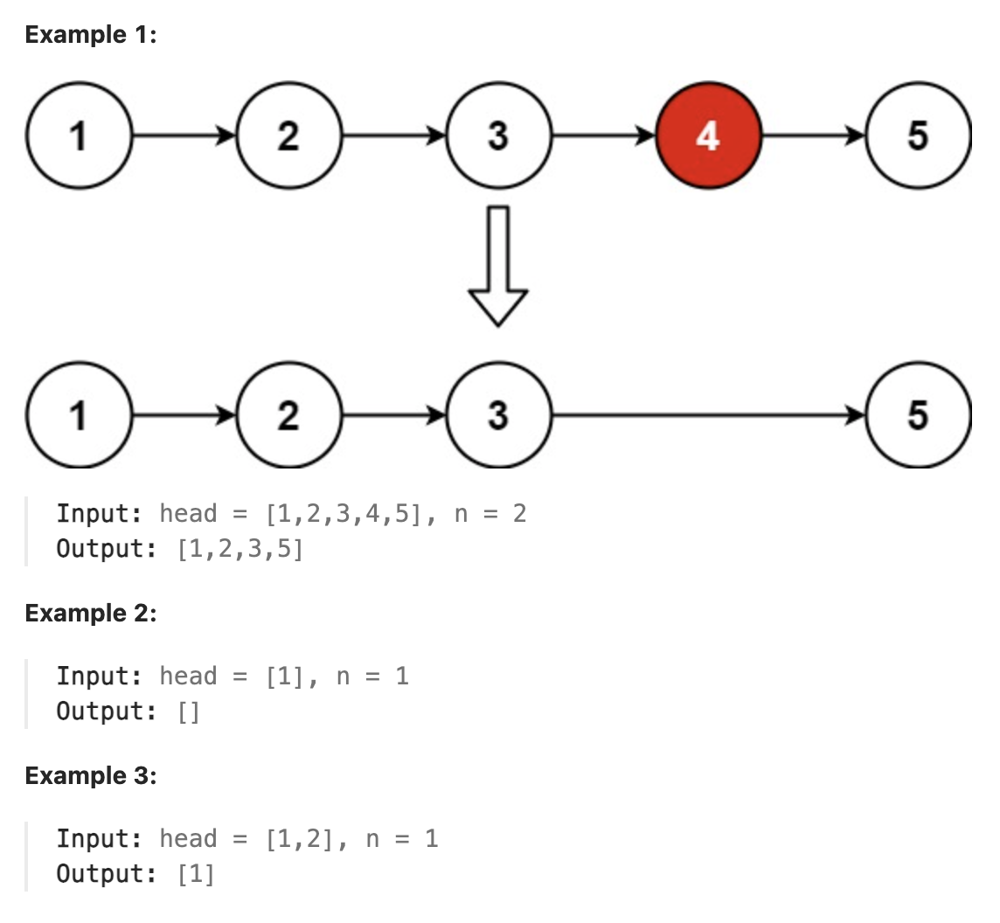

# 19.Remove Nth Node From End of List

### LeetCode 题目链接

[19.Remove Nth Node From End of List](https://leetcode.com/problems/remove-nth-node-from-end-of-list/)

### 题目大意

给一个链表，删除链表的倒数第 `n` 个结点，且返回链表的头结点



说明:
- The number of nodes in the list is sz.
- 1 <= sz <= 30
- 0 <= Node.val <= 100
- 1 <= n <= sz

### 解题

#### 思路 1: 递归

```java
class Solution {
    public ListNode removeNthFromEnd(ListNode head, int n) {
        ListNode dummy = new ListNode(-1);
        dummy.next = head;
        int[] cur = {0};
        recur(dummy, n, cur);
        return dummy.next;
    }

    private void recur(ListNode node, int n, int[] cur) {
        if (node == null) return;
        recur(node.next, n, cur);
        cur[0]++;
        if (cur[0] == n + 1) {
            node.next = node.next.next;
        }
    }
}
```
```python
class Solution:
    def removeNthFromEnd(self, head: Optional[ListNode], n: int) -> Optional[ListNode]:
        dummy = ListNode(-1)
        dummy.next = head
        cur = [0]

        def recur(node):
            if node is None:
                return
            recur(node.next)
            cur[0] += 1
            if cur[0] == n + 1:
                node.next = node.next.next
        
        recur(dummy)
        return dummy.next
```
```js
var removeNthFromEnd = function(head, n) {
    let dummy = new ListNode(-1);
    dummy.next = head;
    let cur = 0;
    function recur(node) {
        if(node == null) return;
        recur(node.next);
        cur++;
        if(cur == n + 1) {
            node.next = node.next.next;
        }
    }
    recur(dummy);
    return dummy.next;
};
```

- 时间复杂度: `O(n)`
- 空间复杂度: `O(n)`

#### 思路 2: 双指针

双指针的经典应用，若要删除倒数第 `n` 个节点，让 `fast` 移动 `n` 步，然后让 `fast` 和 `slow` 同时移动，直到 `fast` 指向链表末尾，删掉 `slow` 所指向的节点即可

- 定义 `fast` 和 `slow` 指针，初始值为 `dummy`  
- `fast` 首先走 `n + 1` 步，因为只有这样同时移动时 `slow` 才能指向删除节点的上一个节点（方便做删除操作）  
- `fast` 和 `slow` 同时移动，直到 `fast` 指向末尾  
- 删除 `slow` 指向的下一个节点

```java
class Solution {
    public ListNode removeNthFromEnd(ListNode head, int n) {
        ListNode dummy = new ListNode(-1);
        dummy.next = head;
        ListNode slow = dummy;
        ListNode fast = dummy;
        for(int i = 0; i <= n; i++) {
            fast = fast.next;
        }
        while(fast != null) {
            slow = slow.next;
            fast = fast.next;
        }
        // 此时 slow 的位置就是待删除元素的前驱节点
        slow.next = slow.next.next;
        return dummy.next;
    }
}
```
```python
class Solution:
    def removeNthFromEnd(self, head: Optional[ListNode], n: int) -> Optional[ListNode]:
        dummy = ListNode(-1)
        dummy.next = head
        slow = dummy
        fast = dummy
        for _ in range(n + 1):
            fast = fast.next

        while fast != None:
            slow = slow.next
            fast = fast.next
        
        slow.next = slow.next.next
        return dummy.next
```
```js
var removeNthFromEnd = function(head, n) {
    let dummy = new ListNode(-1);
    dummy.next = head;
    let slow = dummy;
    let fast = dummy;
    for(let i = 0; i < n + 1; i ++) {
        fast = fast.next;
    }
    while(fast != null) {
        slow = slow.next;
        fast = fast.next;
    }
    slow.next = slow.next.next;
    return dummy.next;
};
```

- 时间复杂度: `O(n)`
- 空间复杂度: `O(1)`