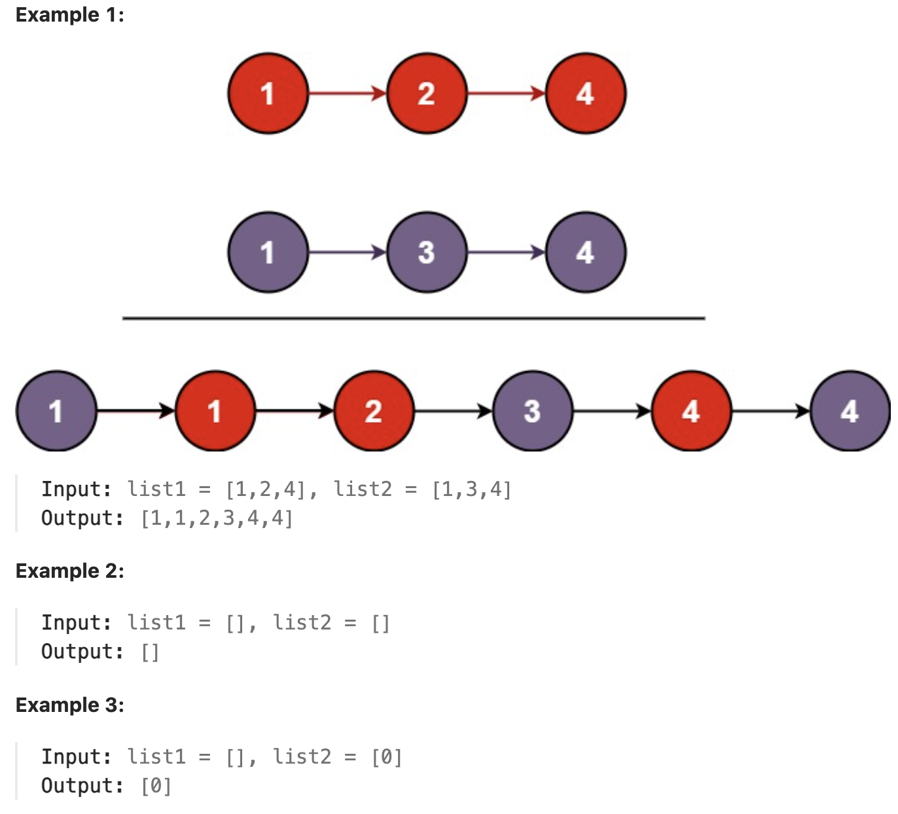

# 21.Merge Two Sorted Lists

### LeetCode 题目链接

[21. Merge Two Sorted Lists](https://leetcode.com/problems/merge-two-sorted-lists/)

### 题目大意

将两个升序链表合并为一个新的`升序`链表并返回

新链表是通过拼接给定的两个链表的所有节点组成的



### 解题

> 处理链表的本质：处理链表结点间的指针关系

**这里增加一个链表的算法题中是很常见的`虚拟头结点`的技巧，即 `dummy` 节点**

所谓 `dummy` 结点，就是人为制造出来的第一个结点的前驱结点，这样链表中所有的结点都能确保有一个前驱结点，即都能够用同样的逻辑来处理

`dummy` 结点能够帮助降低链表处理过程的复杂度；设了 `dummy` 结点，就算不一定用得上，也不会出错。所以个人非常喜欢用 `dummy` 结点

> 什么时候使用呢？
> 
> - 当需要创造一条新链表时，可以使用虚拟头结点简化边界情况的处理
> 
> 如把两条有序链表合并成一条新的有序链表要创造一条新链表、如把一条链表分解成两条链表、也可认为在创造新链表...这些情况都可使用`dummy`简化边界情况的处理
> 
> 而且也经常会遇到这样的问题：链表的第一个结点因为没有前驱结点，导致面对它时无从下手，这时就可以用一个 `dummy` 结点来解决这个问题

```java
class Solution {
    public ListNode mergeTwoLists(ListNode list1, ListNode list2) {
        ListNode dummy = new ListNode(-1);
        ListNode p = dummy;
        ListNode p1 = list1, p2 = list2;
        while(p1 != null && p2 != null) {
            // 比较 p1 和 p2 两个指针
            // 将值较小的的节点接到 p 指针
            if(p1.val > p2.val) {
                p.next = p2;
                p2 = p2.next;
            } else {
                p.next = p1;
                p1 = p1.next;
            }
            p = p.next;
        }
        if(p1 != null) {
            p.next = p1;
        }
        if(p2 != null) {
            p.next = p2;
        }
        return dummy.next;
    }
}
```
```python
class Solution:
    def mergeTwoLists(self, list1: Optional[ListNode], list2: Optional[ListNode]) -> Optional[ListNode]:
        dummy = ListNode(-1)
        p = dummy
        p1 = list1
        p2 = list2
        while p1 and p2:
            if p1.val > p2.val:
                p.next = p2
                p2 = p2.next
            else:
                p.next = p1
                p1 = p1.next
            p = p.next
            
        if p1:
            p.next = p1
        
        if p2:
            p.next = p2

        return dummy.next
```
```js
var mergeTwoLists = function(list1, list2) {
    let dummy = new ListNode(-1);
    let p = dummy;
    let p1 = list1;
    let p2 = list2;
    while(p1 != null && p2 != null) {
        if(p1.val > p2.val) {
            p.next = p2;
            p2 = p2.next;
        } else {
            p.next = p1;
            p1 = p1.next;
        }
        p = p.next;
    }

    if(p1 != null) {
        p.next = p1;
    }

    if(p2 != null) {
        p.next = p2;
    }

    return dummy.next;
};
```
- 时间复杂度: `O(n + m)`, `n` 和 `m` 分别为 `list1` 和 `list2` 的长度
- 空间复杂度: `O(1)`