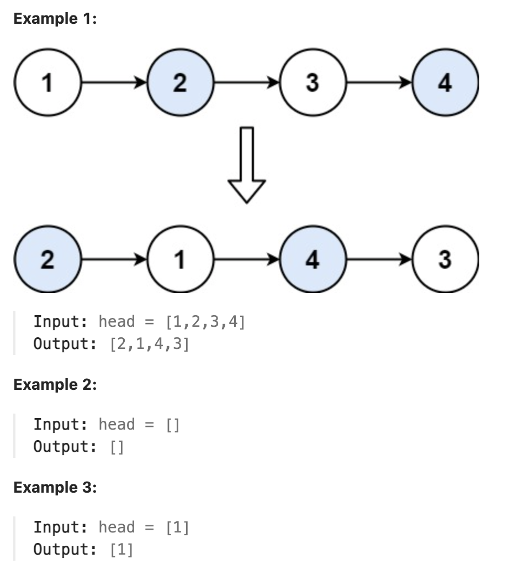

# 24.Swap Nodes in Pairs

### LeetCode 题目链接

[24.Swap Nodes in Pairs](https://leetcode.com/problems/swap-nodes-in-pairs/)

### 题目大意

给一个链表，两两交换其中相邻的节点，并返回交换后链表的头节点

必须在不修改节点内部的值的情况下完成本题（即，只能进行节点交换）



说明:
- The number of nodes in the list is in the range [0, 100].
- 0 <= Node.val <= 100

### 解题

```java
// 迭代
class Solution {
    public ListNode swapPairs(ListNode head) {
        ListNode  dummy = new ListNode(-1);
        dummy.next = head;
        ListNode cur = dummy;
        ListNode temp;
        ListNode firstnode; // 临时节点，保存两个节点中的第一个节点
        ListNode secondnode; // 临时节点，保存两个节点中的第二个节点
        while(cur.next != null && cur.next.next != null) {
            temp = cur.next.next.next;
            firstnode = cur.next;
            secondnode = cur.next.next;
            cur.next = secondnode;
            secondnode.next = firstnode;
            firstnode.next = temp;
            cur = firstnode; // 指向节点交换后的位置了
        }
        return dummy.next;
    }
}

// 递归
// 写法 1
class Solution {
    public ListNode swapPairs(ListNode head) {
        if(head == null || head.next == null) return head;
        // 获取当前节点的下一个节点
        // 获取第二个节点，交换后将成为新的头
        ListNode temp = head.next;
        // 进行递归
        // 从第三个节点开始递归调用链表的 swapPairs
        ListNode newNode = swapPairs(temp.next);
        temp.next = head;
        // 第一个节点现在指向递归调用的结果
        head.next = newNode;
        // 返回第二个节点，它是交换对的新头
        return temp;
    }
}

// 写法 2
class Solution {
    public ListNode swapPairs(ListNode head) {
        if (head == null || head.next == null) {
            return head;
        }
        ListNode first = head;
        ListNode second = head.next;
        ListNode third = head.next.next;
        // 先把前两个元素翻转
        second.next = first;
        // 利用递归定义，将剩下的链表节点两两翻转，接到后面
        first.next = swapPairs(third);
        // 现在整个链表都成功翻转，返回新的头结点
        return second;
    }
}
```
```python
# 迭代
class Solution:
    def swapPairs(self, head: Optional[ListNode]) -> Optional[ListNode]:
        dummy = ListNode(-1)
        dummy.next = head
        cur = dummy
        # 必须有 cur 的下一个和下下个才能交换，否则说明已经交换结束了
        while cur.next and cur.next.next:
            temp = cur.next.next.next
            first = cur.next
            second = cur.next.next
            cur.next = second
            second.next = first
            first.next = temp
            cur = first
        return dummy.next

# 递归
# 写法 1
class Solution:
    def swapPairs(self, head: Optional[ListNode]) -> Optional[ListNode]:
        if head == None or head.next == None:
            return head
        
        temp = head.next
        newNode = self.swapPairs(temp.next)
        temp.next = head
        head.next = newNode
        return temp

# 写法 2
class Solution:
    def swapPairs(self, head: Optional[ListNode]) -> Optional[ListNode]:
        if head == None or head.next == None:
            return head
        
        first = head
        second = head.next
        third = head.next.next

        second.next = first
        first.next = self.swapPairs(third)
        return second
```
```js
// 迭代
var swapPairs = function(head) {
    let dummy = new ListNode(-1);
    dummy.next = head;
    let cur = dummy;
    let temp, first, second;
    while(cur.next != null && cur.next.next != null) {
        temp = cur.next.next.next;
        first = cur.next;
        second = cur.next.next;
        cur.next = second;
        second.next = first;
        first.next = temp;
        cur = first;
    }
    return dummy.next;
};

// 递归
// 写法 1
var swapPairs = function(head) {
    if(head == null || head.next == null) return head;
    let temp = head.next;
    let newNode = swapPairs(temp.next);
    temp.next = head;
    head.next = newNode;
    return temp;
};

// 写法 2
var swapPairs = function(head) {
    if(head == null || head.next == null) return head;
    let first = head;
    let second = head.next;
    let third = head.next.next;

    second.next = first;
    first.next = swapPairs(third);
    return second;
};
```
- 时间复杂度: `O(n)`
- 空间复杂度: `O(1)`