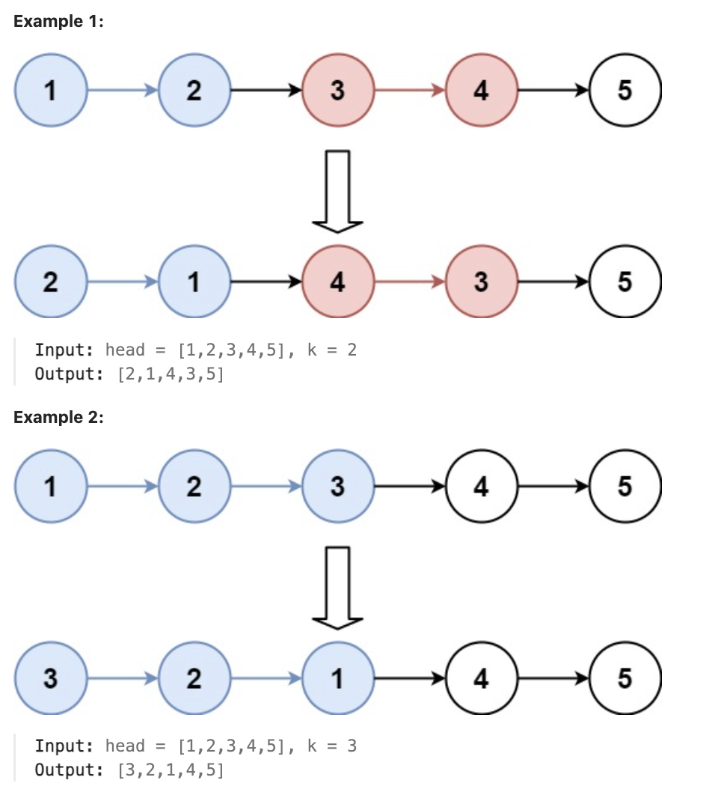

# 25.Reverse Nodes in k-Group

### LeetCode 题目链接

[25.Reverse Nodes in k-Group](https://leetcode.com/problems/swap-nodes-in-pairs/)

### 题目大意

给链表的头节点 `head`，每 `k` 个节点一组进行翻转，请返回修改后的链表

`k` 是一个正整数，它的值小于或等于链表的长度。若节点总数不是 `k` 的整数倍，请将最后剩余的节点保持原有顺序

不能只是单纯的改变节点内部的值，而是需要实际进行节点交换



说明:
- The number of nodes in the list is n.
- 1 <= k <= n <= 5000
- 0 <= Node.val <= 1000

### 解题

#### 思路 1: 递归
```java
/**
 * Definition for singly-linked list.
 * public class ListNode {
 *     int val;
 *     ListNode next;
 *     ListNode() {}
 *     ListNode(int val) { this.val = val; }
 *     ListNode(int val, ListNode next) { this.val = val; this.next = next; }
 * }
 */
class Solution {
    public ListNode reverseKGroup(ListNode head, int k) {
        if (head == null) return null;
        ListNode a, b;
        a = b = head;
        for (int i = 0; i < k; i++) {
            if (b == null) return head;
            b = b.next;
        }
        ListNode newHead = reverse(a, b);
        a.next = reverseKGroup(b, k);
        return newHead;
    }
    ListNode reverse(ListNode a, ListNode b) {
        ListNode pre, cur, nxt;
        pre = null;
        cur = a;
        nxt = a;
        while (cur != b) {
            nxt = cur.next;
            cur.next = pre;
            pre = cur;
            cur = nxt;
        }
        return pre;
    }
}
```
```python
# Definition for singly-linked list.
# class ListNode:
#     def __init__(self, val=0, next=None):
#         self.val = val
#         self.next = next
class Solution:
    def reverseKGroup(self, head: Optional[ListNode], k: int) -> Optional[ListNode]:
        if not head:
            return None
        # 区间 [a, b) 包含 k 个待反转元素
        a = b = head
        for i in range(k):
            # 不足 k 个，不需要反转，base case
            if not b:
                return head
            b = b.next
        # 反转前 k 个元素
        newHead = self.reverse(a, b)
        # 递归反转后续链表并连接起来
        a.next = self.reverseKGroup(b, k) 
        return newHead
    
    def reverse(self, a: ListNode, b: ListNode) -> ListNode: 
        pre, cur, nxt = None, a, a
        # while 终止的条件改一下就行了
        while cur != b:
            nxt = cur.next
            cur.next = pre
            pre = cur
            cur = nxt
        # 返回反转后的头结点
        return pre
```
```js
var reverseKGroup = function(head, k) {
    if (!head) return null;
    let a = head, b = head;
    for (let i = 0; i < k; i++) {
        if (!b) return head;
        b = b.next;
    }
    let newHead = reverse(a, b);
    a.next = reverseKGroup(b, k);
    return newHead;
};

var reverse = function(a, b) {
    let pre = null, cur = a, nxt = a;
    while (cur !== b) {
        nxt = cur.next;
        cur.next = pre;
        pre = cur;
        cur = nxt;
    }
    return pre;
};
```
- 时间复杂度: `O(n)`，其中 `n` 为链表的总长度
- 空间复杂度: `O(n/k)`，因为每 `k` 个节点递归一次，需要系统调用栈的空间

#### 思路 2: 迭代

```java
class Solution {
    private ListNode reverse(ListNode head, ListNode tail) {
        ListNode pre = head;
        ListNode cur = pre.next;
        ListNode first = cur;
        while (cur != tail) {
            ListNode next = cur.next;
            cur.next = pre;
            pre = cur;
            cur = next;
        }
        head.next = pre;
        first.next = tail;
        return first;
    }

    public ListNode reverseKGroup(ListNode head, int k) {
        ListNode dummy = new ListNode(0);
        dummy.next = head;
        ListNode cur = dummy;
        ListNode tail = dummy.next;
        int index = 0;
        while (tail != null) {
            index += 1;
            if (index % k == 0) {
                cur = reverse(cur, tail.next);
                tail = cur.next;
            } else {
                tail = tail.next;
            }
        }
        return dummy.next;
    }
}
```
```python
class Solution:
    def reverse(self, head, tail):
        pre = head
        cur = pre.next
        first = cur
        while cur != tail:
            next = cur.next
            cur.next = pre
            pre = cur
            cur = next
        head.next = pre
        first.next = tail
        return first

    def reverseKGroup(self, head: ListNode, k: int) -> ListNode:
        dummy = ListNode(0)
        dummy.next = head
        cur = dummy
        tail = dummy.next
        index = 0
        while tail:
            index += 1
            if index % k == 0:
                cur = self.reverse(cur, tail.next)
                tail = cur.next
            else:
                tail = tail.next
        return dummy.next
```
```js
var reverseKGroup = function(head, k) {
    let dummy = new ListNode(0);
    dummy.next = head;
    let cur = dummy;
    let tail = dummy.next;
    let index = 0;
    while (tail) {
        index += 1;
        if (index % k === 0) {
            cur = reverse(cur, tail.next);
            tail = cur.next;
        } else {
            tail = tail.next;
        }
    }
    return dummy.next;
};

var reverse = function(head, tail) {
    let pre = head;
    let cur = pre.next;
    let first = cur;
    while (cur !== tail) {
        let next = cur.next;
        cur.next = pre;
        pre = cur;
        cur = next;
    }
    head.next = pre;
    first.next = tail;
    return first;
};
```
- 时间复杂度: `O(n)`
- 空间复杂度: `O(1)`

#### 总结

`递归`方法通过函数调用自身来处理问题，利用系统的调用栈来保存每次调用的状态

`递归`实现的关键点：
- 每次调用 `reverseKGroup` 时，将前 `k` 个节点反转，然后递归处理剩余的链表
- 每次反转完成后，将反转后的链表与递归调用返回的部分连接起来

`迭代`方法通过循环来处理问题，不依赖系统的调用栈，而是通过显式地使用堆栈或指针来保存状态

`迭代`实现的关键点：
- 使用一个循环遍历链表，找到每个 `k` 个节点的组
- 对每个 `k` 个节点的组调用 `reverse` 方法进行反转
- 使用指针更新和连接反转后的子链表