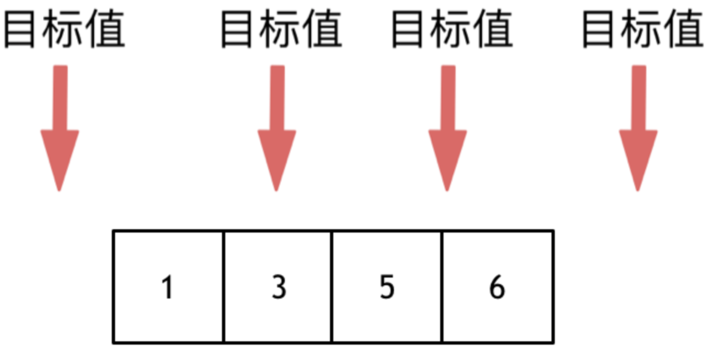

# 35.Search Insert Position

### LeetCode 题目链接

[35.Search Insert Position](https://leetcode.com/problems/search-insert-position/)

### 题目大意

给定一个`排序`数组和一个`目标值`，在数组中找到目标值，并返回其索引

若目标值不存在于数组中，返回它将会被按顺序插入的位置

请必须使用时间复杂度为 `O(log n)` 的算法

```js
Example 1:

Input: nums = [1,3,5,6], target = 5
Output: 2

Example 2:

Input: nums = [1,3,5,6], target = 2
Output: 1

Example 3:

Input: nums = [1,3,5,6], target = 7
Output: 4
```

说明:
- 1 <= nums.length <= 10^4
- -10^4 <= nums[i] <= 10^4
- nums contains distinct values sorted in ascending order.
- -10^4 <= target <= 10^4

### 解题

这道题要在数组中插入目标值，有四种情况：



#### 思路 1: 暴力解法

```java
class Solution {
    public int searchInsert(int[] nums, int target) {
        int len = nums.length;
        for (int i = 0; i < len; i ++) {
            // 分别处理如下三种情况：
            // 1. 目标值在数组所有元素之前
            // 2. 目标值等于数组中某一个元素
            // 3. 目标值插入数组中的位置
            if (nums[i] >= target) { // 一旦发现大于或等于 target 的 num[i]，i 就是要的结果
                return i; 
            }
        }
        return nums.length;
    }
}
```
```python 
class Solution:
    def searchInsert(self, nums: List[int], target: int) -> int:
        numsLen = len(nums)
        for i in range(numsLen):
            if nums[i] >= target:
                return i
        
        return numsLen
```
```js
var searchInsert = function(nums, target) {
    let length = nums.length;
    for (let i = 0; i < length; i++) {
        if (nums[i] >= target) { 
            return i;
        }
    }
    return length;
};
```

- 时间复杂度: `O(n)`
- 空间复杂度: `O(1)`

#### 思路 2: 二分搜索

当目标元素 `target` 不存在数组 `nums` 中时，搜索左侧边界的二分搜索的返回值可以做以下几种解读：  
> 返回的这个值是 `nums` 中大于等于 `target` 的最小元素索引  
> 返回的这个值是 `target` 应该插入在 `nums` 中的索引位置  
> 返回的这个值是 `nums` 中小于 `target` 的元素个数

```java
class Solution {
    public int searchInsert(int[] nums, int target) {
        int left = 0, right = nums.length - 1;
        while(left <= right) {
            int mid = left + (right - left) / 2;
            if(nums[mid] < target) {
                left = mid + 1;
            } else if(nums[mid] > target) {
                right = mid - 1;
            } else if(nums[mid] == target) {
                return mid;
            }
        }
        // 分别处理如下四种情况：
        // 目标值在数组所有元素之前  [0, -1]
        // 目标值等于数组中某一个元素  return middle;
        // 目标值插入数组中的位置 [left, right]，return  right + 1
        // 目标值在数组所有元素之后的情况 [left, right]， 因为是右闭区间，所以 return right + 1
        return right + 1;
    }
}

// 左闭右开
int searchInsert(int[] nums, int target) {
  int left = 0, right = nums.length;
  while(left < right) {
    mid = left + (right - left) / 2;
    if(nums[mid] == target) {
      return mid;
    } else if(nums[mid] < target) {
      left = mid + 1;
    } else if(nums[mid] > target) {
      right = mid;
    }
  }
  // 目标值在数组所有元素之前 [0,0)
  // 目标值插入数组中的位置 [left, right) ，return right 即可
  // 目标值在数组所有元素后的情况 [left, right)，因为是右开区间，return right
  return right;
}
```
```python
class Solution:
    def searchInsert(self, nums: List[int], target: int) -> int:
        left, right = 0, len(nums) - 1
        while left <= right:
            mid = left + (right - left) // 2
            if nums[mid] == target:
                return mid
            elif nums[mid] < target:
                left = mid + 1
            elif nums[mid] > target:
                right = mid - 1
        
        return left
```
```js
var searchInsert = function(nums, target) {
    let left = 0, right = nums.length - 1;
    while(left <= right) {
        let mid = left + Math.floor((right - left) /2);
        if(nums[mid] < target) {
            left = mid + 1;
        } else if(nums[mid] > target) {
            right = mid - 1; 
        } else if(nums[mid] == target) {
            return mid;
        }
    }
    return right + 1;
};

// 写法 2
var searchInsert = function (nums, target) {
    let len = nums.length;
    let left = 0, right = len - 1;
    while(left <= right) {
        let mid = left + Math.floor((right - left) / 2);
        if (nums[mid] < target) {
            left = mid + 1;
        } else {
            len = mid; // len 更新为 `mid`，`target` 要么就在这个位置，要么应插入这
            right = mid - 1;
        }
    }
    return len;
}
```
- 时间复杂度: `O(log n)`
- 空间复杂度: `O(1)`