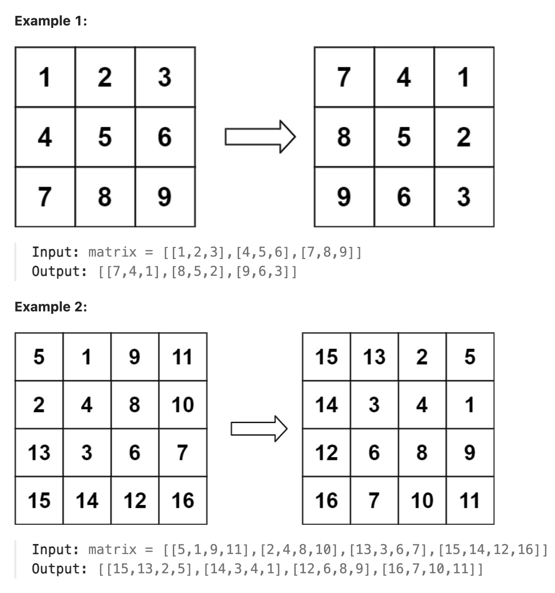

# 48.Rotate Image

### LeetCode 题目链接

[48.Rotate Image](https://leetcode.com/problems/rotate-image/)

### 题目大意

给定一个 `n × n` 的二维矩阵 `matrix` 表示一个图像，请将图像顺时针旋转 `90` 度

必须在`原地`旋转图像，这意味着需要直接修改输入的二维矩阵

请不要`使用另一个矩阵`来旋转图像



说明:
- n == matrix.length == matrix[i].length
- 1 <= n <= 20
- -1000 <= matrix[i][j] <= 1000

### 解题

#### 思路 1: 原地翻转

先将 `n x n` 矩阵按照左上到右下的对角线进行镜像对称，然后再对矩阵的每一行进行反转 --> 结果就是 `matrix` 顺时针旋转 90 度的结果

```java
class Solution {
    public void rotate(int[][] matrix) {
        int n = matrix.length;
        // 先沿对角线反转二维矩阵
        for(int i = 0; i < n; i ++) {
            for(int j = i; j < n; j ++) {
                // 交换 matrix[i][j], matrix[j][i]
                int temp = matrix[i][j];
                matrix[i][j] = matrix[j][i];
                matrix[j][i] = temp;
            }
        }
        // 然后反转二维矩阵的每一行
        for(int[] row: matrix) {
            reverse(row);
        }
    }

    // 反转一维数组
    void reverse(int[] arr) {
        int i = 0, j = arr.length - 1;
        while(j > i) {
            int temp = arr[i];
            arr[i] = arr[j];
            arr[j] = temp;
            i ++;
            j --;
        }
    }
}
```
```python
# 写法 1
class Solution:
    def rotate(self, matrix: List[List[int]]) -> None:
        """
        Do not return anything, modify matrix in-place instead.
        """
        n = len(matrix)
        for i in range(n):
            for j in range(i, n):
                matrix[i][j], matrix[j][i] = matrix[j][i], matrix[i][j]
        
        for row in matrix:
            self.reverse(row)
    
    def reverse(self, arr: List[int]):
        i, j = 0, len(arr) - 1
        while j > i:
            arr[i], arr[j] = arr[j], arr[i]
            j -= 1
            i += 1

# 写法 2
class Solution:
    def rotate(self, matrix: List[List[int]]) -> None:
        n = len(matrix)
        
        for i in range(n // 2):
            for j in range(n):
                matrix[i][j], matrix[n - i - 1][j] = matrix[n - i - 1][j], matrix[i][j]
        
        for i in range(n):
            for j in range(i):
                matrix[i][j], matrix[j][i] = matrix[j][i], matrix[i][j]

```
```js
var rotate = function(matrix) {
    let n = matrix.length;
    for(let i = 0; i < n; i ++) {
        for(let j = i; j < n; j ++) {
            let temp = matrix[i][j];
            matrix[i][j] = matrix[j][i];
            matrix[j][i] = temp;
        }
    }
    for(let row of matrix){
        reverse(row);
    }
};

var reverse = function(arr) {
    let i = 0, j = arr.length - 1;
    while(j > i) {
        let temp = arr[i];
        arr[i] = arr[j];
        arr[j] = temp;
        i++;
        j--;
    }
};
```

- 时间复杂度: `O(n^2)`
  - 对矩阵进行对角线镜像对称：这个步骤涉及遍历矩阵的一半，对于 `n x n` 的矩阵，需要 `O(n^2/2)`的时间，但因为这是一个常数倍的差异，通常忽略常数倍差异，所以这部分的时间复杂度是 `O(n^2)`
  - 反转每一行：每行都被反转，对于每行的操作时间复杂度是 `O(n)`，因为矩阵有 `n` 行，所以这个步骤的总的时间复杂度是 `O(n^2)`

- 空间复杂度为`O(1)`，这个函数是原地操作，除了用于交换的 `temp` 变量外，没有使用额外的空间

#### 思路 2: 原地旋转

若使用额外数组空间，将对应元素存放到对应位置即可，若不使用额外的数组空间，则需要观察每一个位置上的点最初位置和最终位置有什么规律

对于矩阵中第 `i` 行的第 `j` 个元素，旋转后它出现在倒数第 `i` 列的第 `j` 个位置，即：`matrixnew[j][n - i - 1] = matrix[i][j]`

而 `matrixnew[j][n - i - 1]` 的点经过旋转移动到了 `matrix[n - i - 1][n - j - 1]` 的位置

`matrix[n -i - 1][n - j - 1]` 位置上的点经过旋转移动到了 `matrix[n - j - 1][i]` 的位置

`matrix[n - j - 1][i]` 位置上的点经过旋转移动到了最初的 `matrix[i][j]` 位置

这样就形成了一个循环，只需要通过一个临时变量 `temp` 就可以将循环中的元素逐一进行交换

```java
class Solution {
    public void rotate(int[][] matrix) {
        int n = matrix.length;

        for (int i = 0; i < n / 2; i++) {
            for (int j = 0; j < (n + 1) / 2; j++) {
                int temp = matrix[i][j];
                matrix[i][j] = matrix[n - j - 1][i];
                matrix[n - j - 1][i] = matrix[n - i - 1][n - j - 1];
                matrix[n - i - 1][n - j - 1] = matrix[j][n - i - 1];
                matrix[j][n - i - 1] = temp;
            }
        }
    }
}
```
```python
class Solution:
    def rotate(self, matrix: List[List[int]]) -> None:
        n = len(matrix)

        for i in range(n // 2):
            for j in range((n + 1) // 2):
                matrix[i][j], matrix[n - j - 1][i], matrix[n - i - 1][n - j - 1], matrix[j][n - i - 1] = matrix[n - j - 1][i], matrix[n - i - 1][n - j - 1], matrix[j][n - i - 1], matrix[i][j]
```
```js
var rotate = function(matrix) {
    const n = matrix.length;
    for (let i = 0; i < Math.floor(n / 2); i++) {
        for (let j = 0; j < Math.floor((n + 1) / 2); j++) {
            let temp = matrix[i][j];
            matrix[i][j] = matrix[n - j - 1][i];
            matrix[n - j - 1][i] = matrix[n - i - 1][n - j - 1];
            matrix[n - i - 1][n - j - 1] = matrix[j][n - i - 1];
            matrix[j][n - i - 1] = temp;
        }
    }
};
```
- 时间复杂度: `O(n^2)`
- 空间复杂度: ``O(1)`