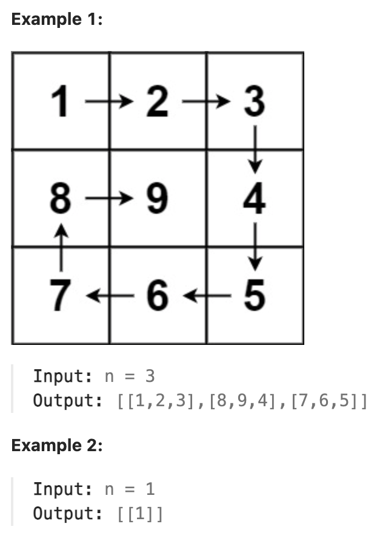

# 59.Spiral Matrix II

### LeetCode 题目链接

[59.Spiral Matrix II](https://leetcode.com/problems/spiral-matrix/)

### 题目大意

给一个正整数 `n`，生成一个包含 `1` 到 `n^2` 所有元素，且元素按`顺时针`顺序螺旋排列的 `n x n` 正方形矩阵 `matrix`



说明:
- 1 <= n <= 20

### 解题

模拟顺时针画矩阵的过程:
- 填充上行从左到右
- 填充右列从上到下
- 填充下行从右到左
- 填充左列从下到上

这里每一条边，从遍历的长度可以看出每一个拐角处的处理规则，拐角处让给新的一条边来继续画，即坚持了每条边`左闭右开`的原则

```java
// 写法一
class Solution {
    public int[][] generateMatrix(int n) {
        int[][] matrix = new int[n][n];
        int up = 0, low = n - 1;
        int left = 0, right = n - 1;

        // 需要填入矩阵的数字
        int num = 1;
        while (num <= n * n) {
            if (up <= low) {
                // 在顶部从左向右遍历
                for (int j = left; j <= right; j++) {
                    matrix[up][j] = num++;
                }
                // 上边界下移
                up++;
            }

            if (left <= right) {
                // 在右侧从上向下遍历
                for (int i = up; i <= low; i++) {
                    matrix[i][right] = num++;
                }
                // 右边界左移
                right--;
            }
            if (up <= low) {
                // 在底部从右向左遍历
                for (int j = right; j >= left; j--) {
                    matrix[low][j] = num++;
                }
                // 下边界上移
                low--;
            }
            if (left <= right) {
                // 在左侧从下向上遍历
                for (int i = low; i >= up; i--) {
                    matrix[i][left] = num++;
                }
                // 左边界右移
                left++;
            }
        }
        return matrix;
    }
}

// 写法 2
class Solution {
    public int[][] generateMatrix(int n) {
        int loop = 0;  // 控制循环次数
        int[][] res = new int[n][n];
        int start = 0;  // 每次循环的开始点(start, start)
        int count = 1;  // 定义填充数字
        int i, j;
        // n / 2：这是取 n（矩阵的大小）的一半
        // 在一个 n x n 的矩阵中，螺旋会从外部向内部进行，每进行一次完整的螺旋（即一圈），就会进入矩阵的一个更内层的圈
        // 因此，总的螺旋次数（或层数）大约是矩阵大小的一半
        // 若 n 是奇数，中心点将在最后单独处理，这就是为什么使用 n / 2
        while (loop++ < n / 2) { // 判断边界后，loop 从 1 开始
            // 模拟上侧从左到右
            for (j = start; j < n - loop; j++) {
                res[start][j] = count++;
            }
            // 模拟右侧从上到下
            for(i = start; i < n - loop; i++) {
                res[i][j] = count++;
            }
            // 模拟下侧从右到左
            for(; j >= loop; j--) {
                res[i][j] = count++;
            }
            // 模拟左侧从下到上
            for (; i >= loop; i--) {
                res[i][j] = count++;
            }
            start++;
        }
        if (n % 2 == 1) {
            res[start][start] = count;
        }
        return res;
    }
}
```
```python
# 写法 1
class Solution:
    def generateMatrix(self, n: int) -> List[List[int]]:
        matrix = [[0 for _ in range(n)] for _ in range(n)]
        up, low = 0, n - 1
        left, right = 0, n - 1
        num = 1
        while num <= n * n:
            if up <= low:
                for j in range(left, right + 1):
                    matrix[up][j] = num
                    num += 1
                up += 1
            if left <= right:
                for i in range(up, low + 1):
                    matrix[i][right] = num
                    num += 1
                right -= 1
            if up <= low:
                for j in range(right, left - 1, -1):
                    matrix[low][j] = num
                    num += 1
                low -= 1
            if left <= right:
                for i in range(low, up - 1, -1):
                    matrix[i][left] = num 
                    num += 1
                left += 1
        return matrix

# 写法 2
class Solution:
    def generateMatrix(self, n: int) -> List[List[int]]:
        nums = [[0] * n for _ in range(n)]
        # 起始点
        startx, starty = 0, 0     
        # 迭代次数、n 为奇数时，矩阵的中心点
        loop, mid = n // 2, n // 2         
        count = 1

        # 每循环一层偏移量加1，偏移量从1开始
        for offset in range(1, loop + 1):
            # 从左至右，左闭右开
            for i in range(starty, n - offset):
                nums[startx][i] = count
                count += 1
             # 从上至下
            for i in range(startx, n - offset) :   
                nums[i][n - offset] = count
                count += 1
            # 从右至左
            for i in range(n - offset, starty, -1):
                nums[n - offset][i] = count
                count += 1
            # 从下至上
            for i in range(n - offset, startx, -1):
                nums[i][starty] = count
                count += 1 
            # 更新起始点
            startx += 1
            starty += 1
        
        # n 为奇数时，填充中心点
        if n % 2 != 0 :	
            nums[mid][mid] = count 
            
        return nums
```
```js
// 写法 1
var generateMatrix = function(n) {
    let matrix = new Array(n).fill().map(() => new Array(n).fill(0));
    let up = 0, low = n - 1;
    let left = 0, right = n - 1;
    let num = 1;

    while (num <= n * n) {
        if (up <= low) {
            for (let j = left; j <= right; j++) {
                matrix[up][j] = num++;
            }
            // 上边界下移
            up++;
        }
        if (left <= right) {
            // 在右侧从上向下遍历
            for (let i = up; i <= low; i++) {
                matrix[i][right] = num++;
            }
            // 右边界左移
            right--;
        }
        if (up <= low) {
            // 在底部从右向左遍历
            for (let j = right; j >= left; j--) {
                matrix[low][j] = num++;
            }
            // 下边界上移
            low--;
        }
        if (left <= right) {
            // 在左侧从下向上遍历
            for (let i = low; i >= up; i--) {
                matrix[i][left] = num++;
            }
            // 左边界右移
            left++;
        }
    }
    return matrix;
};

// 写法 2
var generateMatrix = function(n) {
    let startX = startY = 0;   // 起始位置
    let loop = Math.floor(n/2);   // 旋转圈数
    let mid = Math.floor(n/2);    // 中间位置
    let offset = 1;    // 控制每一层填充元素个数
    let count = 1;     // 更新填充数字
    let res = new Array(n).fill(0).map(() => new Array(n).fill(0));

    while (loop--) {
        let row = startX, col = startY;
        // 上行从左到右（左闭右开）
        for (; col < n - offset; col++) {
            res[row][col] = count++;
        }
        // 右列从上到下（左闭右开）
        for (; row < n - offset; row++) {
            res[row][col] = count++;
        }
        // 下行从右到左（左闭右开）
        for (; col > startY; col--) {
            res[row][col] = count++;
        }
        // 左列做下到上（左闭右开）
        for (; row > startX; row--) {
            res[row][col] = count++;
        }

        // 更新起始位置
        startX++;
        startY++;

        // 更新offset
        offset += 1;
    }
    // 若 n 为奇数，需要单独给矩阵最中间的位置赋值
    if (n % 2 === 1) {
        res[mid][mid] = count;
    }
    return res;
}
```

- 时间复杂度 `O(n^2)`: 模拟遍历二维矩阵的时间
- 空间复杂度 `O(1)`
