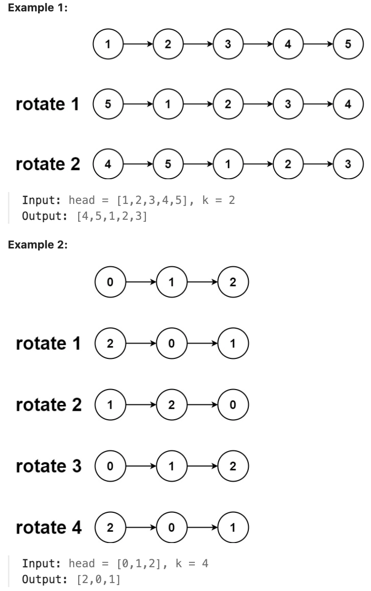

# 61.Rotate List

### LeetCode 题目链接

[61.Rotate List](https://leetcode.com/problems/rotate-list/)

### 题目大意

给一个链表的头节点 `head`，旋转链表，将链表每个节点向右移动 `k` 个位置



说明:
- The number of nodes in the list is in the range [0, 500].
- -100 <= Node.val <= 100
- 0 <= k <= 2 * 10^9

### 解题

```java
class Solution {
    public ListNode rotateRight(ListNode head, int k) {
        if (k == 0 || head == null || head.next == null) {
            return head;
        }
        ListNode curr = head;
        int count = 1;
        while (curr.next != null) {
            count++;
            curr = curr.next;
        }
        int cut = count - k % count;
        curr.next = head;
        while (cut > 0) {
            curr = curr.next;
            cut--;
        }

        ListNode newHead = curr.next;
        curr.next = null;
        return newHead;
    }
}
```
```python
class Solution:
    def rotateRight(self, head: Optional[ListNode], k: int) -> Optional[ListNode]:
        if k == 0 or not head or not head.next:
            return head
        curr = head
        count = 1
        while curr.next:
            count += 1
            curr = curr.next
            
        curr.next = head
        cut = count - k % count
        while cut:
            curr = curr.next
            cut -= 1

        newHead = curr.next
        curr.next = None
        return newHead
```
```js
var rotateRight = function(head, k) {
    if (k === 0 || head === null || head.next === null) {
        return head;
    }

    let curr = head;
    let count = 1;
    while (curr.next !== null) {
        count++;
        curr = curr.next;
    }

    let cut = count - k % count;
    curr.next = head;

    while (cut > 0) {
        curr = curr.next;
        cut--;
    }

    let newHead = curr.next;
    curr.next = null;
    return newHead;
};
```

- 时间复杂度: `O(n)`
- 空间复杂度: `O(1)`