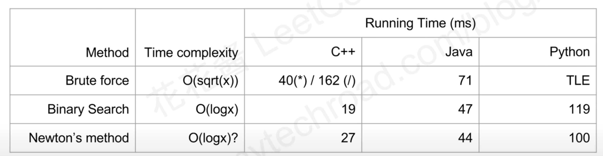

# 69.Sqrt(x)

### LeetCode 题目链接

[69.Sqrt(x)](https://leetcode.com/problems/sqrtx/)

### 题目大意

给一个非负整数 `x`，计算并返回 `x` 的`算术平方根`

由于返回类型是整数，结果只保留`整数部分`，小数部分将被`舍去`

注意：不允许使用任何内置指数函数和算符，例如 `pow(x, 0.5)` 或 `x ** 0.5`

```js
Example 1:

Input: x = 4
Output: 2
Explanation: The square root of 4 is 2, so we return 2.

Example 2:

Input: x = 8
Output: 2
Explanation: The square root of 8 is 2.82842..., and since we round it down to the nearest integer, 2 is returned.
```

说明：
- 0 <= x <= 2^31 - 1

### 解题



#### 思路 1: Brute Force

```java
class Solution {
    public int mySqrt(int x) {
        if(x <= 1) return x;
        for(long s = 1; s <= x; ++s) { // s 从 1 开始逐步递增，直到 s 的平方大于 x
            if(s * s > x) return (int)s - 1; // 若 s 的平方大于 x，返回 s - 1
        }
        return -1;
    }
}
```
```python
class Solution:
    def mySqrt(self, x: int) -> int:
        if x <= 1: 
            return x
        s = 1
        while s * s <= x:
            s += 1
        return s - 1
```
```js
var mySqrt = function(x) {
    if (x <= 1) return x;
    let s = 1;
    while (s * s <= x) {
        s++;
    }
    return s - 1;
};
```

- 时间复杂度: `O(sqrt(x))`
- 空间复杂度: `O(1)`

#### 思路 2: 二分搜索

因为求解的是 `x` 开方的整数部分，所以可以从 `0 ~ x` 的范围进行遍历，找到 `s^2 <= x` 的最大结果

为了减少算法的时间复杂度，可以使用`二分搜索`的方法来搜索答案

```java
class Solution {
    public int mySqrt(int x) {
        int left = 1, right = x; // x 的平方根不会超过 x 本身
        while(left <= right) {
            int mid = left + (right - left) / 2;
            if(x / mid < mid) {
                right = mid - 1;
            } else {
                left = mid + 1;
            }
        }
        // 因为在循环的最后一步中，left 将被设置为超过平方根的第一个整数
        // 而 right 是平方根的整数部分或最接近的整数
        return right; 
    }
}
```
```python
class Solution:
    def mySqrt(self, x: int) -> int:
        left, right = 0, x
        res = 0
        while left <= right:
            mid = left + (right - left) // 2
            if mid**2 > x:
                right = mid - 1
            elif mid**2 < x:
                left = mid + 1
                res = mid
            else: 
                return mid
        return res
```
```js
var mySqrt = function(x) {
    let left = 0, right = x;
    while(left <= right) {
        let mid = left + Math.floor((right - left) / 2);
        if (mid * mid > x) {
            right = mid - 1;
        } else {
            left = mid + 1;
        }
    }
    return right;
};
```

- 时间复杂度: `O(log n)`
- 空间复杂度: `O(1)`

