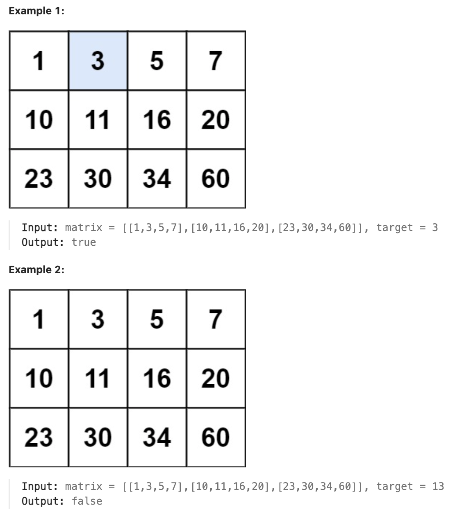

# 74.Search a 2D Matrix

### LeetCode 题目链接

[74.Search a 2D Matrix](https://leetcode.com/problems/search-a-2d-matrix/)

### 题目大意

给一个满足下述两条属性的 `m x n` 整数矩阵：
- 每行中的整数从左到右按非严格递增顺序排列
- 每行的第一个整数大于前一行的最后一个整数

给一个整数 `target`，若 `target` 在矩阵中，返回 `true`；否则，返回 `false` 

说明:
- m == matrix.length
- n == matrix[i].length
- 1 <= m, n <= 100
- -10^4 <= matrix[i][j], target <= 10^4

### 解题

