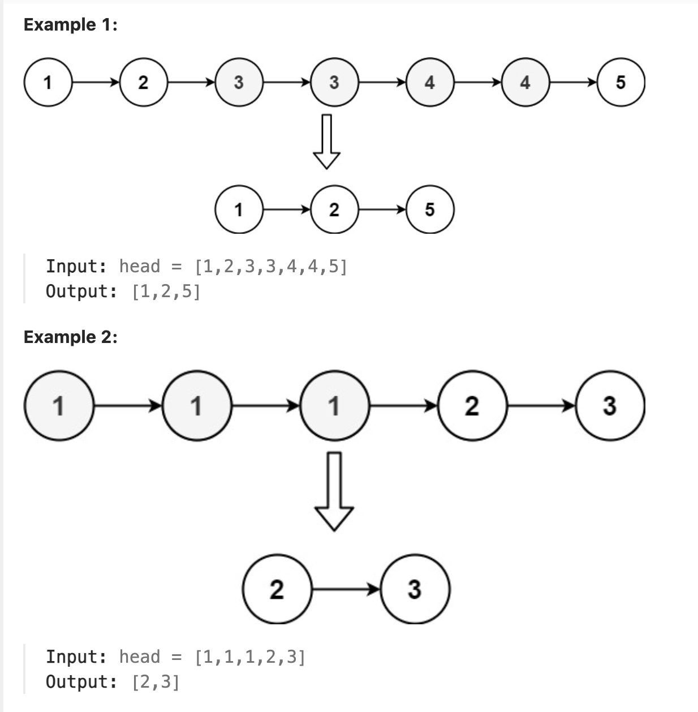
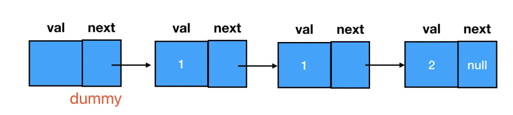
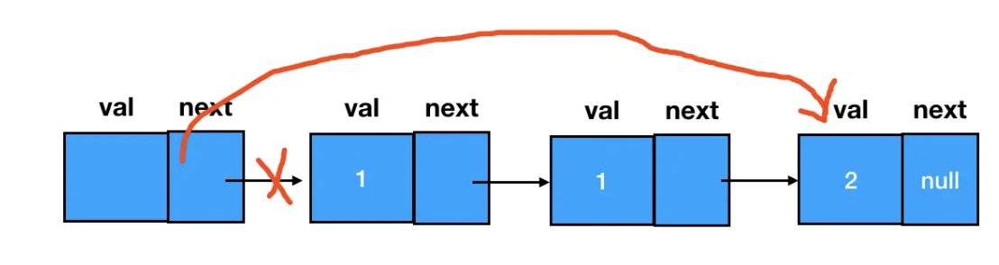

# 82.Remove Duplicates from Sorted List II

### LeetCode 题目链接

[82.Remove Duplicates from Sorted List II](https://leetcode.com/problems/remove-duplicates-from-sorted-list-ii/)

### 题目大意

给定一个已排序的链表的头`head`，删除原始链表中所有重复数字的节点，只留下不同的数字 。返回`已排序`的链表



说明:
- The number of nodes in the list is in the range [0, 300].
- -100 <= Node.val <= 100
- The list is guaranteed to be sorted in ascending order.

### 解题

这里要做的事情变成了把前驱和后继一起删掉，这里引入之前提到的 `dummy`



若想要删除两个连续重复的值为 `1` 的结点，只需把 `dummy` 节点的 `next` 指针直接指向 `2`：



```java
class Solution {
    public ListNode deleteDuplicates(ListNode head) {
        if(head == null || head.next == null) return head;
        ListNode dummy = new ListNode(-1);
        dummy.next = head;
        ListNode cur = dummy;
        while(cur.next != null && cur.next.next != null) {
            if(cur.next.val == cur.next.next.val) {
                ListNode temp = cur.next;
                while(temp != null && temp.next != null && temp.val == temp.next.val) {
                    temp = temp.next;
                }
                cur.next = temp.next;
            } else {
                cur = cur.next;
            }
        }
        return dummy.next;
    }
}
```
```python
class Solution:
    def deleteDuplicates(self, head: Optional[ListNode]) -> Optional[ListNode]:
        if head == None or head.next == None:
            return head
        dummy = ListNode(-1)
        dummy.next = head
        cur = dummy
        while cur.next and cur.next.next:
            if cur.next.val == cur.next.next.val:
                temp = cur.next
                while temp and temp.next and temp.val == temp.next.val:
                    temp = temp.next
                cur.next = temp.next
            else:
                cur = cur.next
        return dummy.next
```
```js
var deleteDuplicates = function(head) {
    if(head == null || head.next == null) return head;
    let dummy = new ListNode(-1);
    dummy.next = head;
    let cur = dummy;
    while(cur.next != null && cur.next.next != null) {
        if(cur.next.val == cur.next.next.val) {
            let temp = cur.next;
            while(temp && temp.next && temp.val == temp.next.val) {
                temp = temp.next;
            }
            cur.next = temp.next;
        } else {
            cur = cur.next;
        }
    }
    return dummy.next;
};
```
- 时间复杂度: `O(n)`
- 空间复杂度: `O(1)`