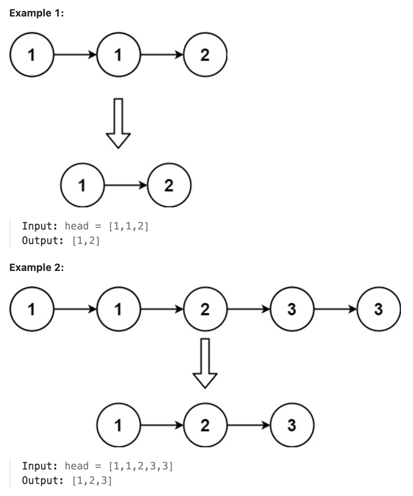

# 83.Remove Duplicates from Sorted List

### LeetCode 题目链接

[83.Remove Duplicates from Sorted List](https://leetcode.com/problems/remove-duplicates-from-sorted-list/)

### 题目大意

给定一个已排序的链表的头 `head`， 删除所有重复的元素，使每个元素只出现一次，返回`已排序`的链表



说明:
- The number of nodes in the list is in the range [0, 300].
- -100 <= Node.val <= 100
- The list is guaranteed to be sorted in ascending order.

### 解题

```java
// 写法 一
class Solution {
    public ListNode deleteDuplicates(ListNode head) {
        if(head == null) return head;
        ListNode slow = head, fast = head;
        while(fast != null) {
            if(fast.val != slow.val) {
                slow.next = fast;
                slow = slow.next;
            }
            fast = fast.next;
        }
        // 断开与后面重复元素的连接
        // 确保新链表的末尾没有指向旧链表中的重复元素
        slow.next = null;
        // 返回新链表的头部 head，这个链表不包含重复的元素
        return head;
    }
}

// 写法 二
class Solution {
    public ListNode deleteDuplicates(ListNode head) {
        if(head == null) return head;
        ListNode cur = head;
        while(cur.next != null) {
            if(cur.val == cur.next.val) {
                cur.next = cur.next.next;
            } else {
                cur = cur.next;
            }
        }
        return head;
    }
}
```
```python
# 写法 一
class Solution:
    def deleteDuplicates(self, head: Optional[ListNode]) -> Optional[ListNode]:
        if head == None:
            return head
        slow = head
        fast = head
        while fast != None:
            if slow.val != fast.val:
                slow.next = fast
                slow = slow.next
            fast = fast.next
        slow.next = None
        return head

# 写法 二
class Solution:
    def deleteDuplicates(self, head: Optional[ListNode]) -> Optional[ListNode]:
        if head == None:
            return head
        cur = head
        while cur.next != None:
            if cur.val == cur.next.val:
                cur.next = cur.next.next
            else:
                cur = cur.next
        return head
```
```js
// 写法 一
var deleteDuplicates = function(head) {
    if(head == null) return head;
    let slow = head, fast = head;
    while(fast != null) {
        if(fast.val != slow.val) {
            slow.next = fast;
            slow = slow.next;
        }
        fast = fast.next;
    }
    slow.next = null;
    return head;
};

// 写法 二
var deleteDuplicates = function(head) {
    if(head == null) return head;
    let cur = head;
    while(cur.next != null) {
        if(cur.val == cur.next.val) {
            cur.next = cur.next.next;
        } else {
            cur = cur.next;
        }
    }
    return head;
};
```

- 时间复杂度:`O(n)`， `n` 为链表长度
- 空间复杂度: `O(1)`