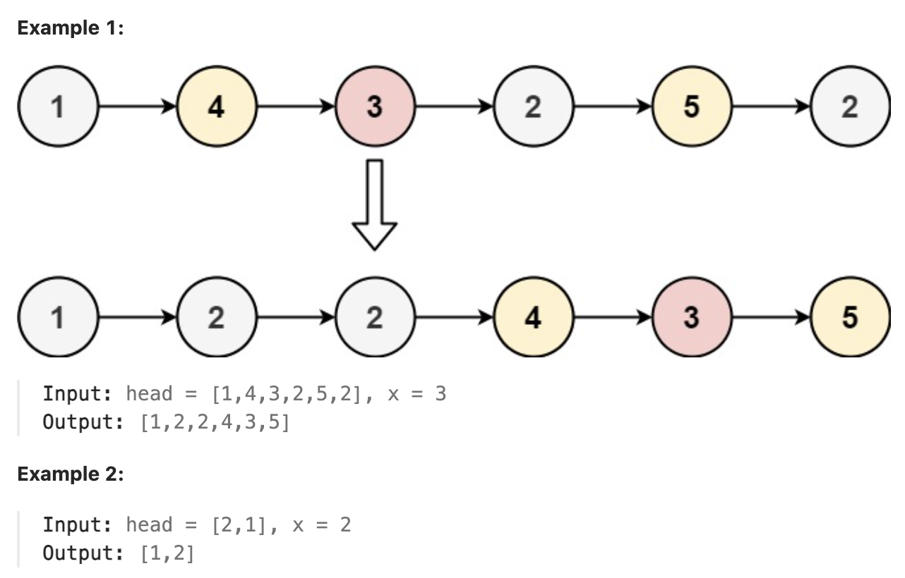

# 86.Partition List

### LeetCode 题目链接

[86.Partition List](https://leetcode.com/problems/partition-list/)

### 题目大意

给一个链表的头节点 `head` 和一个特定值 `x`，请对链表进行分隔，使得所有`小于 x`的节点都出现在`大于或等于 x`的节点前

应当`保留`两个分区中每个节点的初始相对位置



说明:
- The number of nodes in the list is in the range [0, 200].
- -100 <= Node.val <= 100
- -200 <= x <= 200

### 解题

可以把原链表分成两个小链表，一个链表中的元素大小都小于 `x`，另一个链表中的元素都大于等于 `x`，最后再把这两条链表接到一起，就得到了题目想要的结果

```java
class Solution {
    public ListNode partition(ListNode head, int x) {
        // 存放小于 x 的链表的虚拟头结点
        ListNode dummy1 = new ListNode(-1);
        // 存放大于等于 x 的链表的虚拟头结点
        ListNode dummy2 = new ListNode(-1);
        // p1, p2 指针负责生成结果链表
        ListNode p1 = dummy1, p2 = dummy2;
        // p 负责遍历原链表，类似合并两个有序链表的逻辑
        // 这里是将一个链表分解成两个链表
        ListNode p = head;

        while(p != null) {
            if(p.val >= x) {
                p2.next = p;
                p2 = p2.next;
            } else {
                p1.next = p;
                p1 = p1.next;
            }
            // 不能直接让 p 指针前进，
            // p = p.next
            // 断开原链表中的每个节点的 next 指针
            ListNode temp = p.next;
            // 该行将当前节点与列表的其余部分断开
            // 在此操作后，p 将成为其新的较短列表的最后一个节点
            // 原列表在 p 后的节点将不再直接从 p 获取
            p.next = null;
            // 这一行后 p 指向下一个节点，也断开了与前一个节点的连接
            p = temp;
        }
        // 连接两个链表
        p1.next = dummy2.next;
        return dummy1.next;
    }
}
```
```python
class Solution:
    def partition(self, head: Optional[ListNode], x: int) -> Optional[ListNode]:
        dummy1 = ListNode(-1)
        dummy2 = ListNode(-1)
        p1, p2 = dummy1, dummy2
        p = head
        while p != None:
            if p.val >= x:
                p2.next = p
                p2 = p2.next
            else:
                p1.next = p
                p1 = p1.next
            
            # 断开当前节点与原始列表其余部分的连接
            temp = p.next
            p.next = None
            p = temp
        
        p1.next = dummy2.next
        return dummy1.next
```
```js
var partition = function(head, x) {
    let dummy1 = new ListNode(-1);
    let dummy2 = new ListNode(-1);
    let p1 = dummy1, p2 = dummy2;
    let p = head;
    while(p != null) {
        if(p.val >= x) {
            p2.next = p;
            p2 = p2.next;
        } else {
            p1.next = p;
            p1 = p1.next;
        }

        temp = p.next;
        p.next = null;
        p = temp;
    }
    p1.next = dummy2.next;
    return dummy1.next;
};
```

- 时间复杂度：`O(n)`
- 空间复杂度：`O(1)`