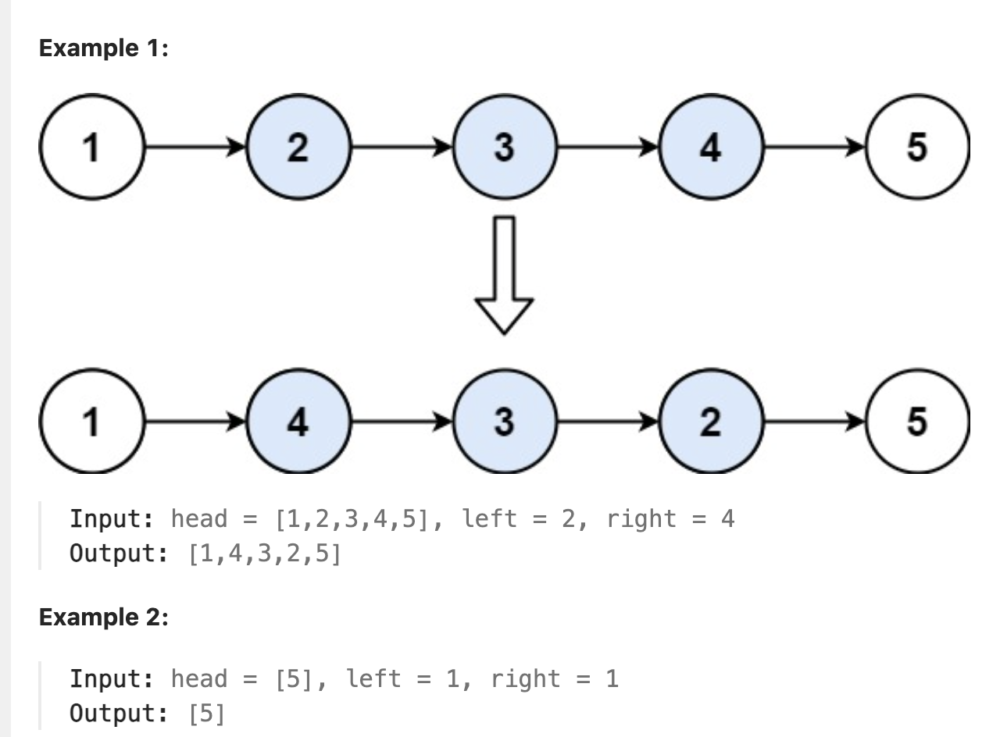
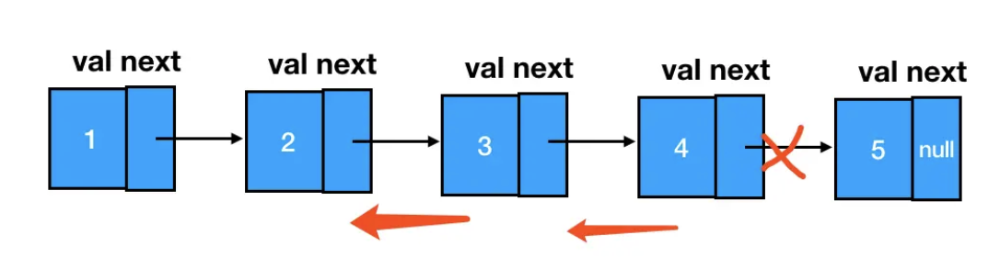
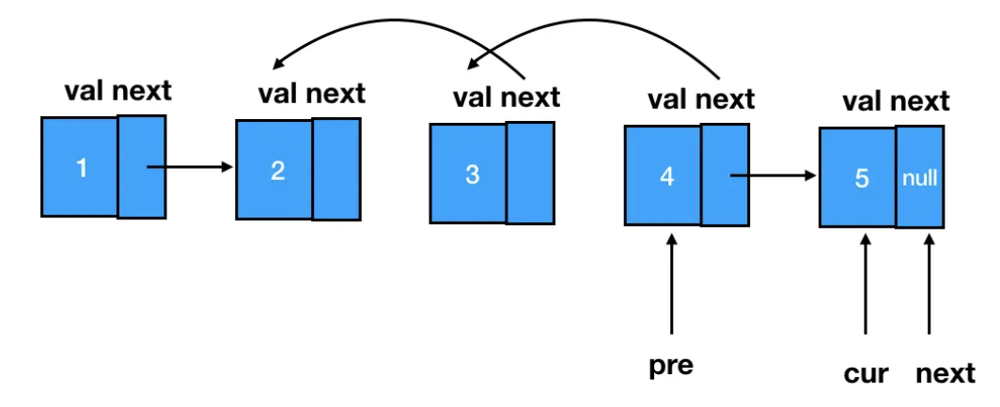

# 92.Reverse Linked List II

### LeetCode 题目链接

[92.Reverse Linked List II](https://leetcode.com/problems/reverse-linked-list-ii/)

### 题目大意

给个单链表的头指针 `head` 和两个整数 `left` 和 `right`，其中 `left <= right`

请反转从位置 `left` 到位置 `right` 的链表节点，返回`反转后的链表` 



说明:
- The number of nodes in the list is n.
- 1 <= n <= 500
- -500 <= Node.val <= 500
- 1 <= left <= right <= n

### 解题

#### 思路 1: 递归

```java
class Solution {
    public ListNode reverseBetween(ListNode head, int left, int right) {
        // base case
        if(left == 1){
            return reverseN(head, right);
        }
        // 前进到反转的起点触发 base case
        head.next = reverseBetween(head.next, left - 1, right - 1);
        return head;
    }

    ListNode successor = null; // 后驱节点
    // 反转以 head 为起点的 right 个节点，返回新的头结点
    ListNode reverseN(ListNode head, int n) {
        if (n == 1) {
            // 记录第 n + 1 个节点
            successor = head.next;
            return head;
        }
        // 以 head.next 为起点，需要反转前 n - 1 个节点
        ListNode last = reverseN(head.next, n - 1);
        head.next.next = head;
        // 让反转后的 head 节点和后面的节点连起来
        head.next = successor;
        return last;
    }
}
```
```python
class Solution:
    def reverseBetween(self, head: Optional[ListNode], left: int, right: int) -> Optional[ListNode]:
        if left == 1:
            return self.reverse(head, right)
        
        # 前进到反转的起点触发
        head.next = self.reverseBetween(head.next, left - 1, right - 1)
        return head
    
    successor = None # 后驱节点
    # 反转以 head 为起点的 n 个节点，返回新的头结点
    def reverse(self, head: ListNode, right: int) -> ListNode:
        if right == 1:
            # 记录第 right + 1 个节点
            self.successor = head.next
            return head
        
        # 以 head.next 为起点，需要反转前 right - 1 个节点
        last = self.reverse(head.next, right - 1)
        head.next.next = head
        # 让反转之后的 head 节点和后面的节点连起来
        head.next = self.successor
        return last
```
```js
var reverseBetween = function(head, left, right) {
    let successor = null;
    const reverse = function(head, right) {
        if (right == 1) {
            successor = head.next;
            return head;
        }
        const last = reverse(head.next, right - 1);
        head.next.next = head;
        head.next = successor;
        return last;

    };
    // base case
    if (left == 1) {
        return reverse(head, right);
    }
    head.next = reverseBetween(head.next, left - 1, right - 1);
    return head;
};
```
- 时间复杂度：`O(n)`
- 空间复杂度：`O(n)`，需要 n 层栈空间

#### 思路 2: 多指针



4 -> 3，3 -> 2，关键在于如何让 1 -> 4、让 2 -> 5，这就要求在单纯的重复“逆序”这个动作外，还需要对被逆序的区间前后的两个结点做额外的处理

由于遍历链表的顺序是从前往后遍历，为了避免 1 和 2 随着遍历向后推进被遗失，需要提前把 1 缓存下来。而随着遍历的进行，当完成了 4 的指针反转后，cur 指针就恰好指在 5 上



```java
class Solution {
    public ListNode reverseBetween(ListNode head, int left, int right) {
        ListNode pre, cur, leftHead, p, start, next;
        ListNode dummy = new ListNode(-1);
        dummy.next = head;
        p = dummy;
        for(int i = 0; i < left - 1; i ++) {
            p = p.next;
        }
        leftHead = p;
        start = leftHead.next;
        pre = start;
        cur = pre.next;
        for(int i = left; i < right; i ++) {
            next = cur.next;
            cur.next = pre;
            pre = cur;
            cur = next;
        }
        leftHead.next = pre;
        start.next = cur;
        return dummy.next;
    }
```
```python
class Solution:
    def reverseBetween(self, head: Optional[ListNode], left: int, right: int) -> Optional[ListNode]:
        if not head:
            return None

        dummy = ListNode(-1)
        dummy.next = head
        p = dummy

        for i in range(left - 1):
            p = p.next
        
        leftHead = p
        start = leftHead.next
        pre = start
        cur = pre.next
        for i in range(left, right):
            next = cur.next
            cur.next = pre
            pre = cur
            cur = next

        leftHead.next = pre
        start.next = cur
        
        return dummy.next
```
```js
var reverseBetween = function(head, left, right) {
    // 定义 pre、cur，用 leftHead 来承接整个区间的前驱结点
    let pre, cur, leftHead;
    // dummy 的后继结点是头结点
    let dummy = new ListNode(-1);
    dummy.next = head;

    // p 是一个游标，用于遍历，最初指向 dummy
    let p = dummy;
    // p 往前走 left - 1 步，走到整个区间的前驱结点处
    for(let i = 0; i < left - 1; i++){
        p = p.next;
    }
    // 缓存这个前驱结点到 leftHead 里
    leftHead = p;
    // start 是反转区间的第一个结点
    let start = leftHead.next;  
    // pre 指向start
    pre = start;
    // cur 指向 start 的下一个结点
    cur = pre.next;
    // 开始重复反转动作
    for(let i = left; i < right; i++) {
        let next = cur.next;
        cur.next = pre;
        pre = cur;
        cur = next;
    }
    leftHead.next = pre;
    start.next = cur;
    return dummy.next;
};
```
- 时间复杂度：`O(n)`
- 空间复杂度：`O(1)`