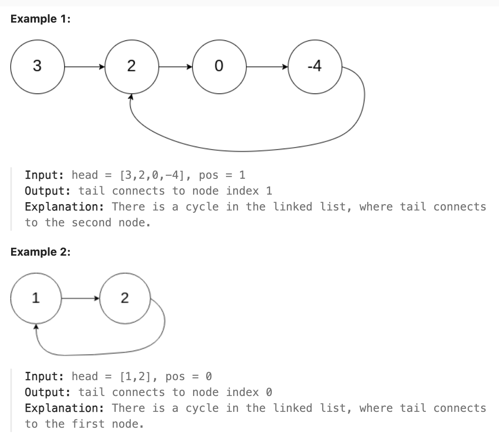
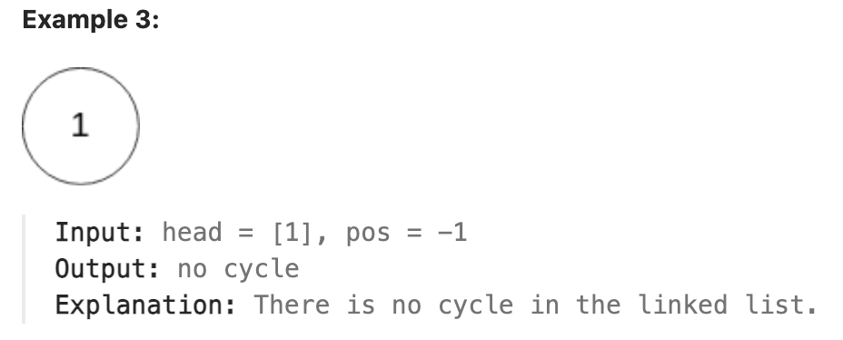
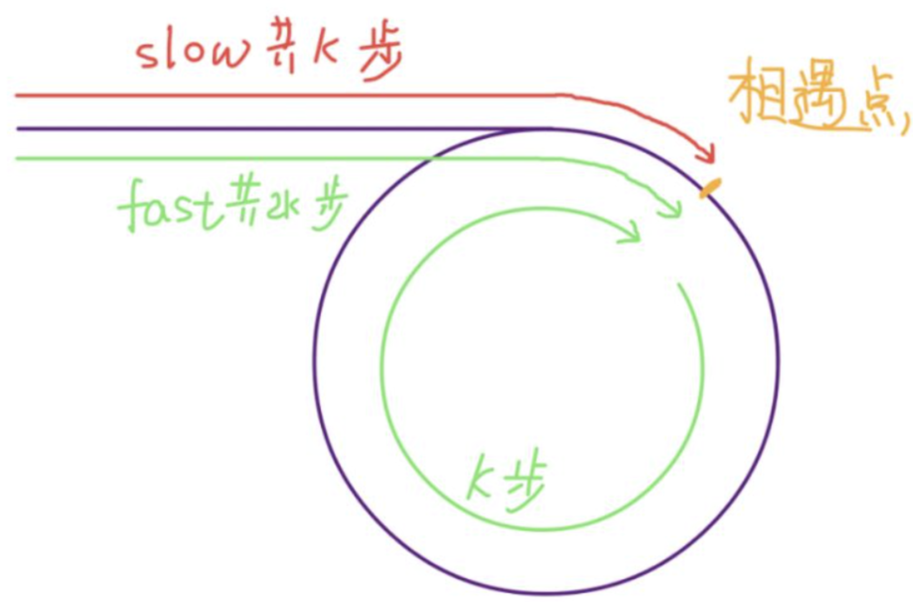
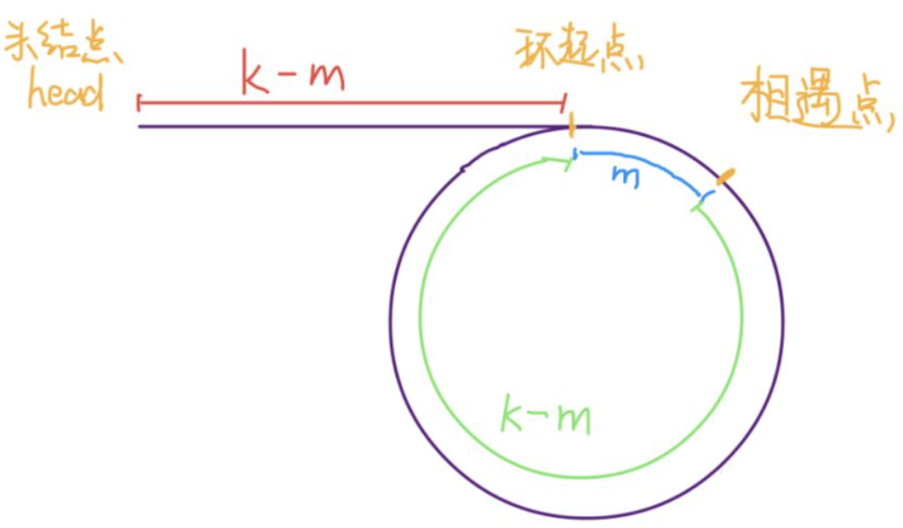

# 142.Linked List Cycle II

### LeetCode 题目链接

[142.Linked List Cycle II](https://leetcode.com/problems/linked-list-cycle-ii/)

### 题目大意

给定一个链表的头节点 `head`，返回链表开始入环的第一个节点，若链表无环，则返回 `null`

若链表中有某个节点，可通过连续跟踪 `next` 指针再次到达，则链表中存在环

为了表示给定链表中的环，评测系统内部使用整数 `pos` 来表示链表尾连接到链表中的位置（索引从 `0` 开始）；若 `pos` 是 `-1`，则在该链表中没有环

注意：`pos` 不作为参数进行传递，仅仅是为了标识链表的实际情况

`不允许修改`链表





说明:
- The number of the nodes in the list is in the range [0, 10^4].
- -10^5 <= Node.val <= 10^5
- pos is -1 or a valid index in the linked-list.

### 解题

假设快慢指针相遇时，慢指针 `slow` 走了 `k` 步，则快指针 `fast` 一定走了 `2k` 步

`fast` 一定比 `slow` 多走了 `k` 步，多走的 `k` 步其实就是 `fast` 指针在环里转圈圈，所以 `k` 的值就是环长度的`整数倍`



假设相遇点距环的起点的距离为 `m`，则环的起点距头结点 `head` 的距离为 `k - m`，即若从 `head` 前进 `k - m` 步就能到达环起点。若从相遇点继续前进 `k - m` 步，也恰好到达环起点



所以，只要把快慢指针中的任一个重新指向 `head`，然后两个指针同速前进，`k - m` 步后一定会相遇，相遇之处就是环的起点

```java
// 写法 1
public class Solution {
    public ListNode detectCycle(ListNode head) {
        ListNode slow = head, fast = head;
        while(fast != null && fast.next != null) {
            slow = slow.next;
            fast = fast.next.next;
            if(slow == fast) { // 有环
                ListNode index1 = fast, index2 = head;
                // 两个指针，从头结点和相遇结点，都往前走，直到相遇，相遇点即为环入口
                while(index1 != index2) {
                    index1 = index1.next;
                    index2 = index2.next;
                }
                return index1;
            }
        }
        return null;
    }
}

// 写法 2
public class Solution {
    public ListNode detectCycle(ListNode head) {
        ListNode slow = head, fast = head;
        while(fast != null && fast.next != null) {
            slow = slow.next;
            fast = fast.next.next;
            if(slow == fast) break;
        }
        if(fast == null || fast.next == null) {
            return null;
        }
        // 重新指向头结点
        slow = head;
        // 快慢指针同步前进，相交点就是环起点
        while(slow != fast) {
            slow = slow.next;
            fast = fast.next;
        }
        return slow;
    }
}
```
```python
# 写法 1
class Solution:
    def detectCycle(self, head: Optional[ListNode]) -> Optional[ListNode]:
        slow = head
        fast = head
        while fast != None and fast.next != None:
            slow = slow.next
            fast = fast.next.next
            if slow == fast:
                index1, index2 = fast, head
                while index1 != index2:
                    index1 = index1.next
                    index2 = index2.next
                return index1
        return None

# 写法 2
class Solution:
    def detectCycle(self, head: Optional[ListNode]) -> Optional[ListNode]:
        slow = head
        fast = head
        while fast != None and fast.next != None:
            slow = slow.next
            fast = fast.next.next
            if slow == fast:
                break

        if fast == None or fast.next == None:
            return None

        slow = head
        
        while fast != slow:
            slow = slow.next
            fast = fast.next

        return slow
```
```js
// 写法 1
var detectCycle = function(head) {
    let slow = head, fast = head;
    while(fast != null && fast.next != null) {
        slow = slow.next;
        fast = fast.next.next;
        if(slow == fast) {
            let index1 = fast, index2 = head;
            while(index1 != index2) {
                index1 = index1.next;
                index2 = index2.next;
            }
            return index1;
        }
    }
    return null;
};

// 写法 2
var detectCycle = function(head) {
    let slow = head, fast = head;
    while(fast != null && fast.next != null) {
        slow = slow.next;
        fast = fast.next.next;
        if(slow == fast) break;
    }

    if(fast == null || fast.next == null) return null;
    
    slow = head;
    while(slow != fast) {
        slow = slow.next;
        fast = fast.next;
    }
    
    return slow;
};
```

- 时间复杂度: `O(n)`，快慢指针相遇前，指针走的次数小于链表长度；快慢指针相遇后，两个指针走的次数也小于链表长度，总体为走的次数小于 `2n`
- 空间复杂度: `O(1)`