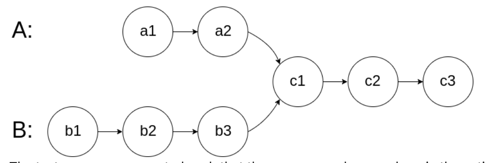
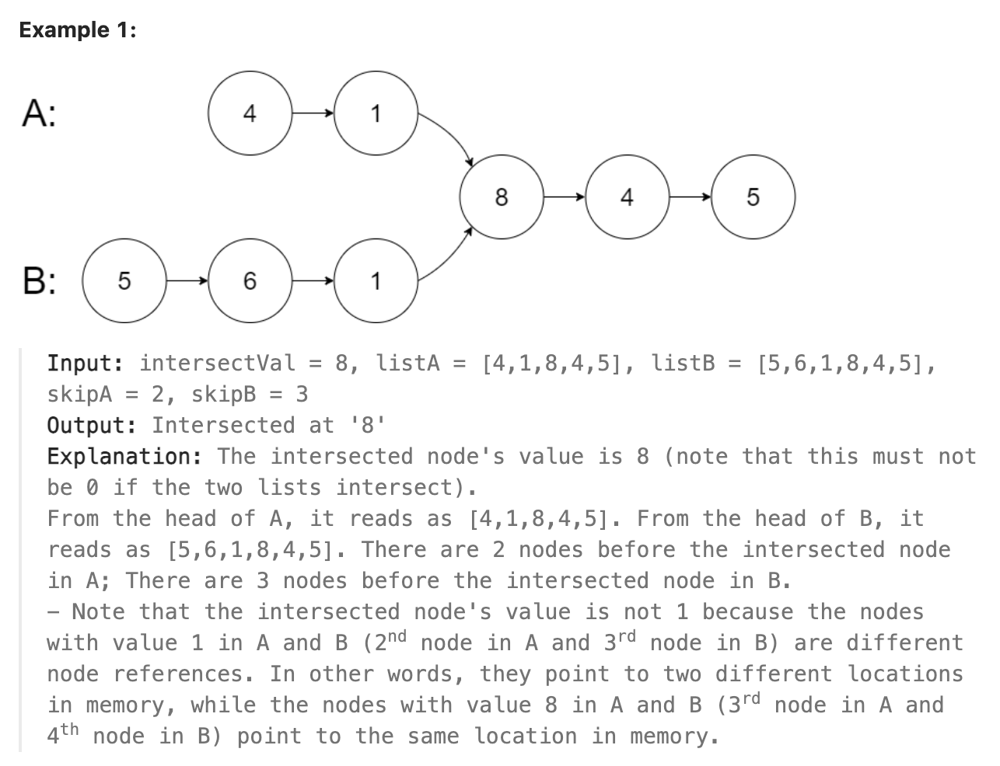
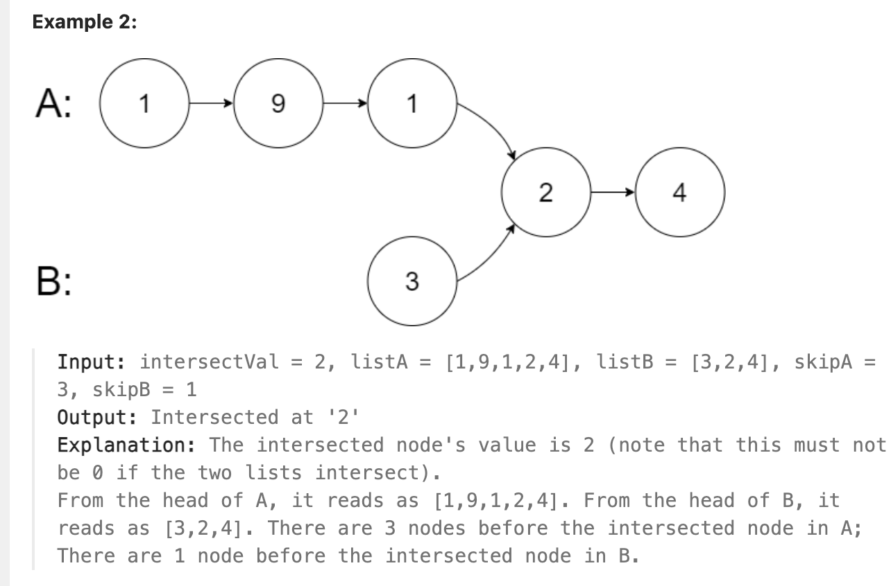
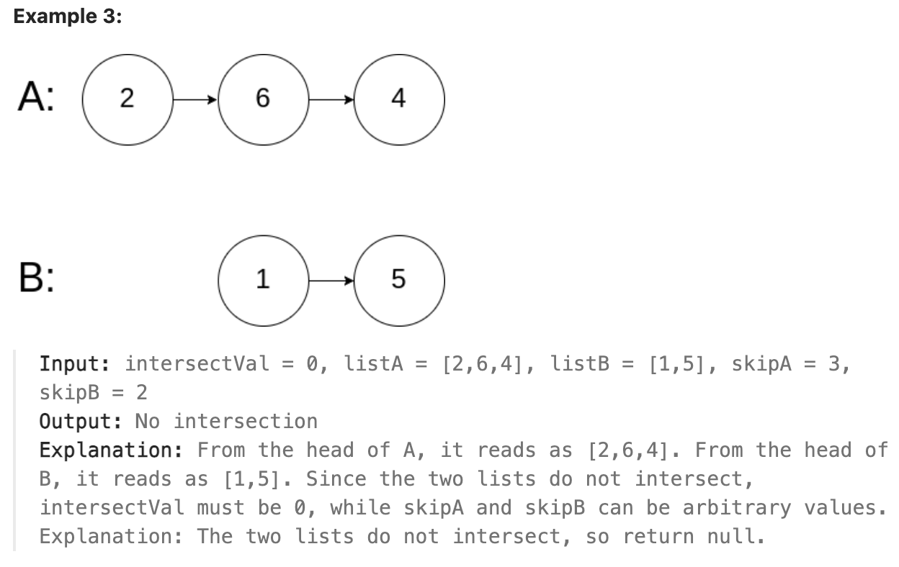

# 160.Intersection of Two Linked Lists

### LeetCode 题目链接

[160.Intersection of Two Linked Lists](https://leetcode.com/problems/intersection-of-two-linked-lists/)

### 题目大意

给两个单链表的头节点`headA`和`headB`，请找出并返回两个单链表相交的起始节点，若两个链表不存在相交节点，返回`null`

图示两个链表在节点 `c1` 开始相交：



题目数据`保证`整个链式结构中不存在环

注意，函数返回结果后，链表必须`保持其原始结构`







说明:
- The number of nodes of listA is in the m.
- The number of nodes of listB is in the n.
- 1 <= m, n <= 3 * 10^4
- 1 <= Node.val <= 10^5
- 0 <= skipA < m
- 0 <= skipB < n
- intersectVal is 0 if listA and listB do not intersect.
- intersectVal == listA[skipA] == listB[skipB] if listA and listB intersect.

### 解题

简单来说就是求两个链表交点节点的`指针`
> 交点不是数值相等，而是`指针`相等

#### 解法 1

求出两个链表的长度，并求出两个链表长度的差值，然后让 `curA` 移动到和 `curB` 末尾对齐的位置

此时比较 `curA` 和 `curB` 是否相同，若不相同则同时向后移动 `curA` 和 `curB`，若遇到 `curA == curB` 则找到交点

```java
public class Solution {
    public ListNode getIntersectionNode(ListNode headA, ListNode headB) {
        ListNode curA = headA;
        ListNode curB = headB;
        int lenA = 0, lenB = 0;
        // 计算 headA 的长度
        while(curA != null) {
            lenA++;
            curA = curA.next;
        }
        // 计算 headB 的长度
        while(curB != null) {
            lenB++;
            curB = curB.next;
        }

        // 重置指向每个列表头部的指针
        curA = headA;
        curB = headB;

        // 让 curA 为最长链表的头，lenA 为其长度
        if(lenB > lenA) {
            // 1. 交换 lenA, lenB
            // lenA 是较长列表的长度
            int tmpLen = lenA;
            lenA = lenB;
            lenB = tmpLen;
            // 2. 交换 curA, curB
            // 使 curA 指向较长列表的头部
            ListNode tmpNode = curA;
            curA = curB;
            curB = tmpNode;
        }
        // 求长度差
        int gap = lenA - lenB;
        // 让 curA 和 curB 在同一起点上（末尾位置对齐）
        while(gap-- > 0){
            curA = curA.next;
        }
        // 同时遍历 curA 和 curB，遇到相同则直接返回
        while (curA != null) {
            if (curA == curB) {
                return curA;
            }
            curA = curA.next;
            curB = curB.next;
        }
        return null;
    }
}
```
```python
class Solution:
    def getIntersectionNode(self, headA: ListNode, headB: ListNode) -> Optional[ListNode]:
        diff = self.getLen(headA) - self.getLen(headB)

        # 通过移动较长的链表，使两链表长度相等
        if(diff > 0):
            headA = self.moveForward(headA, diff)
        else:
            headB = self.moveForward(headB, abs(diff))
        
        # 将两个头向前移动，直到它们相交
        while headA and headB:
            if headA == headB:
                return headA
            headA = headA.next
            headB = headB.next

        return None

    def getLen(self, head: ListNode) -> int:
        len = 0
        while head:
            len += 1
            head = head.next
        return len
    
    def moveForward(self, head: ListNode, steps: int) -> ListNode:
        while steps > 0:
            head = head.next
            steps -= 1
        return head
```
```js
var getIntersectionNode = function(headA, headB) {
    let diff = getLen(headA) - getLen(headB);
    if(diff > 0) {
        headA = moveForward(headA, diff);
    } else {
        headB = moveForward(headB, Math.abs(diff));
    }

    while(headA != null && headB != null) {
        if(headA == headB) {
            return headA;
        }

        headA = headA.next;
        headB = headB.next;
    }
    return null;
};

var moveForward = function(head, steps) {
    while(steps > 0) {
        head = head.next;
        steps--;
    }
    return head;
}

var getLen = function(head) {
    let len = 0;
    while (head) {
        len++;
        head = head.next;
    }
    return len;
};
```

- 时间复杂度：`O(n + m)` (`m` 是链表 `A` 的长度，`n` 是链表 `B` 的长度。这是因为该方法会遍历每个列表一次以计算它们的长度，然后再次遍历以找到交集)
- 空间复杂度：`O(1)`

#### 解法 2

若用两个指针 `p1` 和 `p2` 分别在两条链表上前进，可以让 `p1` 遍历完链表 `A` 后开始遍历链表 `B`，让 `p2` 遍历完链表 `B` 后开始遍历链表 `A`，这样相当于逻辑上两条链表接在了一起

若这样进行拼接，就可让 `p1` 和 `p2` 同时进入公共部分，即同时到达相交节点

```java
public class Solution {
    public ListNode getIntersectionNode(ListNode headA, ListNode headB) {
        ListNode p1 = headA, p2 = headB;
        while(p1 != p2) {
            // p1 走一步，若走到 A 链表末尾，转到 B 链表
            if(p1 == null) {
                p1 = headB;
            } else {
                p1 = p1.next;
            }
            // p2 走一步，若走到 B 链表末尾，转到 A 链表
            if(p2 == null) {
                p2 = headA;
            } else {
                p2 = p2.next;
            }
        }
        return p1;
    }
}
```
```python
class Solution:
    def getIntersectionNode(self, headA: ListNode, headB: ListNode) -> Optional[ListNode]:
        p1, p2 = headA, headB
        while p1 != p2:
            if p1 == None:
                p1 = headB
            else:
                p1 = p1.next
            
            if p2 == None:
                p2 = headA
            else:
                p2 = p2.next
        return p1
```
```js
var getIntersectionNode = function(headA, headB) {
    let p1 = headA, p2 = headB;
    while(p1 != p2) {
        if(p1 == null) {
            p1 = headB;
        } else {
            p1 = p1.next;
        }
        if(p2 == null) {
            p2 = headA;
        } else {
            p2 = p2.next;
        }
    }
    return p1;
};
```

- 时间复杂度：`O(n + m)`，`m` 是链表 `A` 的长度，`n` 是链表 `B` 的长度
- 空间复杂度：`O(1)`