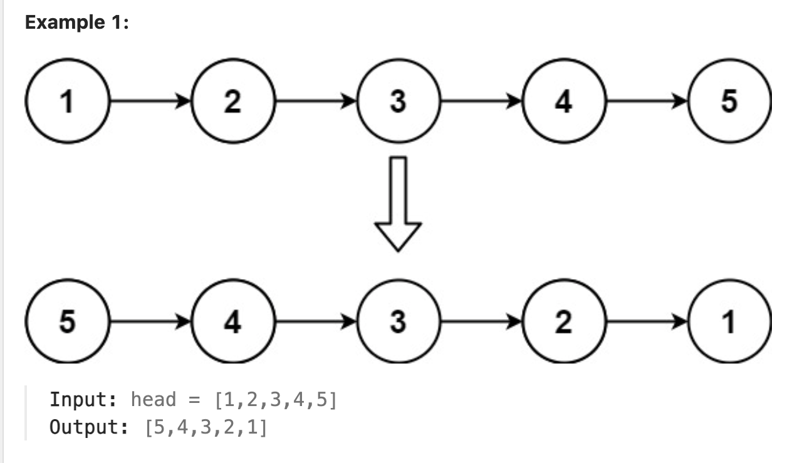
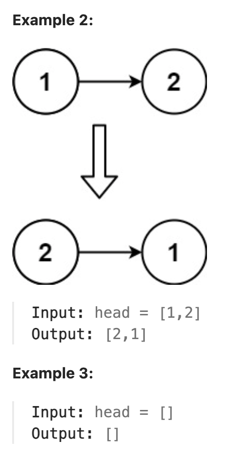
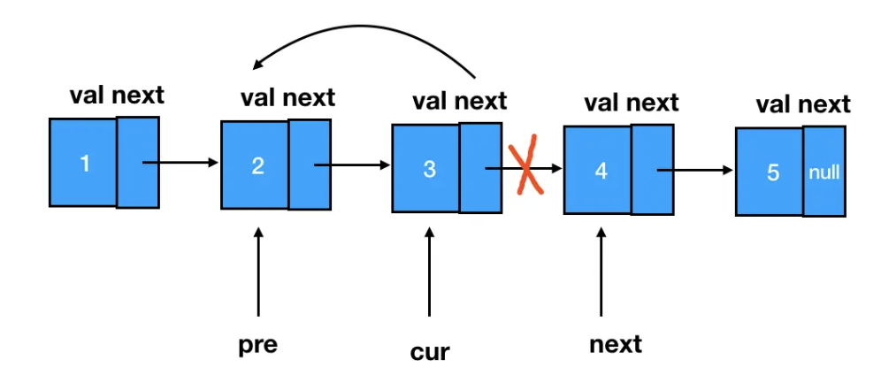
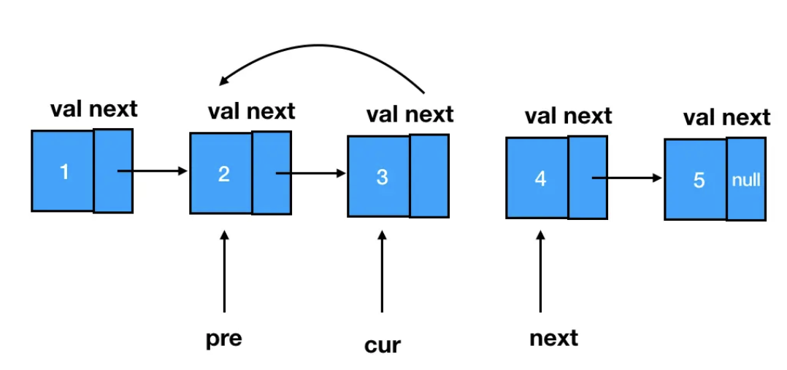

# 206.Reverse Linked List

### LeetCode 题目链接

[206.Reverse Linked List](https://leetcode.com/problems/reverse-linked-list/)

### 题目大意

给出单链表的头节点 `head`，请反转链表，并返回反转后的链表





说明:
- The number of nodes in the list is the range [0, 5000].
- -5000 <= Node.val <= 5000

### 解题

若再定义一个新的链表，实现链表元素的反转，这会浪费内存空间

只需改变链表的 `next`指针的指向，直接将链表反转 ，而不用重新定义一个新的链表

#### 思路 1: 递归

```java
// 从前往后翻转指针指向
class Solution {
    public ListNode reverseList(ListNode head) {
        return reverse(null, head);
    }
    private ListNode reverse(ListNode pre, ListNode cur) {
        if(cur == null) return pre;
        ListNode temp = null;
        temp = cur.next;
        cur.next = pre;
        return reverse(cur, temp);
    }
}

// 从后往前翻转指针指向
class Solution {
    public ListNode reverseList(ListNode head) {
        if(head == null || head.next == null) return head;
        ListNode last = reverseList(head.next);
        // 翻转头节点与第二个节点的指向
        head.next.next = head;
        // 此时的 head 节点为尾节点，next 需要指向 null
        head.next = null;
        return last;
    }
}
```
```python
# 从前往后翻转指针指向
class Solution:
    def reverseList(self, head: Optional[ListNode]) -> Optional[ListNode]:
        return self.reverse(head, None)
    
    def reverse(self, cur: Optional[ListNode], pre: Optional[ListNode]) -> ListNode:
        if cur == None:
            return pre
        temp = cur.next
        cur.next = pre
        return self.reverse(temp, cur)

# 从后往前翻转指针指向
class Solution:
    def reverseList(self, head: Optional[ListNode]) -> Optional[ListNode]:
        if head == None or head.next == None: 
            return head
        
        last = self.reverseList(head.next)
        head.next.next = head
        head.next = None
        return last
```
```js
// 从前往后翻转指针指向
var reverseList = function(head) {
    return reverse(null, head);
};

var reverse = function(pre, head) {
    if(!head) return pre;
    const temp = head.next;
    head.next = pre;
    return reverse(head, temp);
};

// 从后往前翻转指针指向
var reverseList = function(head) {
    if(head == null || head.next == null) return head;
    let last = reverseList(head.next);
    head.next.next = head;
    head.next = null;
    return last;
};
```
- 时间复杂度: `O(n)`，递归处理链表的每个节点
- 空间复杂度: `O(n)`
  > - 递归调用了 `n` 层栈空间，虽然没有显式使用额外的数据结构，递归栈的大小在这里与链表长度成正比
  > - 每进行一次递归调用都会在调用栈上添加一个新的层级，直到达到链表的末尾
  > - 因此，若链表有 `n` 个节点，最坏情况下调用栈的大小也会达到 `n`，这决定了空间复杂度

#### 思路 2: 双指针

先定义一个 `cur` 指针，指向头结点，再定义一个 `pre` 指针，初始化为 `null`

开始反转：首先要把 `cur->next` 节点用 `temp` 指针保存一下，即保存这个节点
> 要保存这个节点是因为接下来要改变 `cur->next` 的指向，将 `cur->next` 指向 `pre` ，此时已反转第一个节点

接着循环走代码逻辑，继续移动 `pre` 和 `cur` 指针

最后，`cur` 指针指向 `null`，循环结束，链表也反转完毕。 此时 `return temp`指针即可，`pre` 指针就指向了新的头结点





```java
class Solution {
    public ListNode reverseList(ListNode head) {
        ListNode pre = null;
        ListNode cur = head;
        ListNode temp = null;
        while(cur != null) {
            temp = cur.next;
            cur.next = pre;
            // pre 往前走一步
            pre = cur;
            // cur 往前走一步
            cur = temp;
        }
        // 反转结束，pre 就会变成新链表的头结点
        return pre;
    }
}
```
```python
class Solution:
    def reverseList(self, head: Optional[ListNode]) -> Optional[ListNode]:
        pre = None
        cur = head
        temp = None
        while cur != None:
            temp = cur.next
            cur.next = pre
            pre = cur
            cur = temp
        return pre
```
```js
var reverseList = function(head) {
    if(!head || !head.next) return head;
    let cur = head;
    let pre = null;
    let temp = null;
    while(cur != null) {
        temp = cur.next;
        cur.next = pre;
        pre = cur;
        cur = temp;
    }
    return pre;
};
```

- 时间复杂度: `O(n)`
- 空间复杂度: `O(1)`