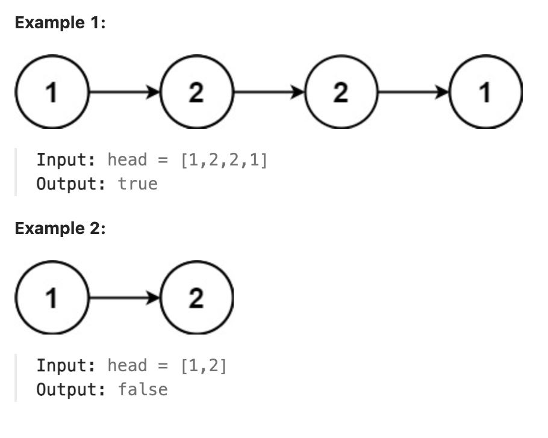

# 234.Palindrome Linked List

### LeetCode 题目链接

[234.Palindrome Linked List](https://leetcode.com/problems/palindrome-linked-list/)

### 题目大意

给一个单链表的头节点 `head`，请判断该链表是否为`回文链表`。若是，返回 `true`；否则，返回 `false`



说明:
- The number of nodes in the list is in the range [1, 10^5].
- 0 <= Node.val <= 9

### 解题

#### 思路 1: 

```java
class Solution {
    public boolean isPalindrome(ListNode head) {
        ArrayList<Integer> nodes = new ArrayList<>();
        ListNode p1 = head;
        while (p1 != null) {
            nodes.add(p1.val);
            p1 = p1.next;
        }
        int size = nodes.size();
        for (int i = 0; i < size / 2; i++) {
            if (!nodes.get(i).equals(nodes.get(size - 1 - i))) {
                return false;
            }
        }
        return true;
    }
}
```
```python
class Solution:
    def isPalindrome(self, head: ListNode) -> bool:
        nodes = []
        p1 = head
        while p1 != None:
            nodes.append(p1.val)
            p1 = p1.next
        return nodes == nodes[::-1]
```
```js
var isPalindrome = function(head) {
    let nodes = [];
    let p1 = head;
    while (p1 !== null) {
        nodes.push(p1.val);
        p1 = p1.next;
    }
    let size = nodes.length;
    for (let i = 0; i < size / 2; i++) {
        if (nodes[i] !== nodes[size - 1 - i]) {
            return false;
        }
    }
    return true;
};
```
- 时间复杂度: `O(n)`
- 空间复杂度: `O(n)`

#### 思路 2: 
```java
/**
 * Definition for singly-linked list.
 * public class ListNode {
 *     int val;
 *     ListNode next;
 *     ListNode() {}
 *     ListNode(int val) { this.val = val; }
 *     ListNode(int val, ListNode next) { this.val = val; this.next = next; }
 * }
 */
class Solution {
    public boolean isPalindrome(ListNode head) {
        ListNode slow, fast;
        slow = fast = head;
        while (fast != null && fast.next != null) {
            slow = slow.next;
            fast = fast.next.next;
        }
        if (fast != null)
            slow = slow.next;
        
        ListNode left = head;
        ListNode right = reverse(slow);
        while (right != null) {
            if (left.val != right.val)
                return false;
            left = left.next;
            right = right.next;
        }

        return true;
    }

    ListNode reverse(ListNode head) {
        ListNode pre = null, cur = head;
        while (cur != null) {
            ListNode next = cur.next;
            cur.next = pre;
            pre = cur;
            cur = next;
        }
        return pre;
    }
}
```
```python
# Definition for singly-linked list.
# class ListNode:
#     def __init__(self, val=0, next=None):
#         self.val = val
#         self.next = next
class Solution:
    def isPalindrome(self, head: Optional[ListNode]) -> bool:
        slow = fast = head
        while fast is not None and fast.next is not None:
            slow = slow.next
            fast = fast.next.next

        if fast is not None:
            slow = slow.next
        
        left = head
        right = self.reverse(slow)
        while right is not None:
            if left.val != right.val:
                return False
            left = left.next
            right = right.next

        return True
    
    def reverse(self, head: ListNode) -> ListNode:
        pre = None
        cur = head
        while cur is not None:
            next = cur.next
            cur.next = pre
            pre = cur
            cur = next
        return pre
```
```js
var isPalindrome = function(head) {
    var reverse = function(head) {
        let pre = null, cur = head;
        while (cur != null) {
            let next = cur.next;
            cur.next = pre;
            pre = cur;
            cur = next;
        }
        return pre;
    };

    let slow = head, fast = head;
    while (fast != null && fast.next != null) {
        slow = slow.next;
        fast = fast.next.next;
    }

    if (fast != null)
        slow = slow.next;

    let left = head;
    let right = reverse(slow);
    while (right != null) {
        if (left.val !== right.val)
            return false;
        left = left.next;
        right = right.next;
    }

    return true;
};
```

- 时间复杂度: `O(n)`
- 空间复杂度: `O(1)`