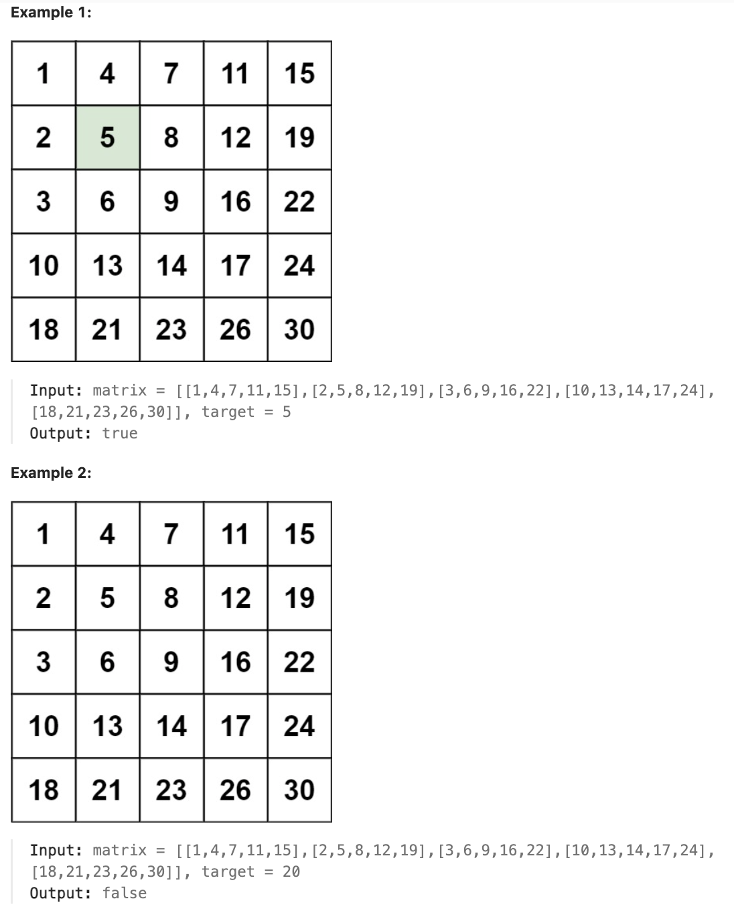

# 240.Search a 2D Matrix II

### LeetCode 题目链接

[240.Search a 2D Matrix II](https://leetcode.com/problems/search-a-2d-matrix-ii/)

### 题目大意

编写一个高效的算法来搜索 `m x n` 矩阵 `matrix` 中的一个目标值 `target`，该矩阵具有以下特性：
- 每行的元素从左到右升序排列
- 每列的元素从上到下升序排列



说明:
- m == matrix.length
- n == matrix[i].length
- 1 <= n, m <= 300
- -10^9 <= matrix[i][j] <= 10^9
- All the integers in each row are sorted in ascending order.
- All the integers in each column are sorted in ascending order.
- -10^9 <= target <= 10^9

### 解题

#### 思路 1: 双指针

这道题说 `matrix` 从上到下递增，从左到右递增 --> 左上角是最小元素，右下角是最大元素

若想高效在 `matrix` 中搜索一个元素，肯定需要从某个角开始，如说从左上角开始，然后每次只能向右或向下移动，不要走回头路

注意，若向左移动，元素在减小；若向下移动，元素在增大，这样的话就可以根据当前位置的元素和 `target` 的相对大小来判断应该往哪移动，不断接近从而找到 `target` 的位置

```java
class Solution {
    public boolean searchMatrix(int[][] matrix, int target) {
        int m = matrix.length, n = matrix[0].length;
        int i = 0, j = n - 1;
        while (i < m && j >= 0) {
            if (matrix[i][j] == target) {
                return true;
            }
            if (matrix[i][j] < target) {
                // 需要大一点，往下移动
                i++;
            } else {
                // 需要小一点，往左移动
                j--;
            }
        }
        return false;
    }
}
```
```python
class Solution:
    def searchMatrix(self, matrix: List[List[int]], target: int) -> bool:
        m, n = len(matrix), len(matrix[0])
        i, j = 0, n - 1
        while i < m and j >= 0:
            if matrix[i][j] == target:
                return True
            if matrix[i][j] < target:
                i += 1
            else:
                j -= 1
        return False
```
```js
var searchMatrix = function(matrix, target) {
    let m = matrix.length, n = matrix[0].length;
    let i = 0, j = n - 1;
    while(i < m && j >= 0) {
        if(matrix[i][j] == target) {
            return true;
        }
        if(matrix[i][j] < target) {
            i++;
        } else {
            j--;
        }

    }
    return false;
};
```
- 时间复杂度: `O(m + n)`，`m` 是矩阵的行数，`n` 是矩阵的列数
- 空间复杂度: `O(1)`

#### 思路 2: 二分查找

矩阵是有序的，可以考虑使用二分查找来实现
- 迭代对角线元素，假设对角线元素的坐标为 `(row, col)`，把数组元素按对角线分为右上角部分和左下角部分
- 对当前对角线元素右侧第 `row` 行、对角线元素下侧第 `col` 列分别进行二分查找
- 若找到目标，直接返回 `true`
- 若找不到目标，则缩小范围，继续查找
- 直到所有对角线元素都遍历完，依旧没找到，则返回 `false`

```java
class Solution {
    public boolean searchMatrix(int[][] matrix, int target) {
        int rows = matrix.length;
        if (rows == 0) {
            return false;
        }
        int cols = matrix[0].length;
        if (cols == 0) {
            return false;
        }

        int minVal = Math.min(rows, cols);
        int index = diagonalBinarySearch(matrix, minVal - 1, target);
        if (matrix[index][index] == target) {
            return true;
        }
        for (int i = 0; i <= index; i++) {
            boolean rowSearch = rowBinarySearch(matrix, i, cols - 1, target);
            boolean colSearch = colBinarySearch(matrix, i, rows - 1, target);
            if (rowSearch || colSearch) {
                return true;
            }
        }
        return false;
    }

    public int diagonalBinarySearch(int[][] matrix, int diagonal, int target) {
        int left = 0;
        int right = diagonal;
        while (left < right) {
            int mid = left + (right - left) / 2;
            if (matrix[mid][mid] < target) {
                left = mid + 1;
            } else {
                right = mid;
            }
        }
        return left;
    }

    public boolean rowBinarySearch(int[][] matrix, int begin, int cols, int target) {
        int left = begin;
        int right = cols;
        while (left < right) {
            int mid = left + (right - left) / 2;
            if (matrix[begin][mid] < target) {
                left = mid + 1;
            } else if (matrix[begin][mid] > target) {
                right = mid - 1;
            } else {
                return true;
            }
        }
        return begin <= left && left <= cols && matrix[begin][left] == target;
    }

    public boolean colBinarySearch(int[][] matrix, int begin, int rows, int target) {
        int left = begin + 1;
        int right = rows;
        while (left < right) {
            int mid = left + (right - left) / 2;
            if (matrix[mid][begin] < target) {
                left = mid + 1;
            } else if (matrix[mid][begin] > target) {
                right = mid - 1;
            } else {
                return true;
            }
        }
        return begin <= left && left <= rows && matrix[left][begin] == target;
    }
}
```
```python
class Solution:
    def diagonalBinarySearch(self, matrix, diagonal, target):
        left = 0
        right = diagonal
        while left < right:
            mid = left + (right - left) // 2
            if matrix[mid][mid] < target:
                left = mid + 1
            else:
                right = mid
        return left

    def rowBinarySearch(self, matrix, begin, cols, target):
        left = begin
        right = cols
        while left < right:
            mid = left + (right - left) // 2
            if matrix[begin][mid] < target:
                left = mid + 1
            elif matrix[begin][mid] > target:
                right = mid - 1
            else:
                left = mid
                break
        return begin <= left <= cols and matrix[begin][left] == target

    def colBinarySearch(self, matrix, begin, rows, target):
        left = begin + 1
        right = rows
        while left < right:
            mid = left + (right - left) // 2
            if matrix[mid][begin] < target:
                left = mid + 1
            elif matrix[mid][begin] > target:
                right = mid - 1
            else:
                left = mid
                break
        return begin <= left <= rows and matrix[left][begin] == target

    def searchMatrix(self, matrix, target: int) -> bool:
        rows = len(matrix)
        if rows == 0:
            return False
        cols = len(matrix[0])
        if cols == 0:
            return False

        min_val = min(rows, cols)
        index = self.diagonalBinarySearch(matrix, min_val - 1, target)
        if matrix[index][index] == target:
            return True
        for i in range(index + 1):
            row_search = self.rowBinarySearch(matrix, i, cols - 1, target)
            col_search = self.colBinarySearch(matrix, i, rows - 1, target)
            if row_search or col_search:
                return True
        return False
```
```js
var diagonalBinarySearch = function(matrix, diagonal, target) {
    let left = 0;
    let right = diagonal;
    while (left < right) {
        let mid = left + Math.floor((right - left) / 2);
        if (matrix[mid][mid] < target) {
            left = mid + 1;
        } else {
            right = mid;
        }
    }
    return left;
};

var rowBinarySearch = function(matrix, begin, cols, target) {
    let left = begin;
    let right = cols;
    while (left < right) {
        let mid = left + Math.floor((right - left) / 2);
        if (matrix[begin][mid] < target) {
            left = mid + 1;
        } else if (matrix[begin][mid] > target) {
            right = mid - 1;
        } else {
            return true;
        }
    }
    return begin <= left && left <= cols && matrix[begin][left] === target;
};

var colBinarySearch = function(matrix, begin, rows, target) {
    let left = begin + 1;
    let right = rows;
    while (left < right) {
        let mid = left + Math.floor((right - left) / 2);
        if (matrix[mid][begin] < target) {
            left = mid + 1;
        } else if (matrix[mid][begin] > target) {
            right = mid - 1;
        } else {
            return true;
        }
    }
    return begin <= left && left <= rows && matrix[left][begin] === target;
};

var searchMatrix = function(matrix, target) {
    const rows = matrix.length;
    if (rows === 0) {
        return false;
    }
    const cols = matrix[0].length;
    if (cols === 0) {
        return false;
    }

    const minVal = Math.min(rows, cols);
    const index = diagonalBinarySearch(matrix, minVal - 1, target);
    if (matrix[index][index] === target) {
        return true;
    }
    for (let i = 0; i <= index; i++) {
        const rowSearch = rowBinarySearch(matrix, i, cols - 1, target);
        const colSearch = colBinarySearch(matrix, i, rows - 1, target);
        if (rowSearch || colSearch) {
            return true;
        }
    }
    return false;
};
```
- 时间复杂度: `O(min(m, n) * (log m + log n))`，`m` 是矩阵的行数，`n` 是矩阵的列数
- 空间复杂度: `O(1)`