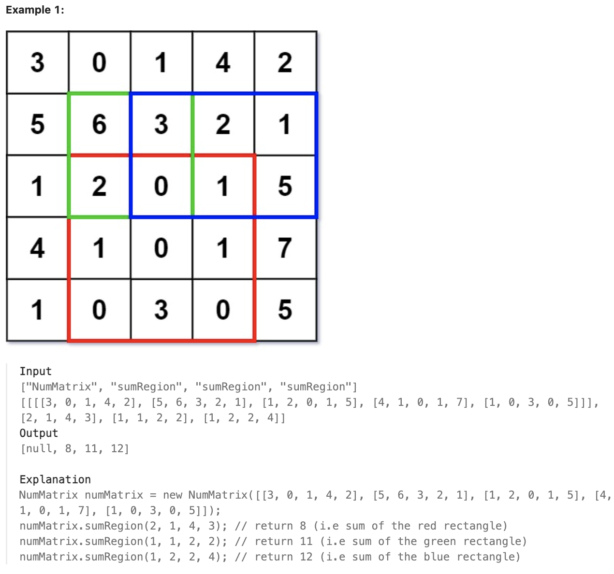
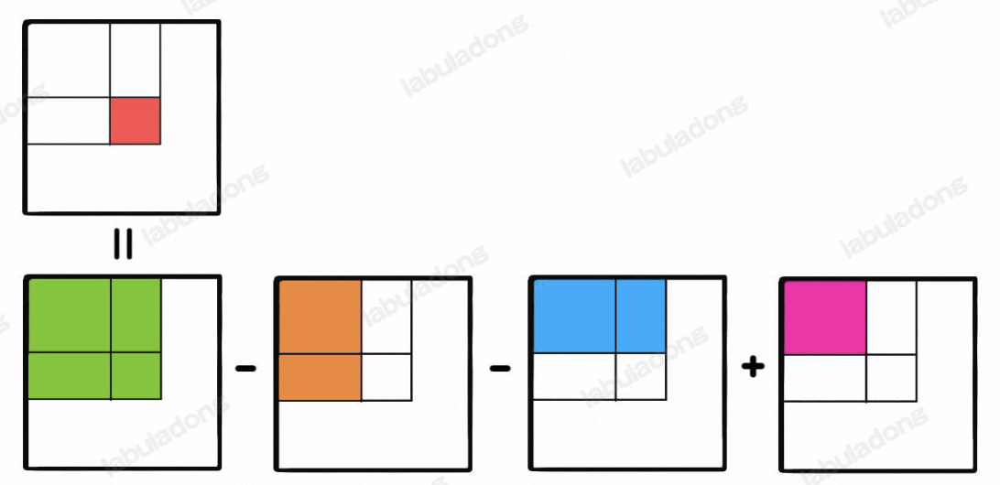

# 304.Range Sum Query 2D - Immutable

### LeetCode 题目链接

[304.Range Sum Query 2D - Immutable](https://leetcode.com/problems/range-sum-query-2d-immutable/)

### 题目大意

给定一个二维矩阵 `matrix`，以下类型的多个请求：
- 计算其子矩形范围内元素的总和，该子矩阵的`左上角`为`(row1, col1)`，`右下角`为`(row2, col2)` 

实现 `NumMatrix` 类：
- `NumMatrix(int[][] matrix)` 给定整数矩阵 `matrix` 进行初始化
- `int sumRegion(int row1, int col1, int row2, int col2)` 返回 `左上角(row1, col1)`、`右下角(row2, col2)` 所描述的子矩阵的元素`总和`



说明:
- m == matrix.length
- n == matrix[i].length
- 1 <= m, n <= 200
- -10^4 <= matrix[i][j] <= 10^4
- 0 <= row1 <= row2 < m
- 0 <= col1 <= col2 < n
- At most 104 calls will be made to sumRegion.

### 解题



若想计算红色的这个子矩阵的元素之和，可以用绿色矩阵减去蓝色矩阵减去橙色矩阵最后加上粉色矩阵
> 绿蓝橙粉这四个矩阵有一个共同的特点：左上角就是 `(0, 0)` 原点

可以维护一个二维 `preSum` 数组，专门记录`以原点为顶点`的矩阵的元素之和，就可用几次加减运算算出任何一个子矩阵的元素和

```java
class NumMatrix {
    // preSum[i][j] 记录矩阵 [0, 0, i-1, j-1] 的元素和
    private int[][] preSum;

    public NumMatrix(int[][] matrix) {
        int m = matrix.length, n = matrix[0].length;
        if (m == 0 || n == 0) return;
        // 构造前缀和矩阵
        preSum = new int[m + 1][n + 1];
        for (int i = 1; i <= m; i++) {
            for (int j = 1; j <= n; j++) {
                // 计算每个矩阵 [0, 0, i, j] 的元素和
                preSum[i][j] = preSum[i-1][j] + preSum[i][j-1] + matrix[i - 1][j - 1] - preSum[i-1][j-1];
            }
        }
    }
    
    public int sumRegion(int row1, int col1, int row2, int col2) {
        // 目标矩阵之和由四个相邻矩阵运算获得
        return preSum[row2+1][col2+1] - preSum[row1][col2+1] - preSum[row2+1][col1] + preSum[row1][col1];
    }
}
```
```python
class NumMatrix:

    def __init__(self, matrix: List[List[int]]):
        m, n = len(matrix), len(matrix[0])
        if m == 0 or n == 0:
            return
        self.preSum = [[0] * (n + 1) for _ in range(m + 1)]
        for i in range(1, m + 1):
            for j in range(1, n + 1):
                self.preSum[i][j] = self.preSum[i - 1][j] + self.preSum[i][j - 1] + matrix[i - 1][j - 1] - self.preSum[i - 1][j - 1]

    def sumRegion(self, row1: int, col1: int, row2: int, col2: int) -> int:
        return self.preSum[row2+1][col2+1] - self.preSum[row1][col2+1] - self.preSum[row2+1][col1] + self.preSum[row1][col1]
```
```js
var NumMatrix = function(matrix) {
    const m = matrix.length, n = matrix[0].length;
    if (m == 0 || n == 0) return;
    // preSum[i][j] 记录矩阵 [0, 0, i, j] 的元素和
    this.preSum = new Array(m + 1).fill().map(() => new Array(n + 1).fill(0));
    for (let i = 1; i <= m; i++) {
        for (let j = 1; j <= n; j++) {
        // 计算每个矩阵 [0, 0, i, j] 的元素和
        this.preSum[i][j] = this.preSum[i - 1][j] + this.preSum[i][j - 1] + matrix[i - 1][j - 1] - this.preSum[i - 1][j - 1];
        }
    }
};

NumMatrix.prototype.sumRegion = function(row1, col1, row2, col2) {
    return this.preSum[row2 + 1][col2 + 1] - this.preSum[row1][col2 + 1] - this.preSum[row2 + 1][col1] + this.preSum[row1][col1];
};
```

- 初始化 (`NumMatrix` 构造函数):
  - 时间复杂度: `O(m * n)`
  - 空间复杂度: `O(m * n)`
- 查询 (`sumRegion` 方法):
  - 时间复杂度: `O(1)`
  - 空间复杂度: `O(1)`