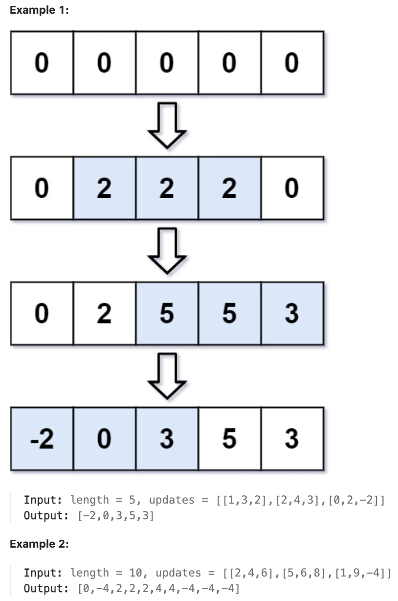

# 370.Range Addition

### LeetCode 题目链接

[370.Range Addition](https://leetcode.com/problems/range-addition/)

### 题目大意

给定一个数组的长度 `length`，初始情况下所有的数字均为 `0`，和数组 `updates`，`updates[i] = [startIdxi, endIdxi, inci]`

在 `i^th` 的操作中，需要通过 `inc_i` 将子数组 `arr[startIndex_i ... endIndex_i]`（包括 `startIndex_i` 和 `endIndex_i`）增加所有元素 

应用所有更新后返回 `arr`



说明:
- 1 <= length <= 10^5
- 0 <= updates.length <= 10^4
- 0 <= startIdxi <= endIdxi < length
- -1000 <= inci <= 1000

### 解题

```java
class Solution {
    public int[] getModifiedArray(int length, int[][] updates) {
        int[] nums = new int[length];
        Difference df = new Difference(nums);
        for (int[] update : updates) {
            int i = update[0];
            int j = update[1];
            int val = update[2];
            df.increment(i, j, val);
        }
        return df.result();
    }

    class Difference {
        private int[] diff;
        public Difference(int[] nums) {
            assert nums.length > 0;
            diff = new int[nums.length];
            diff[0] = nums[0];
            for (int i = 1; i < nums.length; i++) {
                diff[i] = nums[i] - nums[i - 1];
            }
        }

        public void increment(int i, int j, int val) {
            diff[i] += val;
            if (j + 1 < diff.length) {
                diff[j + 1] -= val;
            }
        }

        public int[] result() {
            int[] res = new int[diff.length];
            // 根据差分数组构造结果数组
            res[0] = diff[0];
            for (int i = 1; i < diff.length; i++) {
                res[i] = res[i - 1] + diff[i];
            }
            return res;
        }
    }
}
```
```python
class Solution:
    def getModifiedArray(self, length: int, updates: List[List[int]]) -> List[int]:
        nums = [0]*length 
        df = self.Difference(nums)
        for update in updates:
            i = update[0]
            j = update[1]
            val = update[2]
            df.increment(i, j, val)
        return df.result()

    class Difference:
        def __init__(self, nums: List[int]):
            assert len(nums) > 0
            self.diff = [0]*len(nums)
            self.diff[0] = nums[0]
            for i in range(1, len(nums)):
                self.diff[i] = nums[i] - nums[i - 1]
        
        def increment(self, i: int, j: int, val: int) -> None:
            self.diff[i] += val
            if j + 1 < len(self.diff):
                self.diff[j + 1] -= val
        
        def result(self) -> List[int]:
            res = [0]*len(self.diff)
            res[0] = self.diff[0]
            for i in range(1, len(self.diff)):
                res[i] = res[i - 1] + self.diff[i]

            return res
```
```js
var getModifiedArray = function(length, updates) {
    let nums = new Array(length).fill(0);
    let df = new Difference(nums);
    for (let k = 0; k < updates.length; k++) {
        let i = updates[k][0];
        let j = updates[k][1];
        let val = updates[k][2];
        df.increment(i, j, val);
    }
    return df.result();
};

var Difference = function(nums) {
    let diff = [];
    if (nums.length > 0) {
        diff[0] = nums[0];
        for (let i = 1; i < nums.length; i++) {
            diff[i] = nums[i] - nums[i - 1];
        }
    }

    this.increment = function(i, j, val) {
        diff[i] += val;
        if (j + 1 < diff.length) {
            diff[j + 1] -= val;
        }
    }

    this.result = function() {
        let res = new Array(diff.length);
        // 根据差分数组构造结果数组
        res[0] = diff[0];
        for (let i = 1; i < diff.length; i++) {
            res[i] = res[i - 1] + diff[i];
        }
        return res;
    }
}
```
- 时间复杂度: `O(n + m)`，其中 `m` 是 `updates` 的长度
- 空间复杂度: `O(n)`