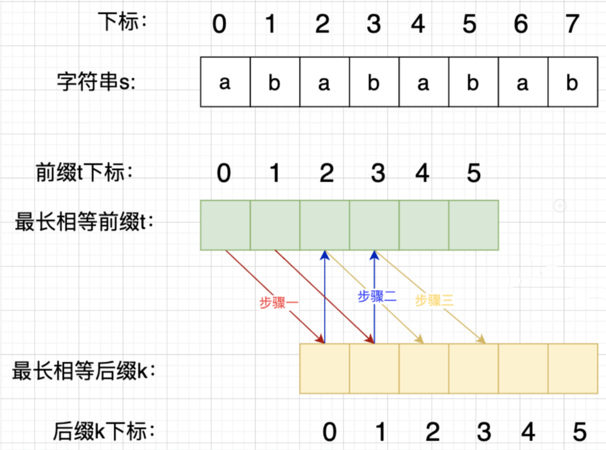

# 459.Repeated Substring Pattern

### LeetCode 题目链接

[459.Repeated Substring Pattern](https://leetcode.com/problems/repeated-substring-pattern/)

### 题目大意

给定一个非空的字符串 `s`，检查是否可以通过由它的一个子串重复多次构成

```js
Example 1:
Input: s = "abab"
Output: true
Explanation: It is the substring "ab" twice.

Example 2:
Input: s = "aba"
Output: false

Example 3:
Input: s = "abcabcabcabc"
Output: true
Explanation: It is the substring "abc" four times or the substring "abcabc" twice.
```

说明:
- 1 <= s.length <= 10^4
- s consists of lowercase English letters.

### 解题

#### 思路 1: 暴力解法

一个 `for` 循环获取子串的终止位置，然后判断子串是否能重复构成字符串，又嵌套一个 `for` 循环，所以是 `O(n^2)` 的时间复杂度

```java
public class Solution {
    public boolean repeatedSubstringPattern(String s) {
        int n = s.length();
        if (n <= 1) {
            return false;
        }
        for (int i = 1; i <= n / 2; i++) {
            if (n % i == 0) {
                String substr = s.substring(0, i);
                StringBuilder repeated = new StringBuilder();
                for (int j = 0; j < n / i; j++) {
                    repeated.append(substr);
                }
                if (repeated.toString().equals(s)) {
                    return true;
                }
            }
        }
        return false;
    }
}
```
```python
class Solution:
    def repeatedSubstringPattern(self, s: str) -> bool:
        n = len(s)
        if n <= 1:
            return False
        substr = ""
        for i in range(1, n//2 + 1):
            if n % i == 0:
                substr = s[:i]
                if substr * (n//i) == s:
                    return True
        return False
```
```js
var repeatedSubstringPattern = function(s) {
    const n = s.length;
    if (n <= 1) {
        return false;
    }
    for (let i = 1; i <= Math.floor(n / 2); i++) {
        if (n % i === 0) {
            const substr = s.slice(0, i);
            let repeated = '';
            for (let j = 0; j < n / i; j++) {
                repeated += substr;
            }
            if (repeated === s) {
                return true;
            }
        }
    }
    return false;
}
```
- 时间复杂度: `O(n^2)`
- 空间复杂度: `O(n)`

#### 思路 2: 移动匹配

当一个字符串 `s：abcabc`，内部由重复的子串组成，则这个字符串的结构一定是这样的：


即由前后相同的子串组成

所以判断字符串 `s` 是否由重复子串组成，只要两个 `s` 拼接在一起，里面还出现一个 `s` 的话，就说明是由重复子串组成

在判断 `s+s` 拼接的字符串里是否出现一个 `s` 时，要刨除 `s+s` 的首字符和尾字符，这样避免在 `s+s` 中搜索出原来的  `s` ，要搜索的是中间拼接出来的 `s`

既然前后有相同的子串，用 `s+s` 这样组成的字符串中，后面的子串做前串，前面的子串做后串，就一定还能组成一个 `s`，如图：


```java
public class Solution {
    public boolean repeatedSubstringPattern(String s) {
        String t = (s + s).substring(1, 2 * s.length() - 1); 
        return t.contains(s);
    }
}
```
```python
class Solution:
    def repeatedSubstringPattern(self, s: str) -> bool:
        t = (s + s)[1:-1]  # 掐头去尾
        return s in t 
```
```js
var repeatedSubstringPattern = function(s) {
    const t = (s + s).slice(1, -1); 
    return t.includes(s);
};
```
- 时间复杂度: `O(n)`
- 空间复杂度: `O(1)`

#### 思路 3: KMP 算法

`KMP` 算法中 `next` 数组为什么遇到字符不匹配时可以找到上一个匹配过的位置继续匹配，靠的是有计算好的前缀表
> 前缀表里统计了各个位置为终点字符串的最长相同前后缀的长度

最长相同前后缀和重复子串的关系有什么关系？
- 在由重复子串组成的字符串中，最长相等前后缀不包含的子串就是最小重复子串，这里拿字符串 `abababab` 来举例，`ab` 就是最小重复单位，如图所示：
  


图中红框部分即为`最小重复字串`



- 步骤一：因为这是相等的前缀和后缀，`t[0]` 与 `k[0]` 相同，`t[1]` 与 `k[1]` 相同，所以 `s[0]` 一定和 `s[2]` 相同，`s[1]` 一定和 `s[3]` 相同，即：`s[0]s[1]` 与 `s[2]s[3]` 相同 
- 步骤二：因为在同一个字符串位置，所以 `t[2]` 与 `k[0]` 相同，`t[3]` 与 `k[1]` 相同
- 步骤三：因为这是相等的前缀和后缀，`t[2]` 与 `k[2]` 相同 ，`t[3]` 与 `k[3]` 相同，所以 `s[2]` 一定和 `s[4]` 相同，`s[3]` 一定和 `s[5]` 相同，即：`s[2]s[3]` 与 `s[4]s[5]` 相同
- 步骤四：循环往复

所以 `s[0]s[1]` 与 `s[2]s[3]` 相同，`s[2]s[3]` 与 `s[4]s[5]` 相同，`s[4]s[5]` 与 `s[6]s[7]` 相同

因为最长相等前后缀的规则，当一个字符串由重复子串组成的，最长相等前后缀不包含的子串就是最小重复子串

```java
class Solution {
    public boolean repeatedSubstringPattern(String s) {
        if (s.equals("")) return false;
        int len = s.length();
        // 原串加个空格(哨兵)，使下标从1开始，这样j从0开始，也不用初始化了
        s = " " + s;
        char[] chars = s.toCharArray();
        int[] next = new int[len + 1];
        // 构造 next 数组过程，j 从 0 开始(空格)，i 从 2 开始
        for (int i = 2, j = 0; i <= len; i++) {
            // 匹配不成功，j回到前一位置 next 数组所对应的值
            while (j > 0 && chars[i] != chars[j + 1]) j = next[j];
            // 匹配成功，j往后移
            if (chars[i] == chars[j + 1]) j++;
            // 更新 next 数组的值
            next[i] = j;
        }

        // 最后判断是否是重复的子字符串，这里 next[len] 即代表 next 数组末尾的值
        if (next[len] > 0 && len % (len - next[len]) == 0) {
            return true;
        }
        return false;
    }
}
```
```python
# 前缀表 减一
class Solution:
    def repeatedSubstringPattern(self, s: str) -> bool:
        if len(s) == 0: 
            return False
        next = [0] * len(s)
        self.getNext(next, s)
        if next[-1] != -1 and len(s) % (len(s) - (next[-1] + 1)) == 0:
            return True
        return False

    def getNext(self, next, s):
        next[0] = -1
        j = -1
        for i in range(1, len(s)):
            while j >= 0 and s[i] != s[j+1]:
                j = next[j]
            if s[i] == s[j+1]:
                j += 1
            next[i] = j
        return next

# 前缀表 不减一
class Solution:
    def repeatedSubstringPattern(self, s: str) -> bool:
        if len(s) == 0: 
            return False
        next = [0] * len(s)
        self.getNext(next, s)
        if next[-1] != 0 and len(s) % (len(s) - (next[-1])) == 0:
            return True
        return False

    def getNext(self, next, s):
        next[0] = 0
        j = 0
        for i in range(1, len(s)):
            while j > 0 and s[i] != s[j]:
                j = next[j - 1]
            if s[i] == s[j]:
                j += 1
            next[i] = j
        return next
```
```js
// 前缀表 减一
ar repeatedSubstringPattern = function(s) {
    if (s.length === 0)
        return false;

    const getNext = (s) => {
        let next = [];
        let j = -1;

        next.push(j);

        for (let i = 1; i < s.length; ++i) {
            while (j >= 0 && s[i] !== s[j + 1])
                j = next[j];
            if (s[i] === s[j + 1])
                j++;
            next.push(j);
        }

        return next;
    }
    let next = getNext(s);

    if (next[next.length - 1] !== -1 && s.length % (s.length - (next[next.length - 1] + 1)) === 0)
        return true;
    return false;
};

// 前缀表 不减一
var repeatedSubstringPattern = function (s) {
    if (s.length === 0)
        return false;

    const getNext = (s) => {
        let next = [];
        let j = 0;

        next.push(j);

        for (let i = 1; i < s.length; ++i) {
            while (j > 0 && s[i] !== s[j])
                j = next[j - 1];
            if (s[i] === s[j])
                j++;
            next.push(j);
        }

        return next;
    }

    let next = getNext(s);

    if (next[next.length - 1] !== 0 && s.length % (s.length - next[next.length - 1]) === 0)
        return true;
    return false;
};
```
- 时间复杂度: `O(n)`
- 空间复杂度: `O(n)`