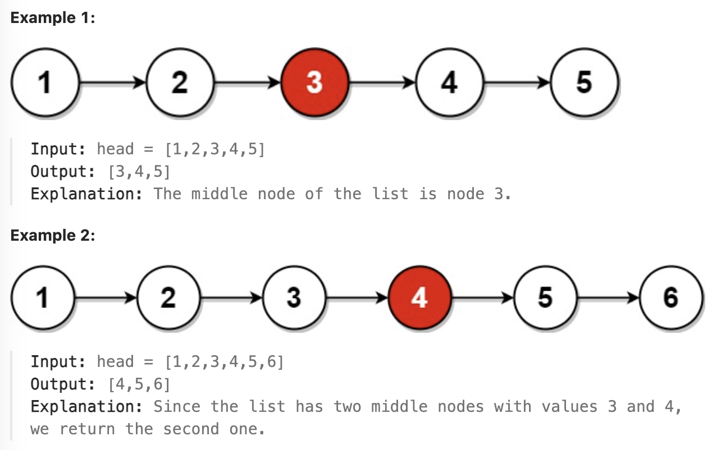

# 876.Middle of the Linked List


### LeetCode 题目链接

[876.Middle of the Linked List](https://leetcode.com/problems/middle-of-the-linked-list/)

### 题目大意

给单链表的头结点 `head`，请找出并返回链表的中间结点，若有两个中间结点，则返回第二个中间结点



说明:
- The number of nodes in the list is in the range [1, 100].
- 1 <= Node.val <= 100

### 解题

暴力解法：问题的关键也在于无法直接得到单链表的长度 `n`，常规方法是先遍历链表计算 `n`，再遍历一次得到第 `n / 2` 个节点，即中间节点

若想一次遍历就得到中间节点，使用`快慢指针`的技巧
- 让两个指针 `slow` 和 `fast` 分别指向链表头结点 `head`
- 当慢指针 `slow` 前进一步，快指针 `fast` 就前进两步；当 `fast` 走到链表末尾时 `slow` 就指向了链表中点

```java
class Solution {
    public ListNode middleNode(ListNode head) {
        ListNode slow = head, fast = head;
        // 快指针走到末尾时停止
        while(fast != null && fast.next != null) {
            // 慢指针走一步，快指针走两步
            slow = slow.next;
            fast = fast.next.next;
        }
        // 慢指针指向中点
        return slow;
    }
}
```
```python
class Solution:
    def middleNode(self, head: Optional[ListNode]) -> Optional[ListNode]:
        slow, fast = head, head
        while fast != None and fast.next != None:
            slow = slow.next
            fast = fast.next.next
        return slow
```
```js
var middleNode = function(head) {
    let slow = head, fast = head;
    while(fast != null && fast.next != null) {
        slow = slow.next;
        fast = fast.next.next;
    }
    return slow;
};
```
- 时间复杂度: `O(n)`
- 空间复杂度: `(1)`