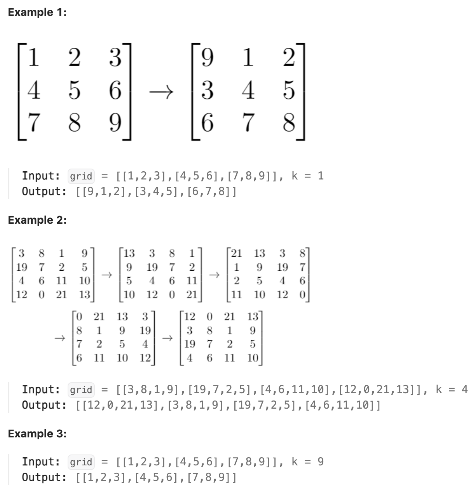

# 1260.Shift 2D Grid 

### LeetCode 题目链接

[1260.Shift 2D Grid](https://leetcode.com/problems/shift-2d-grid/)

### 题目大意

给一个 `m x n` 列的二维网格 `grid` 和一个整数 `k`，需要将 `grid` 迁移 `k` 次

每次「迁移」操作将会引发下述活动：
- 位于 `grid[i][j]` 的元素将会移动到 `grid[i][j + 1]`
- 位于 `grid[i][n - 1]` 的元素将会移动到 `grid[i + 1][0]`
- 位于 `grid[m - 1][n - 1]` 的元素将会移动到 `grid[0][0]`

请返回 `k` 次迁移操作后最终得到的`二维网格`



说明:
- m == grid.length
- n == grid[i].length
- 1 <= m <= 50
- 1 <= n <= 50
- -1000 <= grid[i][j] <= 1000
- 0 <= k <= 100

### 解题

```java
class Solution {
    public List<List<Integer>> shiftGrid(int[][] grid, int k) {
        // 把二维 grid 抽象成一维数组
        int m = grid.length, n = grid[0].length;
        int mn = m * n;
        k = k % mn;
        // 先把最后 k 个数翻转
        reverse(grid, mn - k, mn - 1);
        // 然后把前 mn - k 个数翻转
        reverse(grid, 0, mn - k - 1);
        // 最后把整体翻转
        reverse(grid, 0, mn - 1);

        // 转化成 Java List
        List<List<Integer>> res = new ArrayList<>();
        for (int[] row : grid) {
            List<Integer> rowList = new ArrayList<>();
            for (int e : row) {
                rowList.add(e);
            }
            res.add(rowList);
        }
        return res;
    }

    // 通过一维数组的索引访问二维数组的元素
    int get(int[][] grid, int index) {
        int n = grid[0].length;
        int i = index / n, j = index % n;
        return grid[i][j];
    }

    // 通过一维数组的索引修改二维数组的元素
    void set(int[][] grid, int index, int val) {
        int n = grid[0].length;
        int i = index / n, j = index % n;
        grid[i][j] = val;
    }

    // 翻转一维数组的索引区间元素
    void reverse(int[][] grid, int i, int j) {
        while (i < j) {
            int temp = get(grid, i);
            set(grid, i, get(grid, j));
            set(grid, j, temp);
            i++;
            j--;
        }
    }
}
```
```python
# 注意：python 代码由 chatGPT🤖 根据我的 java 代码翻译，旨在帮助不同背景的读者理解算法逻辑。
# 本代码已经通过力扣的测试用例，应该可直接成功提交。

class Solution:
    def shiftGrid(self, grid: List[List[int]], k: int) -> List[List[int]]:
        # 把二维 grid 抽象成一维数组
        m, n = len(grid), len(grid[0])
        mn = m * n
        k = k % mn
        # 先把最后 k 个数翻转
        self.reverse(grid, mn - k, mn - 1)
        # 然后把前 mn - k 个数翻转
        self.reverse(grid, 0, mn - k - 1)
        # 最后把整体翻转
        self.reverse(grid, 0, mn - 1)

        # 转化成 Python List
        res = []
        for row in grid:
            rowList = []
            for e in row:
                rowList.append(e)
            res.append(rowList)
        return res

    # 通过一维数组的索引访问二维数组的元素
    def get(self, grid, index):
        n = len(grid[0])
        i, j = divmod(index, n)
        return grid[i][j]

    # 通过一维数组的索引修改二维数组的元素
    def set(self, grid, index, val):
        n = len(grid[0])
        i, j = divmod(index, n)
        grid[i][j] = val

    # 翻转一维数组的索引区间元素
    def reverse(self, grid, i, j):
        while i < j:
            temp = self.get(grid, i)
            self.set(grid, i, self.get(grid, j))
            self.set(grid, j, temp)
            i += 1
            j -= 1
```
```js
ar shiftGrid = function(grid, k) {
    // 把二维 grid 抽象成一维数组
    let m = grid.length, n = grid[0].length;
    let mn = m * n;
    k = k % mn;
    // 先把最后 k 个数翻转
    reverse(grid, mn - k, mn - 1);
    // 然后把前 mn - k 个数翻转
    reverse(grid, 0, mn - k - 1);
    // 最后把整体翻转
    reverse(grid, 0, mn - 1);

    // 转化成 Javascript 数组
    let res = [];
    for (let row of grid) {
        let rowList = [];
        for (let e of row) {
            rowList.push(e);
        }
        res.push(rowList);
    }
    return res;
};

var get = function(grid, index) {
    let n = grid[0].length;
    let i = Math.floor(index / n), j = index % n;
    return grid[i][j];
};

var set = function(grid, index, val) {
    let n = grid[0].length;
    let i = Math.floor(index / n), j = index % n;
    grid[i][j] = val;
};

var reverse = function(grid, i, j) {
    while (i < j) {
        let temp = get(grid, i);
        set(grid, i, get(grid, j));
        set(grid, j, temp);
        i++;
        j--;
    }
};
```

- 时间复杂度: `O(mn)`
- 空间复杂度: `O(mn)`