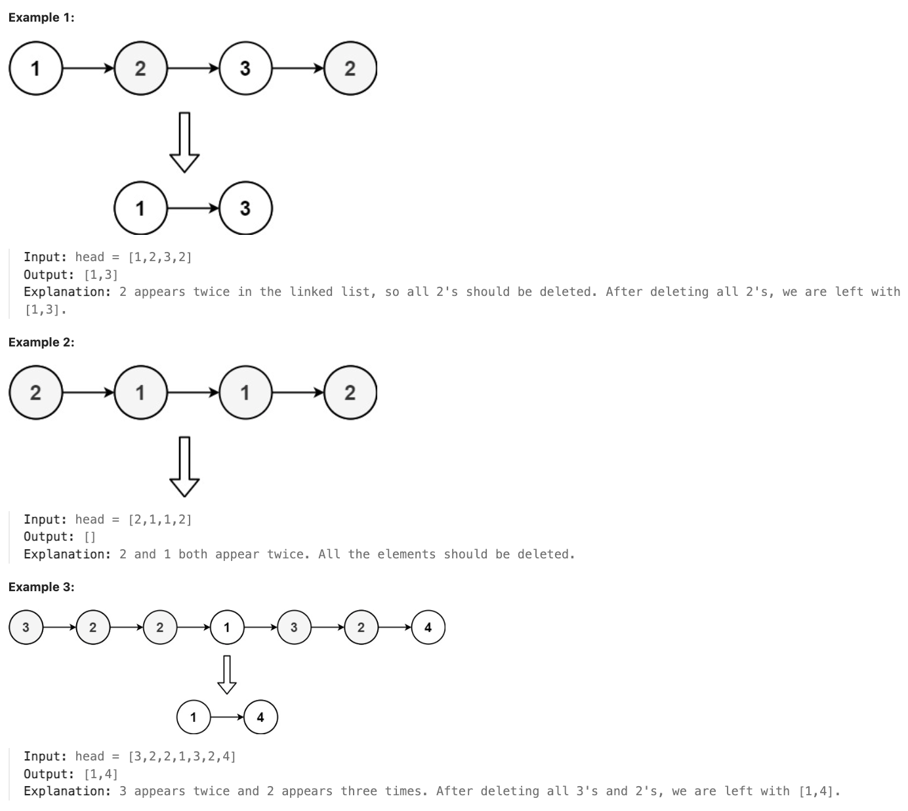

# 1836.Remove Duplicates From an Unsorted Linked List

### LeetCode 题目链接

[1836.Remove Duplicates From an Unsorted Linked List](https://leetcode.cn/problems/remove-duplicates-from-an-unsorted-linked-list/)

### 题目大意

给定一个链表的第一个节点 `head`，找到链表中所有出现多于一次的元素，并删除这些元素所在的节点，返回删除后的链表




说明:
- The number of nodes in the list is in the range [1, 10^5]
- 1 <= Node.val <= 10^5

### 解题

```java
class Solution {
    public ListNode deleteDuplicatesUnsorted(ListNode head) {
        HashMap<Integer, Integer> count = new HashMap<>();
        ListNode p = head;
        while (p != null) {
            count.put(p.val, count.getOrDefault(p.val, 0) + 1);
            p = p.next;
        }
        ListNode dummy = new ListNode(-1);
        dummy.next = head;
        p = dummy;
        while (p != null) {
            ListNode unique = p.next;
            while (unique != null && count.get(unique.val) > 1) {
                unique = unique.next;
            }
            p.next = unique;
            p = p.next;
        }
        return dummy.next;
    }
}
```
```python
class Solution:
    def deleteDuplicatesUnsorted(self, head: ListNode) -> ListNode:
        count = {}
        p = head
        # 先遍历一遍链表，记录每个值出现的次数
        while p:
            count[p.val] = count.get(p.val, 0) + 1
            p = p.next
        # 虚拟头结点（哨兵节点），存放结果链表
        dummy = ListNode(-1)
        dummy.next = head
        p = dummy
        # 再遍历一遍节点，把重复出现的节点剔除
        while p:
            # unique 指针负责寻找不重复的节点
            unique = p.next
            while unique and count[unique.val] > 1:
                # 跳过重复节点，直到找到不重复的节点
                unique = unique.next
            # 接入不重复的节点或尾部空指针
            p.next = unique
            # p 前进，继续寻找不重复节点
            p = p.next
        return dummy.next
```
```js
var deleteDuplicatesUnsorted = function(head) {
    let count = new Map();
    let p = head;
    while(p != null) {
        count.set(p.val, (count.get(p.val) || 0) + 1);
        p = p.next;
    }
    let dummy = new ListNode(-1);
    dummy.next = head;
    p = dummy;
    while (p != null) {
        let unique = p.next;
        while(unique != null && count.get(unique.val) > 1) {
            unique = unique.next;
        }
        p.next = unique;
        p = p.next;
    }
    return dummy.next;

};
```
- 时间复杂度: `O(n)`
- 空间复杂度: `O(n)`，最坏情况下，链表中所有节点值都不相同