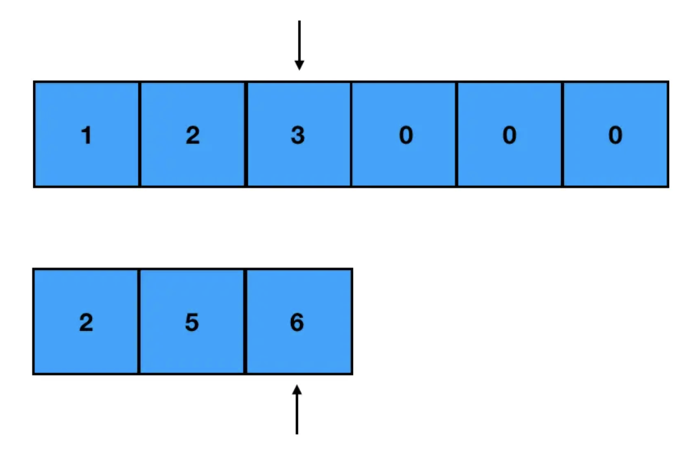
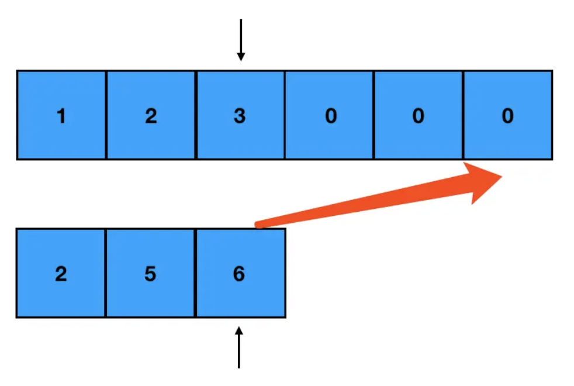

# 合并两个有序数组

### 题目大意


### 解题

定义两个指针，分别指向两个数组生效部分的尾部



每次只对指针所指的元素进行比较，取其中较大的元素，从 `nums1` 的末尾往前补
> 为什么是从后往前填补？
> - 因为要把所有的值合并到 `nums1` 里，所以这里可以把 `nums1` 看做是一个“容器”
> - 但这个容器不是空的，前面几个坑有内容，若从前往后填补，就没法直接往对应的坑位赋值（会产生值覆盖）；从后往前填补，填的都是没有内容的坑，这样会省掉很多麻烦



由于 `nums1` 和 `nums2` 的长度并不一定一致，还需考虑其中一个提前到头的情况：
- 若提前遍历完的是 `nums1` 的有效部分，剩下的是 `nums2`，意味着 `nums1` 的头部空出，直接把 `nums2` 整个补到 `nums1` 前即可
- 若提前遍历完的是 `nums2`，剩下的是 `nums1`，由于容器本身就是 `nums1`，此时不必做任何额外操作

```java
public class Solution {
    public void merge(int[] nums1, int m, int[] nums2, int n) {
        // 初始化两个指针的指向，初始化 nums1 尾部索引 k
        int i = m - 1, j = n - 1, k = m + n - 1;
        // 当两个数组均没遍历完，指针同步移动
        while(i >= 0 && j >= 0) {
            // 取较大的值，从末尾往前补
            if(nums1[i] >= nums2[j]) {
                nums1[k--] = nums1[i--];
            } else {
                nums1[k--] = nums1[i--];
            }
        }
        // nums2 留下的情况
        while(j >= 0) {
            nums1[k--] = nums2[j--];
        }
        return nums1;
    }
}
```
```python
def merge(nums1, m, nums2, n):
    # 初始化两个指针的指向，初始化 nums1 尾部索引 k
    i, j, k = m - 1, n - 1, m + n - 1
    # 当两个数组均没遍历完，指针同步移动
    while i >= 0 and j >= 0:
        # 取较大的值，从末尾往前补
        if nums1[i] >= nums2[j]:
            nums1[k] = nums1[i]
            i -= 1
        else:
            nums1[k] = nums[j]
            j -= 1
        k -= 1
    
    # nums2 留下的情况
    while j >= 0:
        nums1[k] = nums2[j]
        k -= 1
        j -= 1
    return nums1
```
```js
var merge = function(nums1, m, nums2, n) {
    let i = m - 1, j = n - 1, k = m + n - 1;
    while(j >= 0 && j >= 0) {
        if(nums1[i] >= nums2[j]) {
            nums1[k--] = nums1[i--];
        } else {
            nums1[k--] = nums1[j--];
        }
    }
    while(j >= 0) {
        nums1[k--] = nums[j--];
    }
    return nums1;
};
```
- 时间复杂度：`O(m+n)`
- 空间复杂度：`O(1)`