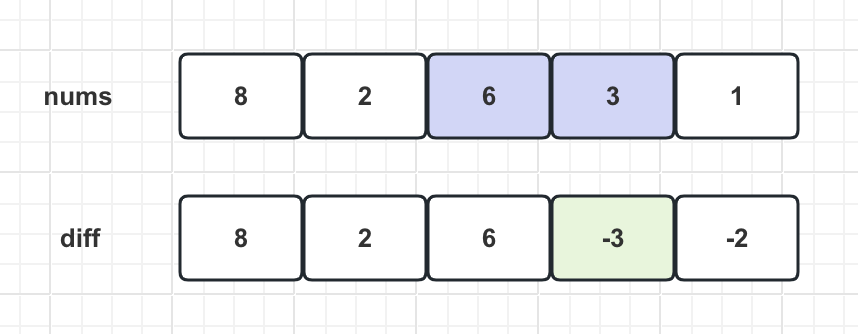
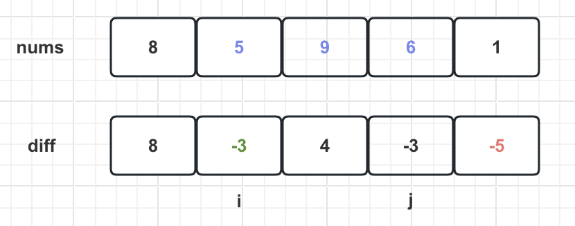

先对 `nums` 数组构造一个 `diff` 差分数组，`diff[i]` 就是 `nums[i]` 和 `nums[i-1]` 之差：

```python
diff = [0] * len(nums)
# 构造差分数组
diff[0] = nums[0]
for i in range(1, len(nums)):
    diff[i] = nums[i] - nums[i - 1]
```



通过这个 `diff` 差分数组可反推出原始数组 `nums`，代码逻辑如下：

```python
res = [0] * len(diff)

# 根据差分数组构造结果数组
res[0] = diff[0]
for i in range(1, len(diff)):
    res[i] = res[i - 1] + diff[i]
```

这样构造的差分数组 `diff`，就可以快速进行区间增减的操作，若想对区间 `nums[i..j]` 的元素全部加 `3`，则只需让 `diff[i] += 3`，然后再让 `diff[j+1] -= 3` 即可：



原理：回想 `diff` 数组反推 `nums` 数组的过程，`diff[i] += 3` 意味着给 `nums[i..]` 所有的元素都加了 `3`，然后 `diff[j+1] -= 3` 意味着对于 `nums[j+1..]` 所有元素再减 `3`，综合起来就是对 `nums[i..j]` 中的所有元素都加 `3`

只要花费 `O(1)` 的时间修改 `diff` 数组，就相当于给 `nums` 的整个区间做了修改，多次修改 `diff`，然后通过 `diff` 数组反推，即可得到 `nums` 修改后的结果

现在把差分数组抽象成一个类，包含 `increment` 方法和 `result` 方法：

```python
class Difference:
    # 差分数组
    def __init__(self, nums: List[int]):
        assert len(nums) > 0
        self.diff = [0] * len(nums)
        self.diff[0] = nums[0]
        for i in range(1, len(nums)):
            self.diff[i] = nums[i] - nums[i - 1]
    
    # 给闭区间 [i, j] 增加 val（可以是负数）
    def increment(self, i: int, j: int, val: int) -> None:
        self.diff[i] += val
        if j + 1 < len(self.diff):
            self.diff[j + 1] -= val
    
    # 返回结果数组
    def result(self) -> List[int]:
        res = [0] * len(self.diff)
  
        res[0] = self.diff[0]
        for i in range(1, len(self.diff)):
            res[i] = res[i - 1] + self.diff[i]
        return res
```

当 `j+1 >= diff.length` 时，说明是对 `nums[i]` 及以后的整个数组都进行修改，就不需要再给 `diff` 数组减 `val` 

